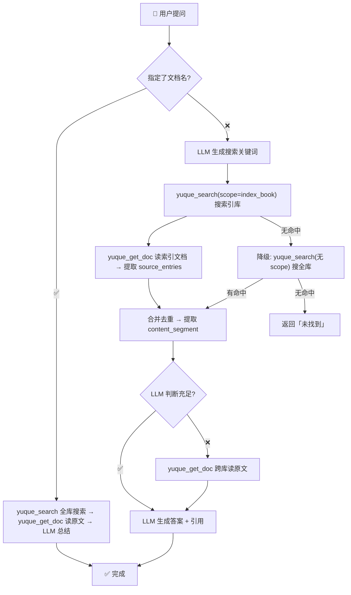

# 语雀 AI Skill

> 语雀全功能 AI Agent 技能 —— 34 MCP Tools + 17 业务 Skills（批量运维/写作辅助/知识分析/翻译/同步/导入），全面超越官方 yuque-ecosystem。纯 LLM + 语雀 API，零外部依赖。

[](./LICENSE)
[](./SKILL.md)
[](./mcp-server)

---

## ⚠️ 免责声明

- 本项目**非语雀官方产品**，与蚂蚁集团/语雀团队无任何关联
- 使用前请**备份重要数据**。本工具涉及文档创建/修改/删除，误操作可能导致数据丢失
- 作者对因使用本工具造成的任何数据丢失、账号限制或其他后果**不承担责任**
- 请遵守[语雀服务协议](https://www.yuque.com/yuque/qeyyk7/bl95f1imynp9u6pg?view=doc_embed&title=0)，控制请求频率避免触发限流

---

## vs 官方生态

官方生态由 3 个核心组件构成：[yuque-mcp-server](https://github.com/yuque/yuque-mcp-server)（MCP Server 核心） + [yuque-ecosystem](https://github.com/yuque/yuque-ecosystem)（OpenClaw 插件，8 skills） + [yuque-plugin](https://github.com/yuque/yuque-plugin)（Claude Code 插件，4+2 skills）。以下按维度逐一对比。

### 基本信息

| 维度 | 🏛 yuque-mcp-server | 🏛 yuque-ecosystem | 🏛 yuque-plugin | 🦞 本项目 |
|------|----------|-----------|-----------|--------|
| 维护方 | 语雀官方 | 语雀官方 | 语雀官方 | 社区（yehuoshun） |
| 定位 | MCP Server 核心 | OpenClaw 插件 | Claude Code 插件 | 全功能 MCP + Agent Skill 套装 |
| 安装方式 | `npx yuque-mcp install` | `openclaw plugins install` | `claude plugin install` | clone + `npm install` + 手动配置 |
| CLI 一键安装 | ✅ 10+ 客户端 | — | — | 🔜 规划中（npm 发布后） |
| npm 发布 | ✅ `npx yuque-mcp` | — | — | 🔜 规划中（当前 test 阶段本地构建） |
| 适用平台 | 通用 MCP 客户端 | OpenClaw | Claude Code | OpenClaw |

### MCP Tools

| 维度 | 🏛 yuque-mcp-server | 🏛 yuque-ecosystem | 🏛 yuque-plugin | 🦞 本项目 |
|------|----------|-----------|-----------|--------|
| 工具总数 | 16 个 | 复用 yuque-mcp-server | 复用 yuque-mcp-server | **34 个** |
| 删除操作 | ❌ | ❌ | ❌ | ✅ repo/doc 硬删除 + note 软删除+恢复 |
| 版本管理 | ❌ | ❌ | ❌ | ✅ 版本历史 + 版本详情 + 版本对比 |
| 群组管理 | ❌ | ❌ | ❌ | ✅ 成员列表/角色变更/移除 |
| 统计面板 | ❌ | ❌ | ❌ | ✅ group/member/book/doc 四维统计 |
| 批量获取正文 | ❌ | ❌ | ❌ | ✅ batch_get_docs_body（并发 5） |
| 上传 & 导入 | ❌ | ❌ | ❌ | ✅ CDN 上传 + Obsidian/Notion 导入 |
| 健康检查 | ❌ | ❌ | ❌ | ✅ Token + 知识库连通性检查 |

### Skills 矩阵

| 维度 | 🏛 yuque-mcp-server | 🏛 yuque-ecosystem | 🏛 yuque-plugin | 🦞 本项目 |
|------|----------|-----------|-----------|--------|
| Skills 总数 | — | 8 个 | 4（个人）/ 6（团队） | **17 个** |
| 知识库问答 | — | `smart-search` | `smart-search` | **一级索引 + 多路并发 + 降级** |
| 智能摘要 | — | `smart-summary`（两档） | `smart-summary`（两档） | `summarize`（L1-L4 四级） |
| 阅读摘录 | — | `reading-digest` | — | `digest`（五维提取 + 知识卡片） |
| 碎片收集 | — | `daily-capture` | — | `inbox`（三种模式 + 可配置清理） |
| 笔记打磨 | — | `note-refine` | — | `polish`（打磨 + 风格分析 + 迁移 + 模板） |
| 风格分析 | — | `style-extract` | — | ↑ 合入 polish |
| 知识关联 | — | `knowledge-connect` | — | `knowledge`（图谱 + 交叉引用 + 聚类） |
| 过时检测 | — | `stale-detector` | — | `audit`（版本审计 + 变更追踪 + 对比） |
| 会议纪要 | — | — | `meeting-notes` | 🟰 无专用模板 |
| 技术方案 | — | — | `tech-design` | 🟰 无专用模板 |
| 周报 | — | — | `weekly-report` | `dashboard`（维度远超周报） |
| 入职指南 | — | — | `onboarding-guide`（团队） | ❌ 官方独有 |
| 知识报告 | — | — | `knowledge-report`（团队） | `dashboard`（覆盖健康度+运营） |

### 本项目独有

| 维度 | 🏛 yuque-mcp-server | 🏛 yuque-ecosystem | 🏛 yuque-plugin | 🦞 本项目 |
|------|----------|-----------|-----------|--------|
| 批量运维 | — | — | — | ✅ 归档/分类/格式化/重命名/重构/仪表盘/审计 |
| 翻译 | — | — | — | ✅ 批量/增量/多语言/保留格式 |
| 文档同步 | — | — | — | ✅ 单向/双向/增量/差异检测 |
| 拆分 & 合并 | — | — | — | ✅ split + merge |
| 外部导入 | — | — | — | ✅ 本地/Obsidian/Notion |

> 🦞 官方优势仅在 CLI 开箱体验 + `meeting-notes` / `tech-design` / `onboarding-guide` 三个专用模板，其余维度本项目全面超越。

---

## 架构

```
yuque-mcp (MCP Server)     ← 管理操作：34 个 tools（CRUD、搜索、批量获取、导入、统计、群组、健康检查）
    ↓
业务 Skills                ← 17 个 skill：batch/ 运维 · write/ 写作 · map/ 分析 · 翻译 · 同步 · 导入
    ↓
LLM Agent                  ← 问答编排：搜索 → 判断 → 补读 → 生成答案
```

| 组件 | 技术栈 | 说明 |
|------|--------|------|
| `mcp-server/` | TypeScript + `@modelcontextprotocol/sdk` | MCP Server，提供 34 个 tools |
| `skills/` | Markdown | 业务 Skills（batch/write/map 三分类，17 个技能） |
| `SKILL.md` | Markdown | AI Agent 执行指南（问答 pipeline + 索引构建 + 业务 skill 路由） |

---

## 快速开始

### 1. 安装 MCP Server

```bash
cd mcp-server
npm install
npm run build
```

### 2. 配置

```bash
cp config/yuque-config.example.json config/yuque-config.json
# 编辑填入 token、group、default_book、index_book
```

配置格式：

```json
{
  "token": "语雀 API Token",
  "group": "yehuoshun",
  "default_book": { "book_id": 78276514, "namespace": "yehuoshun/index-sub-1" },
  "index_book": { "book_id": 77321523, "namespace": "yehuoshun/wwqac0" }
}
```

| 配置项 | 说明 |
|--------|------|
| `token` | 语雀 API Token（需 doc:read/doc:write/repo:read/repo:write） |
| `group` | 语雀用户名/login |
| `default_book` | 默认知识库（创建文档时未指定目标则用此库） |
| `index_book` | 索引库（知识库问答用，可选） |

### 3. 在 MCP 客户端配置

**方式一：npm 安装（推荐）**

```json
{
  "mcpServers": {
    "yuque-mcp": {
      "command": "npx",
      "args": ["yuque-mcp"],
      "env": {
        "YUQUE_TOKEN": "<Token>",
        "YUQUE_GROUP": "<用户名>"
      }
    }
  }
}
```

**方式二：本地开发**

```json
{
  "mcpServers": {
    "yuque-mcp": {
      "command": "node",
      "args": ["mcp-server/dist/index.js"],
      "cwd": "/path/to/yuque-ai-mcp"
    }
  }
}
```

---

## MCP Tools 全览（34 个）

### 知识库

| Tool | 说明 |
|------|------|
| `yuque_list_repos` | 列出所有知识库 |
| `yuque_get_repo` | 获取知识库详情 |
| `yuque_create_repo` | 创建知识库 |
| `yuque_update_repo` | 更新知识库（名称/描述/可见性） |
| `yuque_delete_repo` | ⚠️ 硬删除知识库 |

### 文档

| Tool | 说明 |
|------|------|
| `yuque_list_docs` | 列出文档 |
| `yuque_get_doc` | 获取文档（JSON 多格式，raw=true 纯文本） |
| `yuque_create_doc` | 创建文档 + 自动挂 TOC |
| `yuque_update_doc` | 更新文档 |
| `yuque_delete_doc` | ⚠️ 硬删除文档 |
| `yuque_list_doc_versions` | 文档版本历史 |
| `yuque_get_doc_version` | 文档版本详情 |

### 目录

| Tool | 说明 |
|------|------|
| `yuque_list_toc` | 列出目录结构 |
| `yuque_update_toc` | 更新目录（append/prepend/edit/remove + sibling/child） |
| `yuque_remove_toc_node` | 移除目录节点（不删文档） |

### 小记

| Tool | 说明 |
|------|------|
| `yuque_list_notes` | 列出小记 |
| `yuque_get_note` | 获取小记详情 |
| `yuque_create_note` | 创建小记 |
| `yuque_update_note` | 更新小记 |
| `yuque_delete_note` | 删除小记（软删除） |
| `yuque_restore_note` | 恢复小记 |

### 群组

| Tool | 说明 |
|------|------|
| `yuque_list_group_users` | 列出群组成员 |
| `yuque_update_group_user` | 变更成员角色 |
| `yuque_remove_group_user` | ⚠️ 移除成员 |

### 统计（需 statistic:read 权限）

| Tool | 说明 |
|------|------|
| `yuque_get_group_stats` | 团队整体统计 |
| `yuque_get_member_stats` | 团队成员统计 |
| `yuque_get_book_stats` | 团队知识库统计 |
| `yuque_get_doc_stats` | 团队文档统计 |

### 批量获取 & 搜索 & 元信息

| Tool | 说明 |
|------|------|
| `yuque_search` | 搜索（支持 scope 限定范围） |
| `yuque_batch_get_docs_body` | 批量获取多篇文档 Markdown 正文（并发 5） |
| `yuque_get_user` | 当前 Token 用户详情 |
| `yuque_health_check` | 健康检查（Token + 知识库） |

### 上传 & 导入

| Tool | 说明 |
|------|------|
| `yuque_upload_attachment` | 上传文件到语雀 CDN（image/attachment/video，上限按类型：图片20MB/附件500MB/视频500MB，需 Cookie） |
| `yuque_import_doc` | 导入单个文件到知识库（自动适配 Obsidian WikiLinks/callouts/frontmatter，图片 CDN 上传） |

---

## 知识库问答

一级索引（关键词→来源）+ 多路并发 + 降级模式。纯 LLM + 语雀 API，零外部依赖。

完整搜索管线、索引构建、搜索降级 → **[SKILL.md](./SKILL.md#二知识库问答系统)**。

### 搜索流程



---

## 业务 Skills

基于 MCP 34 tools 的高层业务能力。全部遵循先预览后确认、单篇隔离不传染。

| Skill | 说明 |
|-------|------|
| [archive](skills/batch/archive.md) | 批量归档/备份旧文档（归档移动 / 备份复制两种模式） |
| [classify](skills/batch/classify.md) | 智能分类打标（AI 分析主题 → 自动设计目录树 → 重建结构） |
| [format](skills/batch/format.md) | 批量格式标准化（预设风格 / 参考文档 / 自定义规则，三种格式来源） |
| [rebuild-toc](skills/batch/rebuild-toc.md) | 目录智能重构（保留意图优化现有结构） |
| [rename](skills/batch/rename.md) | 批量重命名（前缀/后缀/序号/查找替换/正则/模板/移除七种方式） |
| [audit](skills/batch/audit.md) | 文档版本审计 & 变更追踪（变更日报/单篇历史/版本对比/协作追踪） |
| [dashboard](skills/batch/dashboard.md) | 知识库运营仪表盘（周报/概览/成员详情，纯只读） |
| [summarize](skills/batch/summarize.md) | 多粒度智能摘要（L1-L4 四级 + 单篇/多篇/知识库三种模式） |
| [translate](skills/batch/translate.md) | AI 批量翻译（单篇/批量/多语言/增量四种模式，保留 Markdown 格式） |
| [sync](skills/batch/sync.md) | 文档镜像 & 知识库同步（单向/双向/增量/差异检测） |
| [split](skills/batch/split.md) | 长文按标题层级自动拆分为多篇 |
| [merge](skills/batch/merge.md) | 多篇文档合并为单篇长文 |
| [import](skills/batch/import.md) | 外部文档导入（本地/Obsidian/Notion，格式适配+图片上传） |
| [polish](skills/write/polish.md) | AI 写作工作室（风格分析/笔记打磨/风格迁移/模板写作） |
| [knowledge](skills/map/knowledge.md) | 文档关联图谱（单篇关联/全库图谱/自动补引用） |
| [digest](skills/map/digest.md) | 阅读摘录（核心观点/金句/行动项/疑思五维 + 知识卡片） |
| [inbox](skills/map/inbox.md) | 碎片收集整理（三种模式 + 可配置清理策略） |

---

## 项目结构

```
yuque-ai-mcp/
├── SKILL.md              # AI Agent 执行规范
├── README.md             # 本文件
├── skills/               # 业务 Skills（14 个）
│   ├── batch/            # 批量运维（13 个）
│   │   ├── archive.md     # 批量归档/备份
│   │   ├── audit.md       # 版本审计 & 变更追踪
│   │   ├── classify.md    # 智能分类打标
│   │   ├── dashboard.md   # 知识库运营仪表盘
│   │   ├── format.md      # 批量格式标准化
│   │   ├── rebuild-toc.md # 目录智能重构
│   │   ├── rename.md      # 批量重命名
│   │   ├── summarize.md   # 多粒度智能摘要
│   │   ├── sync.md        # 文档镜像 & 知识库同步
│   │   ├── split.md       # 长文拆分
│   │   ├── merge.md       # 文档合并
│   │   ├── import.md      # 外部文档导入
│   │   └── translate.md   # AI 批量翻译
│   ├── write/            # 写作辅助（1 个）
│   │   └── polish.md      # AI 写作工作室
│   └── map/              # 知识分析（3 个）
│       ├── digest.md      # 阅读摘录
│       ├── inbox.md       # 碎片收集整理
│       └── knowledge.md   # 文档关联图谱
├── mcp-server/           # MCP Server (TypeScript)
│   ├── src/
│   │   ├── index.ts      # Server 入口（注册 34 个 tools）
│   │   ├── client.ts     # 语雀 HTTP 客户端
│   │   ├── config.ts     # 配置读取
│   │   ├── tools/        # Tool 实现
│   │   │   ├── repos.ts
│   │   │   ├── docs.ts
│   │   │   ├── notes.ts
│   │   │   ├── search.ts
│   │   │   ├── export.ts
│   │   │   └── health.ts
│   │   └── shared/
│   │       └── types.ts
│   ├── package.json
│   └── tsconfig.json
├── config/               # 配置文件
│   ├── yuque-config.example.json
│   └── yuque-config.json (不入库)
├── references/
│   └── api_reference.md  # 语雀 OpenAPI 完整参考
└── .github/
    └── workflows/
        └── dingtalk-notify.yml

```

---

## API 参考

基地址：`https://www.yuque.com/api/v2`

完整端点/参数/错误码/限流 → **[references/api_reference.md](./references/api_reference.md)**