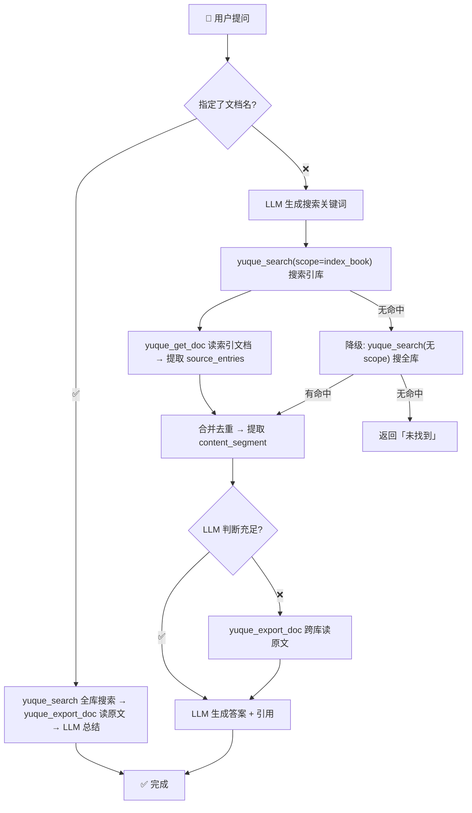

# 语雀 AI Skill

> 语雀全功能 AI Agent 技能 —— 知识库管理、文档 CRUD、小记管理、目录编排、批量导出、一级索引知识库问答 + 批量运维（归档、分类、格式化、目录重构、重命名）。纯 LLM + 语雀 API，零外部依赖。

[](https://github.com/yehuoshun/yuque-ai-mcp/releases)
[](./LICENSE)
[](./SKILL.md)
[](./mcp-server)

---

## 架构

```
yuque-mcp (MCP Server)     ← 管理操作：32 个 tools（CRUD、搜索、导出、统计、群组、健康检查）
    ↓
业务 Skills                ← 批量运维：归档/备份、智能分类、格式标准化、目录重构、批量重命名
    ↓
LLM Agent                  ← 问答编排：搜索 → 判断 → 补读 → 生成答案
```

| 组件 | 技术栈 | 说明 |
|------|--------|------|
| `mcp-server/` | TypeScript + `@modelcontextprotocol/sdk` | MCP Server，提供 32 个 tools |
| `skills/` | Markdown | 业务 Skills（batch-archive、batch-classify 等） |
| `SKILL.md` | Markdown | AI Agent 执行指南（问答 pipeline + 索引构建 + 业务 skill 路由） |
| `yuque_api.py` | Python 3 标准库 | 核心 API 封装（兼容旧版，逐步由 MCP 替代） |
| `yuque_search.py` | Python 3 标准库 | 搜索管线（兼容旧版） |
| `yuque_index.py` | Python 3 标准库 | 索引构建器（兼容旧版） |

---

## 快速开始

### 1. 安装 MCP Server

```bash
cd mcp-server
npm install
npm run build
```

### 2. 配置

```bash
cp config/yuque-config.example.json config/yuque-config.json
# 编辑填入 token、group、default_book、index_book
```

配置格式：

```json
{
  "token": "语雀 API Token",
  "group": "yehuoshun",
  "default_book": { "book_id": 78276514, "namespace": "yehuoshun/index-sub-1" },
  "index_book": { "book_id": 77321523, "namespace": "yehuoshun/wwqac0" }
}
```

| 配置项 | 说明 |
|--------|------|
| `token` | 语雀 API Token（需 doc:read/doc:write/repo:read/repo:write） |
| `group` | 语雀用户名/login |
| `default_book` | 默认知识库（创建文档时未指定目标则用此库） |
| `index_book` | 索引库（知识库问答用，可选） |

### 3. 在 MCP 客户端配置

```json
{
  "mcpServers": {
    "yuque": {
      "command": "node",
      "args": ["mcp-server/dist/index.js"],
      "cwd": "/path/to/yuque-ai-skill"
    }
  }
}
```

---

## MCP Tools 全览（32 个）

### 知识库

| Tool | 说明 |
|------|------|
| `yuque_list_repos` | 列出所有知识库 |
| `yuque_get_repo` | 获取知识库详情 |
| `yuque_create_repo` | 创建知识库 |
| `yuque_update_repo` | 更新知识库（名称/描述/可见性） |
| `yuque_delete_repo` | ⚠️ 硬删除知识库 |

### 文档

| Tool | 说明 |
|------|------|
| `yuque_list_docs` | 列出文档 |
| `yuque_get_doc` | 获取文档（JSON 多格式，raw=true 纯文本） |
| `yuque_create_doc` | 创建文档 + 自动挂 TOC |
| `yuque_update_doc` | 更新文档 |
| `yuque_delete_doc` | ⚠️ 硬删除文档 |
| `yuque_list_doc_versions` | 文档版本历史 |
| `yuque_get_doc_version` | 文档版本详情 |

### 目录

| Tool | 说明 |
|------|------|
| `yuque_list_toc` | 列出目录结构 |
| `yuque_update_toc` | 更新目录（append/prepend/edit/remove + sibling/child） |
| `yuque_remove_toc_node` | 移除目录节点（不删文档） |

### 小记

| Tool | 说明 |
|------|------|
| `yuque_list_notes` | 列出小记 |
| `yuque_get_note` | 获取小记详情 |
| `yuque_create_note` | 创建小记 |
| `yuque_update_note` | 更新小记 |
| `yuque_delete_note` | 删除小记（软删除） |
| `yuque_restore_note` | 恢复小记 |

### 群组

| Tool | 说明 |
|------|------|
| `yuque_list_group_users` | 列出群组成员 |
| `yuque_update_group_user` | 变更成员角色 |
| `yuque_remove_group_user` | ⚠️ 移除成员 |

### 统计（需 statistic:read 权限）

| Tool | 说明 |
|------|------|
| `yuque_get_group_stats` | 团队整体统计 |
| `yuque_get_member_stats` | 团队成员统计 |
| `yuque_get_book_stats` | 团队知识库统计 |
| `yuque_get_doc_stats` | 团队文档统计 |

### 搜索 & 导出 & 元信息

| Tool | 说明 |
|------|------|
| `yuque_search` | 搜索（支持 scope 限定范围） |
| `yuque_export_doc` | 导出单篇 Markdown |
| `yuque_list_docs_for_export` | 批量导出前预览文档列表 |
| `yuque_get_user` | 当前 Token 用户详情 |
| `yuque_health_check` | 健康检查（Token + 知识库） |

---

## 知识库问答

一级索引（关键词→来源）+ 多路并发 + 降级模式。纯 LLM + 语雀 API，零外部依赖。

完整搜索管线、索引构建、搜索降级 → **[SKILL.md](./SKILL.md#二知识库问答系统)**。

### 搜索流程



---

## 业务 Skills

基于 MCP 32 tools 的高层业务能力。全部遵循先预览后确认、单篇隔离不传染。

| Skill | 说明 |
|-------|------|
| [batch-archive](skills/batch-archive.md) | 批量归档/备份旧文档（归档移动 / 备份复制两种模式） |
| [batch-classify](skills/batch-classify.md) | 智能分类打标（AI 分析主题 → 自动设计目录树 → 重建结构） |
| batch-format | 批量格式标准化（待开发） |
| batch-toc-rebuild | 目录智能重构（待开发） |
| batch-rename | 批量重命名（待开发） |

---

## 项目结构

```
yuque-ai-skill/
├── SKILL.md              # AI Agent 执行规范
├── README.md             # 本文件
├── skills/               # 业务 Skills
│   ├── batch-archive.md  # 批量归档/备份
│   └── batch-classify.md # 智能分类打标
├── mcp-server/           # MCP Server (TypeScript)
│   ├── src/
│   │   ├── index.ts      # Server 入口（注册 32 个 tools）
│   │   ├── client.ts     # 语雀 HTTP 客户端
│   │   ├── config.ts     # 配置读取
│   │   ├── tools/        # Tool 实现
│   │   │   ├── repos.ts
│   │   │   ├── docs.ts
│   │   │   ├── notes.ts
│   │   │   ├── search.ts
│   │   │   ├── export.ts
│   │   │   └── health.ts
│   │   └── shared/
│   │       └── types.ts
│   ├── package.json
│   └── tsconfig.json
├── yuque_api.py          # 核心 API 封装（Python 标准库，兼容旧版）
├── yuque_search.py       # 搜索管线
├── yuque_index.py        # 索引构建器
├── config/               # 配置文件
│   ├── yuque-config.example.json
│   └── yuque-config.json (不入库)
├── references/
│   └── api_reference.md  # 语雀 OpenAPI 完整参考
└── .github/
    └── workflows/
        └── dingtalk-notify.yml

```

---

## API 参考

基地址：`https://www.yuque.com/api/v2`

完整端点/参数/错误码/限流 → **[references/api_reference.md](./references/api_reference.md)**