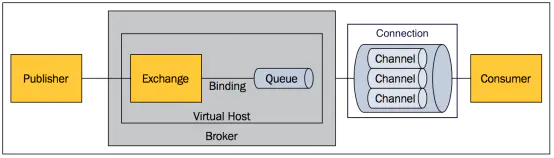
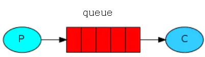
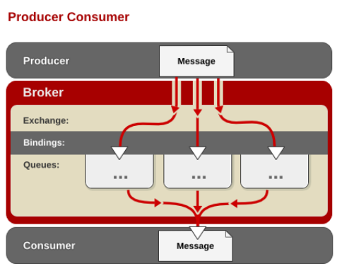
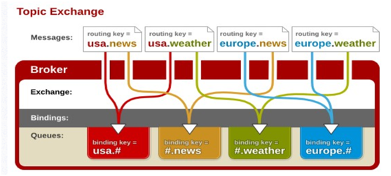
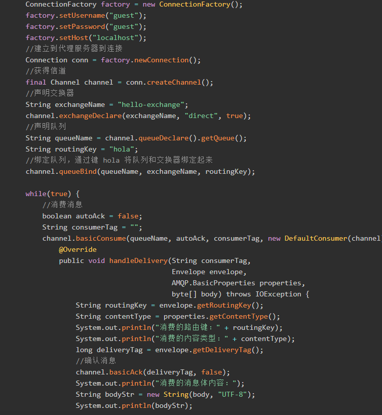
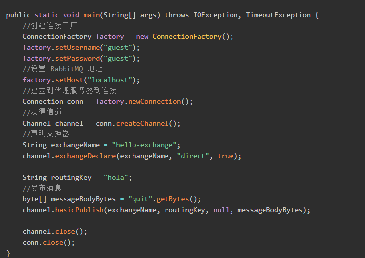

## 课程简介
RabbitMQ是实现了高级消息队列协议（AMQP）的开源消息代理软件（亦称面向消息的中间件）。本课程内容包括环境搭建、后台监控管理界面、发送队列、交换机、三种绑定模式、使用Java代码实现最基本的接受消息和发送消息。高级特性包括主题匹配、削峰机制、死信队列、在SpringBoot中整合RabbitMQ实现快速首发消息。本课程由浅入深，让你可以循序渐进的理解RabbitMQ的工作原理和开发步骤。

 

## 课程目标
学习完本课程掌握消息队列机制,原理以及开发步骤。掌握RabbitMQ 使用一些机制来保证可靠性，如持久化、传输确认、发布确认等知识。

## 适合人群
有java基础的学员

对高性能、高并发感兴趣的学员

想要掌握消息队列的学员

## 课程大纲
1. AMQP简介
2. RabbitMQ简介
3. RabbitMQ运行原理
4. Erlang安装
5. Rabbitmq安装
6. 创建Rabiitmq账户
7. Web管理插件可视化界面说明
8. 交换器Direct讲解
9. 交换器Fanout讲解
10. 交换器Topic讲解
11. 同步数据-项目搭建
12. 同步数据-Provider模块的编写
13. 同步数据-商品新增功能实
14. 课上练习-search项目搭建
15. 课上练习-同步solr数据
16. 同步数据-使用rabbitmq改写原代码(上)
17. 同步数据-使用rabbitmq改写原代码(下)

## 课程亮点
**关于课程的细节**

+ 针对的学生群体多是零基础同学，课程中更注重细节的培养，编程的养成在课程的初期尤其重要，课程过程中结合辅导老师指导，培养适合自己的编程体系

**关于课程的内容**

+ 我们针对课程的内容进行了科学研究，抓重点知识，设置以点盖面知识体系。
+ 让课程的受众群体更广，学习成本降到最低

**关于课程目标**

+ 前期化整为零，将大的项目拆分成知识点，融入到每一个小练习当中。以练习带动记忆，最后具备项目级开发的能力
+ 结合课堂知识，学练一体，为后期课程打下扎实基础

## 课程代码
 

## 讲师介绍
高级技术专家，曾就职于国内一线互联网企业，目前就职于知名互联网公司，拥有丰富的大型项目开发经验。多年IT从业经验，精通Java、JavaScript等语言，对JavaWeb框架、架构设计等有深入的理解和实践。