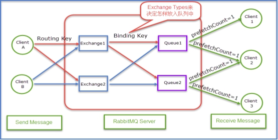

| **1.Message** |
| :--- |
| 消息。消息是不具名的，它由消息头消息体组成。消息体是不透明的，而消息头则由一系列可选属性组成，这些属性包括：routing-key(路由键)、priority(相对于其他消息的优先权)、delivery-mode(指出消息可能持久性存储)等。 |
| **2**.**Publisher** |
| 消息的生产者。也是一个向交换器发布消息的客户端应用程序。 |
| **3**.**Consumer** |
| 消息的消费者。表示一个从消息队列中取得消息的客户端应用程序。 |
| **4.Exchange** |
| 交换器。用来接收生产者发送的消息并将这些消息路由给服务器中的队列。三种常用的交换器类型1. direct(发布与订阅 完全匹配)2. fanout(广播)3. topic(主题，规则匹配) |
| **5.Binding** |
| 绑定。用于消息队列和交换器之间的关联。一个绑定就是基于路由键将交换器和消息队列连接起来的路由规则，所以可以将交换器理解成一个由绑定构成的路由表。 |
| **6.Queue** |
| 消息队列。用来保存消息直到发送给消费者。它是消息的容器，也是消息的终点。一个消息可投入一个或多个队列。消息一直在队列里面，等待消费者链接到这个队列将其取走。 |
| **7.Routing-key** |
| 路由键。RabbitMQ决定消息该投递到哪个队列的规则。（也可以理解为队列的名称，路由键是key，队列是value）队列通过路由键绑定到交换器。消息发送到MQ服务器时，消息将拥有一个路由键，即便是空的，RabbitMQ也会将其和绑定使用的路由键进行匹配。如果相匹配，消息将会投递到该队列。如果不匹配，消息将会进入黑洞。 |
| **8.Connection** |
| 链接。指rabbit服务器和服务建立的TCP链接。 |
| **9.Channel** |
| 信道。1，Channel中文叫做信道，是TCP里面的虚拟链接。例如：电缆相当于TCP，信道是一个独立光纤束，一条TCP连接上创建多条信道是没有问题的。2，TCP一旦打开，就会创建AMQP信道。3，无论是发布消息、接收消息、订阅队列，这些动作都是通过信道完成的。 |
| **10.Virtual Host** |
| 虚拟主机。表示一批交换器，消息队列和相关对象。虚拟主机是共享相同的身份认证和加密环境的独立服务器域。每个vhost本质上就是一个mini版的RabbitMQ服务器，拥有自己的队列、交换器、绑定和权限机制。vhost是AMQP概念的基础，必须在链接时指定，RabbitMQ默认的vhost是**/** |
| **11.Borker** |
| 表示消息队列服务器实体。 |
| **12.交换器和队列的关系** |
| 交换器是通过路由键和队列绑定在一起的，如果消息拥有的路由键跟队列和交换器的路由键匹配，那么消息就会被路由到该绑定的队列中。 也就是说，消息到队列的过程中，消息首先会经过交换器，接下来交换器在通过路由键匹配分发消息到具体的队列中。 路由键可以理解为匹配的规则。 |
| **13.RabbitMQ为什么需要信道？为什么不是TCP直接通信？** |
| 1. TCP的创建和销毁开销特别大。创建需要3次握手，销毁需要4次分手。2. 如果不用信道，那应用程序就会以TCP链接Rabbit，高峰时每秒成千上万条链接会造成资源巨大的浪费，而且操作系统每秒处理TCP链接数也是有限制的，必定造成性能瓶颈。3. 信道的原理是一条线程一条通道，多条线程多条通道同用一条TCP链接。一条TCP链接可以容纳无限的信道，即使每秒成千上万的请求也不会成为性能的瓶颈。 |