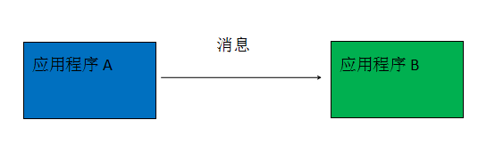
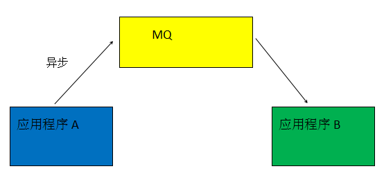

#### 1 **RabbitMQ介绍**
	RabbitMQ是由Erlang语言编写的基于AMQP的消息中间件。而消息中间件作为分布式系统重要组件之一，可以解决应用耦合，异步消息，流量削峰等问题。

##### 1.1 **解决应用耦合**
###### 1.1.1 **不使用MQ时**

###### 1.1.2 **使用MQ解决耦合**

#### 2 **RabbitMQ适用场景**
	排队算法 : 使用消息队列特性

	秒杀活动 : 使用消息队列特性

	消息分发 : 使用消息异步特性

	异步处理 : 使用消息异步特性

	数据同步 : 使用消息异步特性

	处理耗时任务 : 使用消息异步特性

	流量销峰