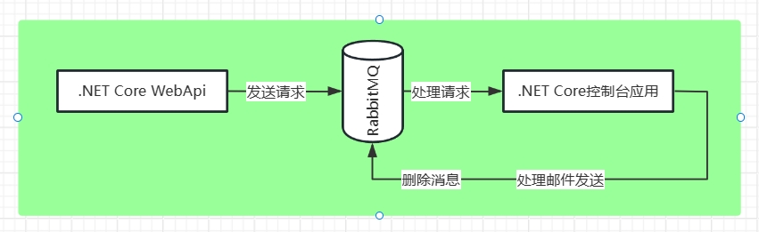
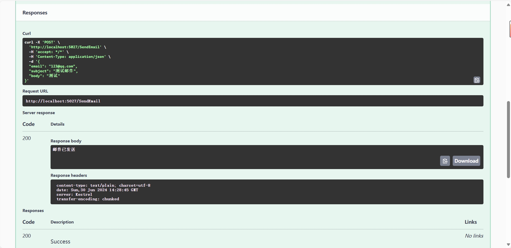
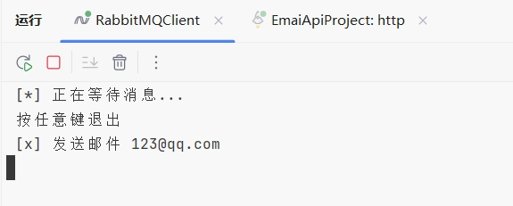
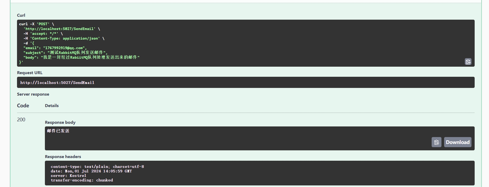
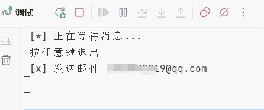
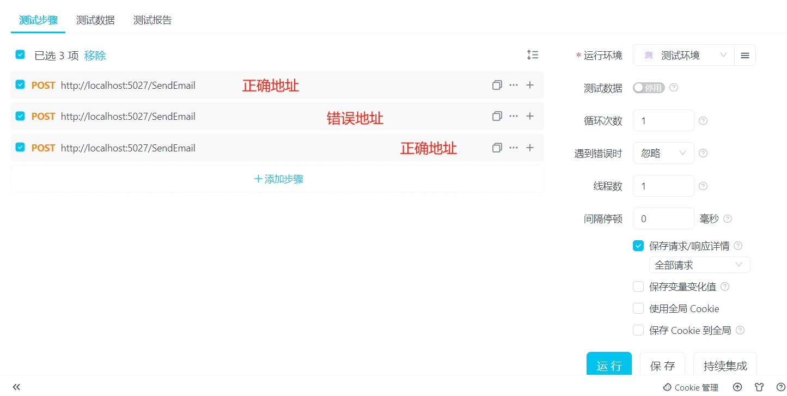
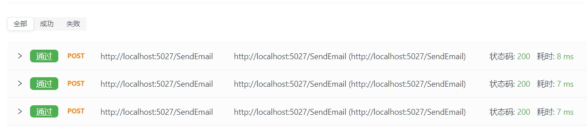
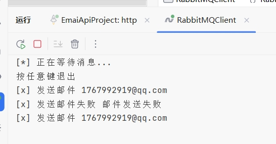
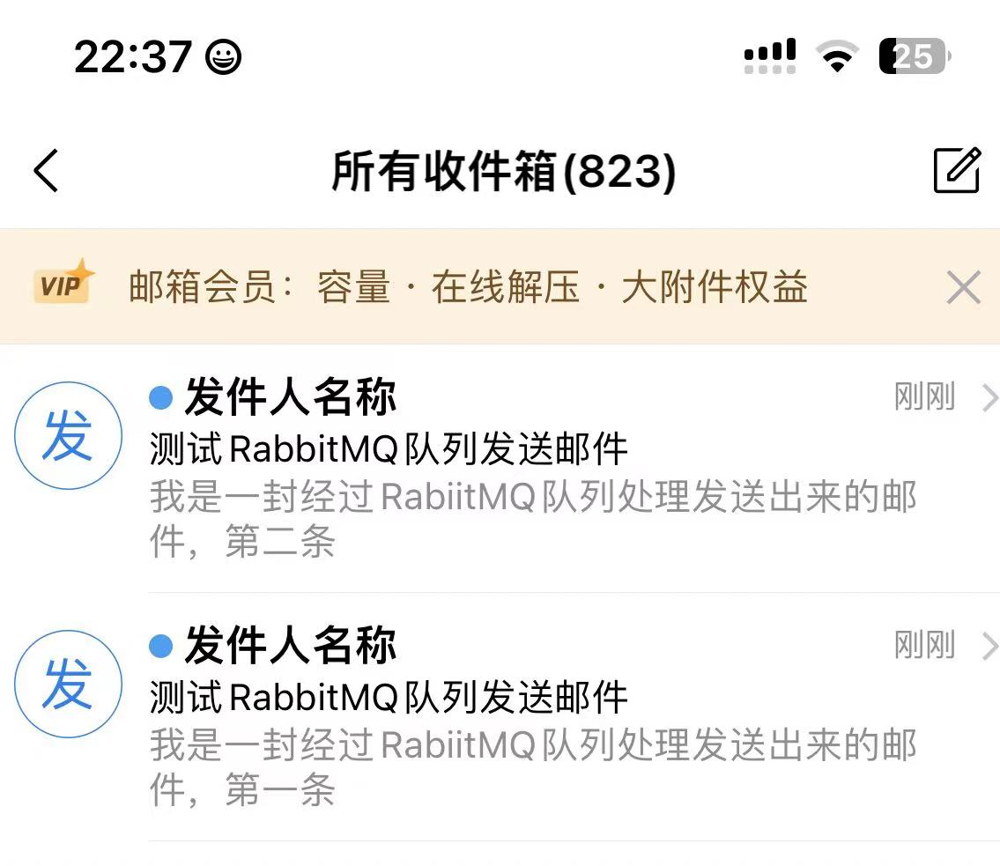

在C#中使用RabbitMQ做个简单的发送邮件小项目 - 妙妙屋（zy） - 博客园          

*    [](https://www.cnblogs.com/ "开发者的网上家园") 
*   [会员](https://cnblogs.vip/)
*   [众包](https://www.cnblogs.com/cmt/p/18500368)
*   [新闻](https://news.cnblogs.com/)
*   [博问](https://q.cnblogs.com/)
*   [闪存](https://ing.cnblogs.com/)
*   [赞助商](https://www.cnblogs.com/cmt/p/18341478)
*   [Trae](https://trae.cnblogs.com/)
*   [Chat2DB](https://chat2db-ai.com/)

*    
      
    
    *   
        
        所有博客
    *   
        
        当前博客
    *   
        
        我的博客
    
*    [](https://i.cnblogs.com/EditPosts.aspx?opt=1 "写随笔") [ 
     ](https://www.cnblogs.com/yehuoshun/ "我的博客") [ 
      ](https://msg.cnblogs.com/ "短消息") [](javascript:void(0) "简洁模式启用，您在访问他人博客时会使用简洁款皮肤展示") 
    
     [](https://home.cnblogs.com/u/yehuoshun) 
    
    [我的博客](https://www.cnblogs.com/yehuoshun/) [我的园子](https://home.cnblogs.com/) [账号设置](https://account.cnblogs.com/settings/account) [会员中心](https://vip.cnblogs.com/my) [简洁模式 ...](javascript:void(0) "简洁模式会使用简洁款皮肤显示所有博客") [退出登录](javascript:void(0))
    
    [注册](https://account.cnblogs.com/signup) [登录](javascript:void(0);)

[
](https://www.cnblogs.com/ZYPLJ/)

[ZYPLJ](https://www.cnblogs.com/ZYPLJ)
======================================

*   [博客园](https://www.cnblogs.com/)
*   [首页](https://www.cnblogs.com/ZYPLJ/)
*   [新随笔](https://i.cnblogs.com/EditPosts.aspx?opt=1)
*   [联系](https://msg.cnblogs.com/send/%E5%A6%99%E5%A6%99%E5%B1%8B%EF%BC%88zy%EF%BC%89)
*   [订阅](javascript:void(0))
*   [管理](https://i.cnblogs.com/)

[在C#中使用RabbitMQ做个简单的发送邮件小项目](https://www.cnblogs.com/ZYPLJ/p/18279034 "发布于 2024-07-02 08:32")
=============================================================================================

[合集 - .NET 技术合集(23)](/ZYPLJ/collections/2941)

[1..NET 文件上传服务设计2023-06-15](https://www.cnblogs.com/ZYPLJ/p/17483162.html)[2..NET项目中使用HtmlSanitizer防止XSS攻击2023-06-12](https://www.cnblogs.com/ZYPLJ/p/17475646.html)[3..NET 中使用RabbitMQ初体验2023-07-21](https://www.cnblogs.com/ZYPLJ/p/17572104.html)[4..NET中使用RabbitMQ延时队列和死信队列2023-07-30](https://www.cnblogs.com/ZYPLJ/p/17591838.html)[5.认识.NET 日志系统2023-08-28](https://www.cnblogs.com/ZYPLJ/p/17663487.html)[6..NET 认识日志系统-22023-08-30](https://www.cnblogs.com/ZYPLJ/p/17667970.html)[7..NET 日志系统-3 结构化日志和集中日志服务2023-09-01](https://www.cnblogs.com/ZYPLJ/p/17671522.html)[8.EF Core并发控制2023-09-03](https://www.cnblogs.com/ZYPLJ/p/17675494.html)[9..Net Framework使用Autofac实现依赖注入2023-09-12](https://www.cnblogs.com/ZYPLJ/p/17694895.html)[10.ASP.NET Core使用Hangfire定时发布文章2023-10-15](https://www.cnblogs.com/ZYPLJ/p/17765413.html)[11.记录EF 排序配上自定义的比较器2023-10-23](https://www.cnblogs.com/ZYPLJ/p/17783188.html)[12..NET Core MVC基础之页面传值方式📃2023-11-25](https://www.cnblogs.com/ZYPLJ/p/17854903.html)[13..NET Core MVC基础之返回文件类型2023-12-11](https://www.cnblogs.com/ZYPLJ/p/17895143.html)[14..NET Core WebAPI项目部署iis后Swagger 404问题解决2024-03-06](https://www.cnblogs.com/ZYPLJ/p/18057885)[15.在C#中进行单元测试2024-06-27](https://www.cnblogs.com/ZYPLJ/p/18270869)

16.在C#中使用RabbitMQ做个简单的发送邮件小项目2024-07-02

[17..NET Core搭配Vue开源弹幕效果，实现一个评论小项目。好玩！2024-09-09](https://www.cnblogs.com/ZYPLJ/p/18403223)[18..NET9 中替换Swagger使用Scalar01-22](https://www.cnblogs.com/ZYPLJ/p/18686930)[19.简单说说C#中委托的使用-0105-26](https://www.cnblogs.com/ZYPLJ/p/18897174)[20.基于SharpIco开发图片转ICO工具网站06-30](https://www.cnblogs.com/ZYPLJ/p/18957808)[21.SharpIcoWeb开发记录篇07-02](https://www.cnblogs.com/ZYPLJ/p/18961664)[22.dotnet Minimal APIs实现动态注册端点07-15](https://www.cnblogs.com/ZYPLJ/p/18985930)[23..Net Minimal APIs实现动态注册服务07-17](https://www.cnblogs.com/ZYPLJ/p/18988989)

收起

在C#中使用RabbitMQ做个简单的发送邮件小项目
==========================

前言
==

好久没有做项目了，这次做一个发送邮件的小项目。发邮件是一个比较耗时的操作，之前在我的个人博客里面回复评论和友链申请是会通过发送邮件来通知对方的，不过当时只是简单的进行了异步操作。  
那么这次来使用RabbitMQ去统一发送邮件，我的想法是通过调用邮件发送接口，将请求发送到队列。然后在队列中接收并执行邮件发送操作。  
本文采用简单的点对点模式：

> 在点对点模式中，只会有一个消费者进行消费。

对于常用的RabbitMQ队列模式不了解的可以查看往期文章：

*   [.NET 中使用RabbitMQ初体验 - 妙妙屋（zy） - 博客园 (cnblogs.com)](https://www.cnblogs.com/ZYPLJ/p/17572104.html) [https://www.cnblogs.com/ZYPLJ/p/17572104.html](https://www.cnblogs.com/ZYPLJ/p/17572104.html)
*   [ZY知识库 · ZY - 在.NET Core中使用RabbitMQ (pljzy.top)](https://pljzy.top/blog/post/fa670520e3df2839.html) [https://pljzy.top/blog/post/fa670520e3df2839.html](https://pljzy.top/blog/post/fa670520e3df2839.html)

架构图
===

[
](../images/3091176-20240701231656065-847505720.png)

简单描述下项目结构。项目主要分为生产者、RabbitMQ、消费者这3个对象。

*   **生产者（Publisher）**：负责将邮件发送请求发送到RabbitMQ的队列中。
*   **RabbitMQ服务器**：作为消息中间件，用于接收并存储生产者发送的消息。
*   **消费者（Consumer）**：从RabbitMQ的队列中接收邮件发送请求，并执行实际的邮件发送操作。

项目结构
====

*   RabbitMQEmailProject
    *   EamilApiProject 生产者
        *   Controllers 控制器
        *   Service 服务
    *   RabiitMQClient 消费者
        *   Program 主程序
    *   Model 实体类

开始编码(一阶段)
=========

首先我们先简单的将生产者和消费者代码完成，让生产者能够发送消息，消费者能够接受并处理消息。代码有点多，不过注释也多很容易看懂。  
给生产者和消费者都安装上用于处理RabiitMQ连接的Nuget包：

```null
dotnet add package RabbitMQ.Client

``` 

生产者
---

`EamilApiProject`

### 配置文件

`appsetting.json`

```null
"RabbitMQ": {  
  "Hostname": "localhost",  
  "Port": "5672",  
  "Username": "guest",  
  "Password": "guest"  
}

``` 

### 控制器

```null
[ApiController]  
[Route("[controller]")]  
public class SendEmailController : ControllerBase  
{  
    private readonly EmailService _emailService;  
  
    public SendEmailController(EmailService emailService)  
    {       
	     _emailService = emailService;  
    }  
    [HttpPost(Name = "SendEmail")]  
    public IActionResult Post([FromBody] EmailDto emailRequest)  
    {        
	    _emailService.SendEamil(emailRequest);  
        return Ok("邮件已发送");  
    }
}

``` 

### 服务

RabbitMQ连接服务

```null
public class RabbitMqConnectionFactory :IDisposable  
{  
    private readonly RabbitMqSettings _settings;  
    private IConnection _connection;  
  
    public RabbitMqConnectionFactory (IOptions<RabbitMqSettings> settings)  
    {       
	     _settings = settings.Value;  
    }  
    public IModel CreateChannel()  
    {        
    if (_connection == null || _connection.IsOpen == false)  
        {            
        var factory = new ConnectionFactory()  
            {  
                HostName = _settings.Hostname,  
                UserName = _settings.Username,  
                Password = _settings.Password  
            };  
            _connection = factory.CreateConnection();  
        }  
        return _connection.CreateModel();  
    }  
    public void Dispose()  
    {        
	    if (_connection != null)  
        {            
	        if (_connection.IsOpen)  
            {               
	             _connection.Close();  
            }            
            _connection.Dispose();  
        }    
    }
}

``` 

发送邮件服务

```null
public class EmailService
{
    private readonly RabbitMqConnectionFactory _connectionFactory;

    public EmailService(RabbitMqConnectionFactory connectionFactory)
    {
        _connectionFactory = connectionFactory;
    }
    public void SendEamil(EmailDto emailDto)
    {
        using var channel = _connectionFactory.CreateChannel();
        var properties = channel.CreateBasicProperties();
        properties.Persistent = true;//消息持久化
        
        var message = JsonConvert.SerializeObject(emailDto);
        var body = Encoding.UTF8.GetBytes(message);

        channel.BasicPublish( string.Empty, "email_queue", properties, body);
    }
}

``` 

注册服务

```null
builder.Services.Configure<RabbitMqSettings>(builder.Configuration.GetSection("RabbitMQ"));
builder.Services.AddSingleton<RabbitMqConnectionFactory >();
builder.Services.AddTransient<EmailService>();

``` 

实体
--

`Model`

```null
public class EmailDto  
{  
    /// <summary>  
    /// 邮箱地址  
    /// </summary>  
    public string Email { get; set; }  
    /// <summary>  
    /// 主题  
    /// </summary>  
    public string Subject { get; set; }  
    /// <summary>  
    /// 内容  
    /// </summary>  
    public string Body { get; set; }  
}

``` ```null
public class RabbitMqSettings  
{  
    public string Hostname { get; set; }  
    public string Port { get; set; }  
    public string Username { get; set; }  
    public string Password { get; set; }  
}

``` 

消费者
---

`RabiitMQClient`

```null
static void Main(string[] args)  
{  
    var factory = new ConnectionFactory { HostName = "localhost", Port = 5672, UserName = "guest", Password = "guest" };  
    using var connection = factory.CreateConnection();  
    using var channel = connection.CreateModel();  
  
    channel.QueueDeclare(queue: "email_queue",  
        durable: true,//是否持久化  
        exclusive: false,//是否排他  
        autoDelete: false,//是否自动删除  
        arguments: null);//参数  
  
    //这里可以设置prefetchCount的值，表示一次从队列中取多少条消息，默认是1，可以根据需要设置  
    //这里设置了prefetchCount为1，表示每次只取一条消息，然后处理完后再确认收到，这样可以保证消息的顺序性  
    //global是否全局  
    channel.BasicQos(prefetchSize: 0, prefetchCount: 1, global: false);  
  
    Console.WriteLine(" [*] 正在等待消息...");  
  
    //创建消费者  
    var consumer = new EventingBasicConsumer(channel);  
    //注册事件处理方法  
    consumer.Received += (model, ea) =>  
    {  
        byte[] body = ea.Body.ToArray();  
        var message = Encoding.UTF8.GetString(body);  
        var email = JsonConvert.DeserializeObject<EmailDto>(message);  
        Console.WriteLine(" [x] 发送邮件 {0}", email.Email);  
        //处理完消息后，确认收到  
        //multiple是否批量确认  
        channel.BasicAck(deliveryTag: ea.DeliveryTag, multiple: false);  
    };    //开始消费  
    //queue队列名  
    //autoAck是否自动确认，false表示手动确认  
    //consumer消费者  
    channel.BasicConsume(queue: "email_queue",  
        autoAck: false,  
        consumer: consumer);  
  
    Console.WriteLine(" 按任意键退出");  
    Console.ReadLine();  
}	

``` 

一阶段测试效果
=======

一阶段就是消费者和生产者能正常运行。

[
](../images/3091176-20240701231718551-1605431352.png)  
[
](../images/3091176-20240701231722190-344120581.png)

可以看到生产者发送邮件之后，消费者能够正常消费请求。那么开始二阶段，将邮件发送代码完成，并实现能够通过队列处理邮件发送。  
对于邮件发送失败就简单的做下处理，相对较好的解决方案就是使用死信队列，将发送失败的消息放到死信队列处理，我这里就不用死信队列，对于死信队列感兴趣的可以查看往期文章：

*   [.NET中使用RabbitMQ延时队列和死信队列 - 妙妙屋（zy） - 博客园 (cnblogs.com)](https://www.cnblogs.com/ZYPLJ/p/17591838.html)
*   [ZY知识库 · ZY - RabbitMQ延时队列和死信队列 (pljzy.top)](https://pljzy.top/blog/post/8a8b75ca23896940.html#)

开始编码(二阶段)
=========

简单的创建一个用于发送邮件的类，这里使用`MailKit`库发送邮件。

```null
public class EmailService  
{  
	private readonly SmtpClient client;  

	public EmailService(SmtpClient client)  
	{  
		this.client = client;  
	}  

	public async Task SendEmailAsync(string from, string to, string subject, string body)  
	{
		try
		{
			await client.ConnectAsync("smtp.163.com", 465, SecureSocketOptions.SslOnConnect); 
			// 认证  
			await client.AuthenticateAsync("zy1767992919@163.com", "");  

			// 创建一个邮件消息  
			var message = new MimeMessage(); 
			message.From.Add(new MailboxAddress("发件人名称", from));  
			message.To.Add(new MailboxAddress("收件人名称", to));  
			message.Subject = subject;  

			// 设置邮件正文  
			message.Body = new TextPart("html")  
			{  
				Text = body  
			};  

			// 发送邮件  
			var response =await client.SendAsync(message);  
			
			// 断开连接  
			await client.DisconnectAsync(true);  
		}
		catch (Exception ex)
		{
			// 断开连接  
			await client.DisconnectAsync(true);  
			throw new EmailServiceException("邮件发送失败", ex);  
		}
	}  
}  

public class EmailServiceFactory  
{  
	public EmailService CreateEmailService()  
	{  
		var client = new SmtpClient();  
		return new EmailService(client);  
	}  
}  
public class EmailServiceException : Exception  
{  
	public EmailServiceException(string message) : base(message)  
	{  
	}  

	public EmailServiceException(string message, Exception innerException) : base(message, innerException)  
	{  
	}  
}  

``` 

接下来我们在消费者中调用邮件发送方法即可，如果不使用死信队列，我们只需要在事件处理代码加上邮件发送逻辑就行了。

```null
consumer.Received += async (model, ea) =>
{
	byte[] body = ea.Body.ToArray();
	var message = Encoding.UTF8.GetString(body);
	
	var email = JsonConvert.DeserializeObject<EmailDto>(message);
	
	// 创建一个EmailServiceFactory实例
	var emailServiceFactory = new EmailServiceFactory();  
	  
	// 使用EmailServiceFactory创建一个EmailService实例  
	var emailService = emailServiceFactory.CreateEmailService();  
	  
	// 调用EmailService的SendEmailAsync方法来发送电子邮件  
	string from = "zy1767992919@163.com"; // 发件人地址  
	string to = email.Email; // 收件人地址  
	string subject = email.Subject; // 邮件主题  
	string emailbody = email.Body; // 邮件正文  
	  
	try  
	{  
		await emailService.SendEmailAsync(from, to, subject, emailbody);  
		Console.WriteLine(" [x] 发送邮件 {0}", email.Email);
	}  
	catch (Exception ex)  
	{  
		Console.WriteLine(" [x] 发送邮件失败 " + ex.Message);  
		//这里可以记录日志
		//可以使用BasicNack方法，重新回到队列，重新消费
	}  
	
	
	//处理完消息后，确认收到
	//multiple是否批量确认
	channel.BasicAck(deliveryTag: ea.DeliveryTag, multiple: false);
};

``` 

在上面中可以将发送失败的邮件重新放队列，多试几次，这里就不做多余的介绍了。

完成效果展示
======

一封正确的邮件
-------

ok，现在展示邮件发送Demo的完整展示。  
首先我们来写一个正确的邮箱地址进行发送：

[
](../images/3091176-20240701231742616-938955139.png)  
[
](../images/3091176-20240701231745813-472873235.png)  
[
](../images/3091176-20240701231808323-1233499817.jpg)

可以看到当我们发送请求之后，消费者正常消费了这条请求，同时邮件发送服务也正常执行。

多条发送邮件请求
--------

那么接下来，我们通过Api测试工具，一次性发送多条邮件请求。其中包含正确的邮箱地址、错误的邮箱地址，看看消费者能不能正常消费呢~  
这里简单的发送3条请求，2封正确的邮件地址，一封错误的，看看2封正常邮件地址的能不能正常发送出去。

> 这里有个问题，如果我填的邮件格式是正确的但是这个邮件地址是不存在的，他是能正常发送过去的，然后会被邮箱服务器退回来，这里不知道该怎么判断是否发送成功。所以我这的错误地址是格式就不对的邮件地址，用来模拟因为网络原因或者其他原因导致的邮件发送不成功。

[
](../images/3091176-20240701231824863-1520350267.png)  
[
](../images/3091176-20240701231828368-319461238.png)  
[
](../images/3091176-20240701231831652-909666453.png)  
[
](../images/3091176-20240701231835433-1872102055.jpg)

可以看到3条请求都成功了，并且消费者接收到并正确消费了。2条正确邮件也收到了，1条错误的邮件也捕获到了。

总结
==

本文通过使用`RabiitMQ`点对点模式来完成一个发送邮件的小项目，通过队列去处理邮件发送。  
通过`RabbitMQ.Client`库去连接RabbitMQ服务器。  
使用`MailKit`库发送邮件。  
通过使用RabbitMQ来避免邮件发送请求时间长的问题，同时能在消费者中重试、记录发送失败的邮件，来统一发送、统一处理。  
不足点就是被退回的邮件不知道该如何处理。  
可优化点：

*   可以使用`WorkQueues`工作队列队列模式将消息分发给多个消费者，适用于消息量较大的情况。
*   可以使用死信队列处理发送失败的邮件

参考链接
====

*   [RabbitMQ tutorial - Work Queues | RabbitMQ](https://www.rabbitmq.com/tutorials/tutorial-two-dotnet) [https://www.rabbitmq.com/tutorials/tutorial-two-dotnet](https://www.rabbitmq.com/tutorials/tutorial-two-dotnet)
*   [.NET 中使用RabbitMQ初体验 - 妙妙屋（zy） - 博客园 (cnblogs.com)](https://www.cnblogs.com/ZYPLJ/p/17572104.html) [https://www.cnblogs.com/ZYPLJ/p/17572104.html](https://www.cnblogs.com/ZYPLJ/p/17572104.html)
*   [ZY知识库 · ZY - RabbitMQ延时队列和死信队列 (pljzy.top)](https://pljzy.top/blog/post/8a8b75ca23896940.html) [https://pljzy.top/blog/post/8a8b75ca23896940.html](https://pljzy.top/blog/post/8a8b75ca23896940.html)

*   [在C#中使用RabbitMQ做个简单的发送邮件小项目](#在c中使用rabbitmq做个简单的发送邮件小项目)
*   [前言](#前言)
*   [架构图](#架构图)
*   [项目结构](#项目结构)
*   [开始编码(一阶段)](#开始编码一阶段)
*   [    生产者](#生产者)
*   [        配置文件](#配置文件)
*   [        控制器](#控制器)
*   [        服务](#服务)
*   [    实体](#实体)
*   [    消费者](#消费者)
*   [一阶段测试效果](#一阶段测试效果)
*   [开始编码(二阶段)](#开始编码二阶段)
*   [完成效果展示](#完成效果展示)
*   [    一封正确的邮件](#一封正确的邮件)
*   [    多条发送邮件请求](#多条发送邮件请求)
*   [总结](#总结)
*   [参考链接](#参考链接)

  

\_\_EOF\_\_

[
](../images/20230208231503.png)

*   **本文作者：**  [妙妙屋（zy）](https://www.cnblogs.com/ZYPLJ)
*   **本文链接：**  [https://www.cnblogs.com/ZYPLJ/p/18279034](https://www.cnblogs.com/ZYPLJ/p/18279034)
*   **关于博主：**  评论和私信会在第一时间回复。或者[直接私信](https://msg.cnblogs.com/msg/send/ZYPLJ)我。
*   **版权声明：**  本博客所有文章除特别声明外，均采用 [BY-NC-SA](https://creativecommons.org/licenses/by-nc-sa/4.0/ "BY-NC-SA") 许可协议。转载请注明出处！
*   **声援博主：**  如果您觉得文章对您有帮助，可以点击文章右下角**【[推荐](javascript:void(0);)】** 一下。

合集: [.NET 技术合集](https://www.cnblogs.com/ZYPLJ/collections/2941) , [杂七杂八](https://www.cnblogs.com/ZYPLJ/collections/4272)

标签: [.NET](https://www.cnblogs.com/ZYPLJ/tag/.NET/), [C#](https://www.cnblogs.com/ZYPLJ/tag/C%23/), [RabbitMQ](https://www.cnblogs.com/ZYPLJ/tag/RabbitMQ/)

[好文要顶](javascript:void(0);)推荐该文

[关注我](javascript:void(0);)关注博主关注博主 [收藏该文](javascript:void(0);)收藏本文 [微信分享](javascript:void(0);)分享微信

[
](https://home.cnblogs.com/u/ZYPLJ/)

[妙妙屋（zy）](https://home.cnblogs.com/u/ZYPLJ/)  
[粉丝 - 72](https://home.cnblogs.com/u/ZYPLJ/followers/) [关注 - 7](https://home.cnblogs.com/u/ZYPLJ/followees/)  

[+加关注](javascript:void(0);)

5

1

[«](https://www.cnblogs.com/ZYPLJ/p/18275380) 上一篇： [记录一次Windows下安装RabbitMQ](https://www.cnblogs.com/ZYPLJ/p/18275380 "发布于 2024-06-29 16:54")  
[»](https://www.cnblogs.com/ZYPLJ/p/18306505) 下一篇： [设计模式-C#实现简单工厂模式](https://www.cnblogs.com/ZYPLJ/p/18306505 "发布于 2024-07-17 08:44")

posted @ 2024-07-02 08:32  [妙妙屋（zy）](https://www.cnblogs.com/ZYPLJ)  阅读(1522)  评论(10)    [收藏](javascript:void(0))  [举报](javascript:void(0))

  

评论列表

默认 | 按时间 | 按支持数

[
](https://www.cnblogs.com/maojiayuan/)

   [回复](javascript:void(0);) [引用](javascript:void(0);)

[#1楼](#5282353) 2024-07-02 15:19 [2604529](https://www.cnblogs.com/maojiayuan/)

从我项目经验看，轮询比mq靠谱多了。。mq需要解决宕机问题，用了新东西势必引发新问题。。

[支持(1)](javascript:void(0);) [反对(0)](javascript:void(0);)

../images/u117648.jpg

[
](https://www.cnblogs.com/ZYPLJ/)

   [回复](javascript:void(0);) [引用](javascript:void(0);)

[#2楼](#5282354) \[楼主\] 2024-07-02 15:24 [妙妙屋（zy）](https://www.cnblogs.com/ZYPLJ/)

[@](#5282353 "查看所回复的评论")2604529  
用来做小项目玩玩就行了，主要是学习下如何使用。目前工作上也用不到mq😂

[支持(0)](javascript:void(0);) [反对(0)](javascript:void(0);)

../images/20230208231503.png

[
](https://www.cnblogs.com/maojiayuan/)

   [回复](javascript:void(0);) [引用](javascript:void(0);)

[#3楼](#5282355) 2024-07-02 15:27 [2604529](https://www.cnblogs.com/maojiayuan/)

[@](#5282354 "查看所回复的评论")妙妙屋（zy）  
需要学习mq宕机的解决办法，等你分享。

[支持(0)](javascript:void(0);) [反对(0)](javascript:void(0);)

../images/u117648.jpg

[
](https://home.cnblogs.com/u/3404052/)

   [回复](javascript:void(0);) [引用](javascript:void(0);)

[#4楼](#5282468) 2024-07-03 09:33 [学习是生命中最美的词](https://home.cnblogs.com/u/3404052/)

使用消息队列可以看看[MassTransit](https://github.com/MassTransit/MassTransit),这个sample可以看看https://github.com/hgmauri/sample-masstransit

[支持(0)](javascript:void(0);) [反对(0)](javascript:void(0);)

[
](https://www.cnblogs.com/ZYPLJ/)

   [回复](javascript:void(0);) [引用](javascript:void(0);)

[#5楼](#5282480) \[楼主\] 2024-07-03 10:05 [妙妙屋（zy）](https://www.cnblogs.com/ZYPLJ/)

[@](#5282468 "查看所回复的评论")学习是生命中最美的词  
可以 有时间去看看 🤔

[支持(0)](javascript:void(0);) [反对(0)](javascript:void(0);)

../images/20230208231503.png

[
](https://www.cnblogs.com/daoge/)

   [回复](javascript:void(0);) [引用](javascript:void(0);)

[#6楼](#5282527) 2024-07-03 12:37 [Dockyyyyy](https://www.cnblogs.com/daoge/)

我没用过队列组件，像这种情景，我们一般是不同生产者将待发送邮件放入一个统一的数据库，再由一个统一的程序做消费者轮询进行发送，虽然轮询有一定的滞后性，但邮件这种形式，几分钟的延时是可以接受的。

[支持(1)](javascript:void(0);) [反对(0)](javascript:void(0);)

../images/20150506135047.png

[
](https://www.cnblogs.com/vipwan/)

   [回复](javascript:void(0);) [引用](javascript:void(0);)

[#7楼](#5282589) 2024-07-03 16:10 [万雅虎](https://www.cnblogs.com/vipwan/)

[@](#5282527 "查看所回复的评论")Harris-Z  
他应该只是阐述下mq的使用方法, 至于发邮件短信这种 一般还需要溯源回执什么的 确实是持久化轮询消费的多, 一般mq主要的使用方式是服务和服务之间沟通 ,比如 订单服务下单成功 然后mq发一条消息给邮箱服务(客人下单成功了,我得邮箱发一下清单给客户) , 邮箱服务取到mq后持久化, 然后轮询消费

[支持(1)](javascript:void(0);) [反对(0)](javascript:void(0);)

../images/u127598.jpg

[
](https://www.cnblogs.com/kananet/)

   [回复](javascript:void(0);) [引用](javascript:void(0);)

[#8楼](#5282687) 2024-07-04 09:09 [上帝说网名一定要长](https://www.cnblogs.com/kananet/)

一个消费者就要创建一个控制台吗？如果想要多个消费者去处理耗时的任务，不会得创建多个控制台程序吧

[支持(0)](javascript:void(0);) [反对(0)](javascript:void(0);)

[
](https://www.cnblogs.com/ZYPLJ/)

   [回复](javascript:void(0);) [引用](javascript:void(0);)

[#9楼](#5282710) \[楼主\] 2024-07-04 09:59 [妙妙屋（zy）](https://www.cnblogs.com/ZYPLJ/)

[@](#5282687 "查看所回复的评论")上帝说网名一定要长  
不一定，可以一个消费者一个控制台程序，也可以在一个控制台中创建多个消费者，也可以使用后台服务来作为消费者。如何选择就看你的需求了。

[支持(0)](javascript:void(0);) [反对(0)](javascript:void(0);)

../images/20230208231503.png

[
](https://www.cnblogs.com/daoge/)

   [回复](javascript:void(0);) [引用](javascript:void(0);)

[#10楼](#5282935) 5282935 2024/7/5 09:02:11 2024-07-05 09:02 [Dockyyyyy](https://www.cnblogs.com/daoge/)

[@](#5282589 "查看所回复的评论")万雅虎  
感谢讲解，我未能接触过你说的业务场景，所以感触不深，目前我仅视mq为备选方案和一个知识点的存在。

[支持(0)](javascript:void(0);) [反对(0)](javascript:void(0);)

../images/20150506135047.png

[刷新评论](javascript:void(0);)[刷新页面](#)[返回顶部](#top)

发表评论 [升级成为园子VIP会员](https://cnblogs.vip/)

编辑 预览

c6df3402-7d42-46d7-9688-08d9b4008d6c

 自动补全

 [不改了](javascript:void(0);) [退出](javascript:void(0);) [订阅评论](javascript:void(0); "订阅后有新评论时会邮件通知您") [我的博客](//www.cnblogs.com/yehuoshun/)

\[Ctrl+Enter快捷键提交\]

[【推荐】100%开源！大型工业跨平台软件C++源码提供，建模，组态！](http://www.uccpsoft.com/index.htm)  
[【推荐】AI 的力量，开发者的翅膀：欢迎使用 AI 原生开发工具 TRAE](https://www.cnblogs.com/cmt/p/19004092)  
[【推荐】2025 HarmonyOS 鸿蒙创新赛正式启动，百万大奖等你挑战](https://www.cnblogs.com/HarmonyOS5/p/18974773)  
[【推荐】轻量又高性能的 SSH 工具 IShell：AI 加持，快人一步](http://ishell.cc/)  

 [](https://www.cnblogs.com/cmt/p/18894723) 

**相关博文：**   

·  [.NET 中使用RabbitMQ初体验](https://www.cnblogs.com/ZYPLJ/p/17572104.html ".NET 中使用RabbitMQ初体验")

·  [.NET中使用RabbitMQ延时队列和死信队列](https://www.cnblogs.com/ZYPLJ/p/17591838.html ".NET中使用RabbitMQ延时队列和死信队列")

·  [rabbitmq](https://www.cnblogs.com/GaoUpUp/p/17879653.html "rabbitmq")

·  [C# RabbitMQ的使用](https://www.cnblogs.com/sexintercourse/p/16344319.html "C# RabbitMQ的使用")

·  [C# 封装RabbitMQ消息队列处理](https://www.cnblogs.com/Alex80/p/18756704 "C# 封装RabbitMQ消息队列处理")

**阅读排行：**   
· [抽象与性能：从 LINQ 看现代 .NET 的优化之道](https://www.cnblogs.com/sdcb/p/19013541/linq-abstraction-and-perf-modern-programming-language)  
· [Coze工作流实战：一键上传excel生成数据图表](https://www.cnblogs.com/lucky_hu/p/19018899)  
· [Trae Plus 让没有编程基础的女朋友也用上了 AI Coding](https://www.cnblogs.com/caituotuo/p/19019858)  
· [程序员究竟要不要写文章](https://www.cnblogs.com/xiaoxi666/p/19019449)  
· [MySQL 23 MySQL是怎么保证数据不丢的？](https://www.cnblogs.com/san-mu/p/19007778)  

在C#中使用RabbitMQ做个简单 \_
=====================

2024-07-02 08:321522105  
1039720:47 ~ 34:39

[.NET](https://www.cnblogs.com/ZYPLJ/tag/.NET/)[C#](https://www.cnblogs.com/ZYPLJ/tag/C%23/)[RabbitMQ](https://www.cnblogs.com/ZYPLJ/tag/RabbitMQ/)

[Scroll Down](javascript:void(0);)

   欢迎访问本博客~


昵称： [妙妙屋（zy）](https://home.cnblogs.com/u/ZYPLJ/)  
园龄： [2年6个月](https://home.cnblogs.com/u/ZYPLJ/ "入园时间：2023-02-04")  
粉丝： [72](https://home.cnblogs.com/u/ZYPLJ/followers/)  
关注： [7](https://home.cnblogs.com/u/ZYPLJ/followees/)

[+加关注](javascript:void(0))

随笔 - 72 文章 - 1 评论 - 112 阅读 - 36943

| 
| [<](javascript:void(0);) | 2025年8月 | [\>](javascript:void(0);) | |
| 日 | 一 | 二 | 三 | 四 | 五 | 六 |
| 27 | 28 | 29 | 30 | 31 | 1 | 2 |
| 3 | 4 | 5 | 6 | 7 | 8 | 9 |
| 10 | 11 | 12 | 13 | 14 | 15 | 16 |
| 17 | 18 | 19 | 20 | 21 | 22 | 23 |
| 24 | 25 | 26 | 27 | 28 | 29 | 30 |
| 31 | 1 | 2 | 3 | 4 | 5 | 6 |

*   [积分排名](javascript:void(0))
    
    *   [积分 - 39454](javascript:void(0);)
    *   [排名 - 43519](javascript:void(0);)
    
*   [最新随笔](javascript:void(0))
    
    *   [基于Astro开发的Fuwari静态博客模版配置CICD流程](https://www.cnblogs.com/ZYPLJ/p/19012706)
    *   [.Net Minimal APIs实现动态注册服务](https://www.cnblogs.com/ZYPLJ/p/18988989)
    *   [dotnet Minimal APIs实现动态注册端点](https://www.cnblogs.com/ZYPLJ/p/18985930)
    *   [SharpIcoWeb开发记录篇](https://www.cnblogs.com/ZYPLJ/p/18961664)
    *   [基于SharpIco开发图片转ICO工具网站](https://www.cnblogs.com/ZYPLJ/p/18957808)
    *   [简单说说C#中委托的使用-01](https://www.cnblogs.com/ZYPLJ/p/18897174)
    *   [SqlServer 中行转列PIVOT函数用法](https://www.cnblogs.com/ZYPLJ/p/18783932)
    *   [关于我用Claude 3.7 Sonnet模型直接生成小程序](https://www.cnblogs.com/ZYPLJ/p/18758578)
    *   [解决uniapp使用Font Awesome图标无法显示问题](https://www.cnblogs.com/ZYPLJ/p/18756492)
    *   [.NET Core + Vue3 个人博客后台系统更新啦~](https://www.cnblogs.com/ZYPLJ/p/18710924)
    
*   [我的标签](javascript:void(0))
    
    *   [.NET(49)](https://www.cnblogs.com/ZYPLJ/tag/.NET/)
    *   [C#(45)](https://www.cnblogs.com/ZYPLJ/tag/C%23/)
    *   [服务器(8)](https://www.cnblogs.com/ZYPLJ/tag/%E6%9C%8D%E5%8A%A1%E5%99%A8/)
    *   [Vue(7)](https://www.cnblogs.com/ZYPLJ/tag/Vue/)
    *   [Docker(6)](https://www.cnblogs.com/ZYPLJ/tag/Docker/)
    *   [html(3)](https://www.cnblogs.com/ZYPLJ/tag/html/)
    *   [EF Core(3)](https://www.cnblogs.com/ZYPLJ/tag/EF%20Core/)
    *   [css(3)](https://www.cnblogs.com/ZYPLJ/tag/css/)
    *   [算法设计(3)](https://www.cnblogs.com/ZYPLJ/tag/%E7%AE%97%E6%B3%95%E8%AE%BE%E8%AE%A1/)
    *   [RabbitMQ(2)](https://www.cnblogs.com/ZYPLJ/tag/RabbitMQ/)
    *   [更多](https://www.cnblogs.com/ZYPLJ/tag/)
    
*   [随笔分类](javascript:void(0))
    
*   [文章分类](javascript:void(0))
    
*   [阅读排行](javascript:void(0))
    
    *   [.NET Core WebApi接口ip限流实践(2016)](https://www.cnblogs.com/ZYPLJ/p/17243389.html)
    *   [vue＋.net入门级书签项目(1881)](https://www.cnblogs.com/ZYPLJ/p/17133550.html)
    *   [.NET Core WebAPI项目部署iis后Swagger 404问题解决(1744)](https://www.cnblogs.com/ZYPLJ/p/18057885)
    *   [在C#中使用RabbitMQ做个简单的发送邮件小项目(1522)](https://www.cnblogs.com/ZYPLJ/p/18279034)
    *   [在C#中进行单元测试(1480)](https://www.cnblogs.com/ZYPLJ/p/18270869)
    
*   [推荐排行](javascript:void(0))
    
    *   [设计模式-C#实现简单工厂模式(10)](https://www.cnblogs.com/ZYPLJ/p/18306505)
    *   [在C#中进行单元测试(9)](https://www.cnblogs.com/ZYPLJ/p/18270869)
    *   [vue＋.net入门级书签项目(7)](https://www.cnblogs.com/ZYPLJ/p/17133550.html)
    *   [在C#中使用RabbitMQ做个简单的发送邮件小项目(5)](https://www.cnblogs.com/ZYPLJ/p/18279034)
    *   [基于.NET Core + Jquery实现文件断点分片上传(5)](https://www.cnblogs.com/ZYPLJ/p/17263430.html)
    
*   [最新评论](javascript:void(0))
    
    *   [Re:dotnet Minimal APIs实现动态注册端点](https://www.cnblogs.com/ZYPLJ/p/18985930)
        
        @Dark丶潇洒哥 这个问题问的不不错，但是使用Minimal不是为了AOT哦，sharpico项目确实用到了AOT，但是它是控制台程序，我这个只是作为接口调用它，提供了接口和GUI，并没有使用AOT...
        
        \--妙妙屋（zy）
        
    *   [Re:dotnet Minimal APIs实现动态注册端点](https://www.cnblogs.com/ZYPLJ/p/18985930)
        
        使用Minimal 是为了AOT，你又加了反射，那为啥不使用控制器呢，这样的好处在哪里呢？
        
        \--Dark丶潇洒哥
        
    *   [Re:基于SharpIco开发图片转ICO工具网站](https://www.cnblogs.com/ZYPLJ/p/18957808)
        
        mark，感谢分享
        
        \--ad313
        
    *   [Re:SharpIcoWeb开发记录篇](https://www.cnblogs.com/ZYPLJ/p/18961664)
        
        @longware 之前被百度收录了 上午还能搜到 下午就搜不到了 太惨了...
        
        \--妙妙屋（zy）
        
    *   [Re:SharpIcoWeb开发记录篇](https://www.cnblogs.com/ZYPLJ/p/18961664)
        
        也算是有GUI了
        
        \--longware
        
    
*   [随笔档案](javascript:void(0))
    
    *   [2025年7月(4)](https://www.cnblogs.com/ZYPLJ/p/archive/2025/07)
    *   [2025年6月(1)](https://www.cnblogs.com/ZYPLJ/p/archive/2025/06)
    *   [2025年5月(1)](https://www.cnblogs.com/ZYPLJ/p/archive/2025/05)
    *   [2025年3月(3)](https://www.cnblogs.com/ZYPLJ/p/archive/2025/03)
    *   [2025年2月(1)](https://www.cnblogs.com/ZYPLJ/p/archive/2025/02)
    *   [2025年1月(1)](https://www.cnblogs.com/ZYPLJ/p/archive/2025/01)
    *   [2024年11月(2)](https://www.cnblogs.com/ZYPLJ/p/archive/2024/11)
    *   [2024年9月(2)](https://www.cnblogs.com/ZYPLJ/p/archive/2024/09)
    *   [2024年7月(2)](https://www.cnblogs.com/ZYPLJ/p/archive/2024/07)
    *   [2024年6月(2)](https://www.cnblogs.com/ZYPLJ/p/archive/2024/06)
    *   [2024年3月(1)](https://www.cnblogs.com/ZYPLJ/p/archive/2024/03)
    *   [2024年1月(1)](https://www.cnblogs.com/ZYPLJ/p/archive/2024/01)
    *   [2023年12月(1)](https://www.cnblogs.com/ZYPLJ/p/archive/2023/12)
    *   [2023年11月(2)](https://www.cnblogs.com/ZYPLJ/p/archive/2023/11)
    *   [2023年10月(6)](https://www.cnblogs.com/ZYPLJ/p/archive/2023/10)
    *   [2023年9月(4)](https://www.cnblogs.com/ZYPLJ/p/archive/2023/09)
    *   [2023年8月(7)](https://www.cnblogs.com/ZYPLJ/p/archive/2023/08)
    *   [2023年7月(6)](https://www.cnblogs.com/ZYPLJ/p/archive/2023/07)
    *   [2023年6月(10)](https://www.cnblogs.com/ZYPLJ/p/archive/2023/06)
    *   [2023年5月(4)](https://www.cnblogs.com/ZYPLJ/p/archive/2023/05)
    *   [2023年4月(2)](https://www.cnblogs.com/ZYPLJ/p/archive/2023/04)
    *   [2023年3月(5)](https://www.cnblogs.com/ZYPLJ/p/archive/2023/03)
    *   [2023年2月(4)](https://www.cnblogs.com/ZYPLJ/p/archive/2023/02)
    
*   [文章档案](javascript:void(0))
    
    *   [2023年2月(1)](https://www.cnblogs.com/ZYPLJ/articles/archive/2023/02)
    

[首页](https://www.cnblogs.com/ZYPLJ)

[联系](https://msg.cnblogs.com/send/ZYPLJ)

[订阅](javascript:void(0))

[管理](https://i.cnblogs.com/)

Created with Snap

MENU

### 公告

文章目录

访问主页

5

1

 Alipay

 WeChat

qrCode

关注

点击开启

跳至底部

昵称： [妙妙屋（zy）](https://home.cnblogs.com/u/ZYPLJ/)  
园龄： [2年6个月](https://home.cnblogs.com/u/ZYPLJ/ "入园时间：2023-02-04")  
粉丝： [72](https://home.cnblogs.com/u/ZYPLJ/followers/)  
关注： [7](https://home.cnblogs.com/u/ZYPLJ/followees/)

[+加关注](javascript:void(0))

### 搜索

 

### 常用链接

*   [我的随笔](https://www.cnblogs.com/ZYPLJ/p/ "我的博客的随笔列表")
*   [我的评论](https://www.cnblogs.com/ZYPLJ/MyComments.html "我的发表过的评论列表")
*   [我的参与](https://www.cnblogs.com/ZYPLJ/OtherPosts.html "我评论过的随笔列表")
*   [最新评论](https://www.cnblogs.com/ZYPLJ/comments "我的博客的评论列表")
*   [我的标签](https://www.cnblogs.com/ZYPLJ/tag/ "我的博客的标签列表")

### 最新随笔

*   [1.基于Astro开发的Fuwari静态博客模版配置CICD流程](https://www.cnblogs.com/ZYPLJ/p/19012706)
*   [2..Net Minimal APIs实现动态注册服务](https://www.cnblogs.com/ZYPLJ/p/18988989)
*   [3.dotnet Minimal APIs实现动态注册端点](https://www.cnblogs.com/ZYPLJ/p/18985930)
*   [4.SharpIcoWeb开发记录篇](https://www.cnblogs.com/ZYPLJ/p/18961664)
*   [5.基于SharpIco开发图片转ICO工具网站](https://www.cnblogs.com/ZYPLJ/p/18957808)
*   [6.简单说说C#中委托的使用-01](https://www.cnblogs.com/ZYPLJ/p/18897174)
*   [7.SqlServer 中行转列PIVOT函数用法](https://www.cnblogs.com/ZYPLJ/p/18783932)
*   [8.关于我用Claude 3.7 Sonnet模型直接生成小程序](https://www.cnblogs.com/ZYPLJ/p/18758578)
*   [9.解决uniapp使用Font Awesome图标无法显示问题](https://www.cnblogs.com/ZYPLJ/p/18756492)
*   [10..NET Core + Vue3 个人博客后台系统更新啦~](https://www.cnblogs.com/ZYPLJ/p/18710924)

### [我的标签](https://www.cnblogs.com/ZYPLJ/tag/)

*   [.NET(49)](https://www.cnblogs.com/ZYPLJ/tag/.NET/)
*   [C#(45)](https://www.cnblogs.com/ZYPLJ/tag/C%23/)
*   [服务器(8)](https://www.cnblogs.com/ZYPLJ/tag/%E6%9C%8D%E5%8A%A1%E5%99%A8/)
*   [Vue(7)](https://www.cnblogs.com/ZYPLJ/tag/Vue/)
*   [Docker(6)](https://www.cnblogs.com/ZYPLJ/tag/Docker/)
*   [html(3)](https://www.cnblogs.com/ZYPLJ/tag/html/)
*   [EF Core(3)](https://www.cnblogs.com/ZYPLJ/tag/EF%20Core/)
*   [css(3)](https://www.cnblogs.com/ZYPLJ/tag/css/)
*   [算法设计(3)](https://www.cnblogs.com/ZYPLJ/tag/%E7%AE%97%E6%B3%95%E8%AE%BE%E8%AE%A1/)
*   [RabbitMQ(2)](https://www.cnblogs.com/ZYPLJ/tag/RabbitMQ/)
*   [更多](https://www.cnblogs.com/ZYPLJ/tag/)

### 积分与排名

*   积分 - 39454
*   排名 - 43519

### 合集

*   [ZY知识库图片项目(3)](https://www.cnblogs.com/ZYPLJ/collections/2189)
*   [ZY知识库(15)](https://www.cnblogs.com/ZYPLJ/collections/2723)
*   [.NET 技术合集(23)](https://www.cnblogs.com/ZYPLJ/collections/2941)
*   [杂七杂八(16)](https://www.cnblogs.com/ZYPLJ/collections/4272)
*   [Python(1)](https://www.cnblogs.com/ZYPLJ/collections/5230)
*   [树洞(2)](https://www.cnblogs.com/ZYPLJ/collections/21115)
*   [算法简单篇(1)](https://www.cnblogs.com/ZYPLJ/collections/22779)

### 随笔档案

*   [2025年7月(4)](https://www.cnblogs.com/ZYPLJ/p/archive/2025/07)
*   [2025年6月(1)](https://www.cnblogs.com/ZYPLJ/p/archive/2025/06)
*   [2025年5月(1)](https://www.cnblogs.com/ZYPLJ/p/archive/2025/05)
*   [2025年3月(3)](https://www.cnblogs.com/ZYPLJ/p/archive/2025/03)
*   [2025年2月(1)](https://www.cnblogs.com/ZYPLJ/p/archive/2025/02)
*   [2025年1月(1)](https://www.cnblogs.com/ZYPLJ/p/archive/2025/01)
*   [2024年11月(2)](https://www.cnblogs.com/ZYPLJ/p/archive/2024/11)
*   [2024年9月(2)](https://www.cnblogs.com/ZYPLJ/p/archive/2024/09)
*   [2024年7月(2)](https://www.cnblogs.com/ZYPLJ/p/archive/2024/07)
*   [2024年6月(2)](https://www.cnblogs.com/ZYPLJ/p/archive/2024/06)
*   [2024年3月(1)](https://www.cnblogs.com/ZYPLJ/p/archive/2024/03)
*   [2024年1月(1)](https://www.cnblogs.com/ZYPLJ/p/archive/2024/01)
*   [2023年12月(1)](https://www.cnblogs.com/ZYPLJ/p/archive/2023/12)
*   [2023年11月(2)](https://www.cnblogs.com/ZYPLJ/p/archive/2023/11)
*   [2023年10月(6)](https://www.cnblogs.com/ZYPLJ/p/archive/2023/10)
*   [2023年9月(4)](https://www.cnblogs.com/ZYPLJ/p/archive/2023/09)
*   [2023年8月(7)](https://www.cnblogs.com/ZYPLJ/p/archive/2023/08)
*   [2023年7月(6)](https://www.cnblogs.com/ZYPLJ/p/archive/2023/07)
*   [2023年6月(10)](https://www.cnblogs.com/ZYPLJ/p/archive/2023/06)
*   [2023年5月(4)](https://www.cnblogs.com/ZYPLJ/p/archive/2023/05)
*   [2023年4月(2)](https://www.cnblogs.com/ZYPLJ/p/archive/2023/04)
*   [2023年3月(5)](https://www.cnblogs.com/ZYPLJ/p/archive/2023/03)
*   [2023年2月(4)](https://www.cnblogs.com/ZYPLJ/p/archive/2023/02)

### 文章档案

*   [2023年2月(1)](https://www.cnblogs.com/ZYPLJ/articles/archive/2023/02)

### [阅读排行榜](https://www.cnblogs.com/ZYPLJ/most-viewed)

*   [1\. .NET Core WebApi接口ip限流实践(2016)](https://www.cnblogs.com/ZYPLJ/p/17243389.html)
*   [2\. vue＋.net入门级书签项目(1881)](https://www.cnblogs.com/ZYPLJ/p/17133550.html)
*   [3\. .NET Core WebAPI项目部署iis后Swagger 404问题解决(1744)](https://www.cnblogs.com/ZYPLJ/p/18057885)
*   [4\. 在C#中使用RabbitMQ做个简单的发送邮件小项目(1522)](https://www.cnblogs.com/ZYPLJ/p/18279034)
*   [5\. 在C#中进行单元测试(1480)](https://www.cnblogs.com/ZYPLJ/p/18270869)

### [评论排行榜](https://www.cnblogs.com/ZYPLJ/most-commented)

*   [1\. 在C#中使用RabbitMQ做个简单的发送邮件小项目(10)](https://www.cnblogs.com/ZYPLJ/p/18279034)
*   [2\. 双非本科求职经验分享(10)](https://www.cnblogs.com/ZYPLJ/p/17720585.html)
*   [3\. 设计模式-C#实现简单工厂模式(9)](https://www.cnblogs.com/ZYPLJ/p/18306505)
*   [4\. .NET Core WebApi接口ip限流实践(7)](https://www.cnblogs.com/ZYPLJ/p/17243389.html)
*   [5\. SSM框架笔记 庆祝学习SSM框架结束！！！(6)](https://www.cnblogs.com/ZYPLJ/p/17270208.html)

### [推荐排行榜](https://www.cnblogs.com/ZYPLJ/most-liked)

*   [1\. 设计模式-C#实现简单工厂模式(10)](https://www.cnblogs.com/ZYPLJ/p/18306505)
*   [2\. 在C#中进行单元测试(9)](https://www.cnblogs.com/ZYPLJ/p/18270869)
*   [3\. vue＋.net入门级书签项目(7)](https://www.cnblogs.com/ZYPLJ/p/17133550.html)
*   [4\. 在C#中使用RabbitMQ做个简单的发送邮件小项目(5)](https://www.cnblogs.com/ZYPLJ/p/18279034)
*   [5\. 基于.NET Core + Jquery实现文件断点分片上传(5)](https://www.cnblogs.com/ZYPLJ/p/17263430.html)

### [最新评论](https://www.cnblogs.com/ZYPLJ/comments)

*   [1\. Re:dotnet Minimal APIs实现动态注册端点](https://www.cnblogs.com/ZYPLJ/p/18985930)
*   @Dark丶潇洒哥 这个问题问的不不错，但是使用Minimal不是为了AOT哦，sharpico项目确实用到了AOT，但是它是控制台程序，我这个只是作为接口调用它，提供了接口和GUI，并没有使用AOT...
*   \--妙妙屋（zy）
*   [2\. Re:dotnet Minimal APIs实现动态注册端点](https://www.cnblogs.com/ZYPLJ/p/18985930)
*   使用Minimal 是为了AOT，你又加了反射，那为啥不使用控制器呢，这样的好处在哪里呢？
    
*   \--Dark丶潇洒哥
*   [3\. Re:基于SharpIco开发图片转ICO工具网站](https://www.cnblogs.com/ZYPLJ/p/18957808)
*   mark，感谢分享
    
*   \--ad313
*   [4\. Re:SharpIcoWeb开发记录篇](https://www.cnblogs.com/ZYPLJ/p/18961664)
*   @longware 之前被百度收录了 上午还能搜到 下午就搜不到了 太惨了...
*   \--妙妙屋（zy）
*   [5\. Re:SharpIcoWeb开发记录篇](https://www.cnblogs.com/ZYPLJ/p/18961664)
*   也算是有GUI了
    
*   \--longware

\[ ##textLeft## ##textRight## \]

This blog has running : 911 d 23 h 31 m 26 s ღゝ◡╹)ノ♡

##linksHtml##

博客园  ©  2004-2025 浙公网安备 33010602011771号 浙ICP备2021040463号-3

1.  1 够爱（翻自 曾沛慈） 是我呀卡司宝贝
2.  2 老人と海 ヨルシカ
3.  3 主角 沉画文阁,马里奥,曲杨,draceana
4.  4 Wings！You Are My Future Wthegg

老人と海 \- ヨルシカ

00:00 / 03:06

作词 : n-buna

作曲 : n-buna

编曲 : n-buna

靴紐が解けてる 木漏れ日は足を舐む

息を吸う音だけ聞こえてる

貴方は今立ち上がる 古びた椅子の上から

柔らかい麻の匂いがする

遥か遠くへ まだ遠くへ

遥か遠くへ まだ遠くへ

僕らは身体も脱ぎ去って

まだ遠くへ 雲も越えてまだ向こうへ

風に乗って

僕の想像力という重力の向こうへ

まだ遠くへ まだ遠くへ

海の方へ

靴紐が解けてる 蛇みたいに跳ね遊ぶ

靴紐が解けてる 蛇みたいに跳ね遊ぶ

貴方の靴が気になる

僕らは今歩き出す 潮風は肌を舐む

手を引かれるままの道

さぁまだ遠くへ まだ遠くへ

さぁまだ遠くへ まだ遠くへ

僕らはただの風になって

まだ遠くへ 雲も越えてまだ向こうへ

風に乗って 僕ら想像力という縛りを抜け出して

まだ遠くへ まだ遠くへ 海の方へ

靴紐が解けてる 僕はついにしゃがみ込む

靴紐が解けてる 僕はついにしゃがみ込む

鳥の鳴く声だけ聞こえてる

肩をそっと叩かれてようやく僕は気が付く

海がもう目の先にある

あぁまだ遠くへ まだ遠くへ

あぁまだ遠くへ まだ遠くへ

僕らは心だけになって

まだ遠くへ 海も越えてまだ向こうへ

風に乗って 僕の想像力という重力の向こうへ

まだ遠くへ まだ遠くへ

海の方へ

僕らは今靴を脱ぐ さざなみは足を舐む

僕らは今靴を脱ぐ さざなみは足を舐む

貴方の眼は遠くを見る

ライオンが戯れるアフリカの砂浜は

海のずっと向こうにある

 

点击右上角即可分享

