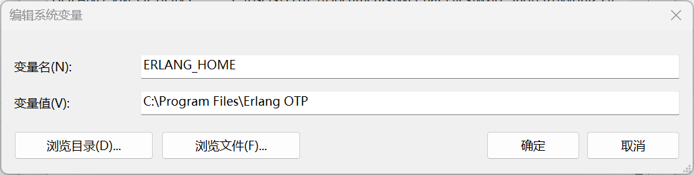
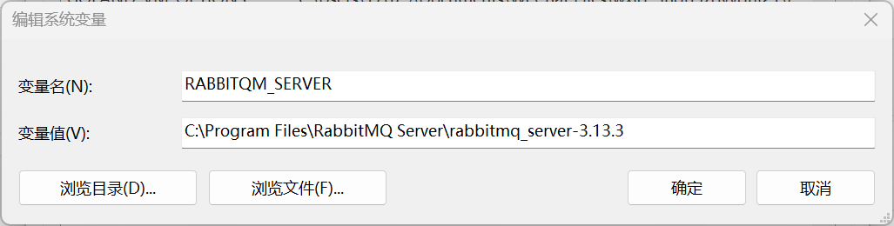
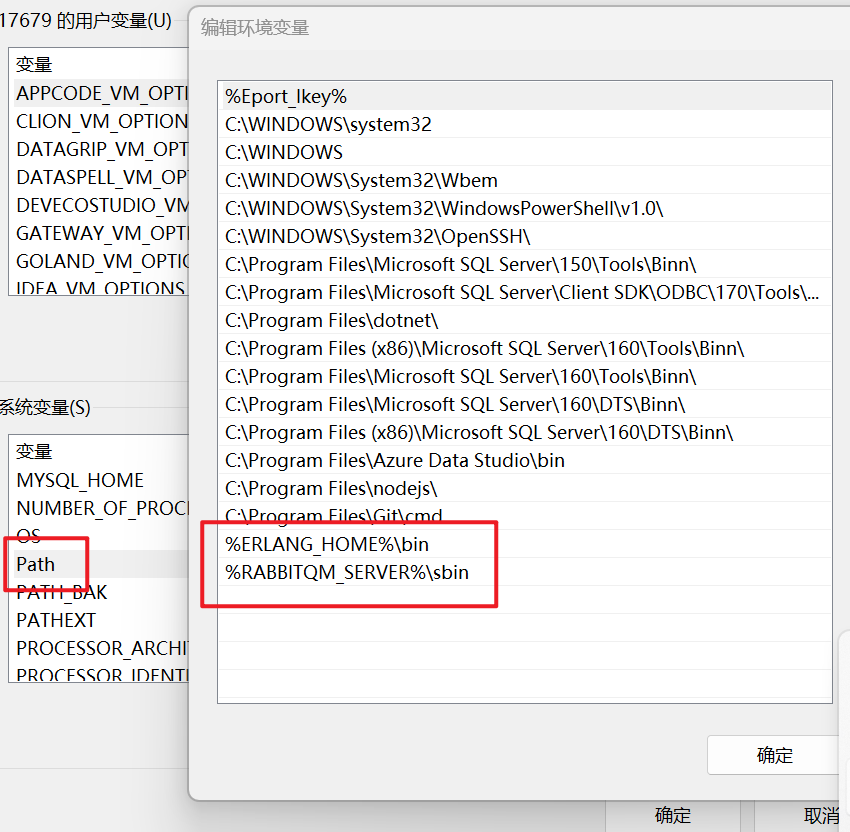
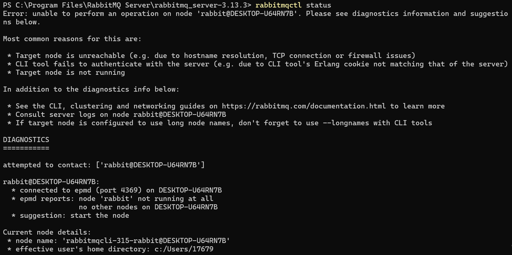
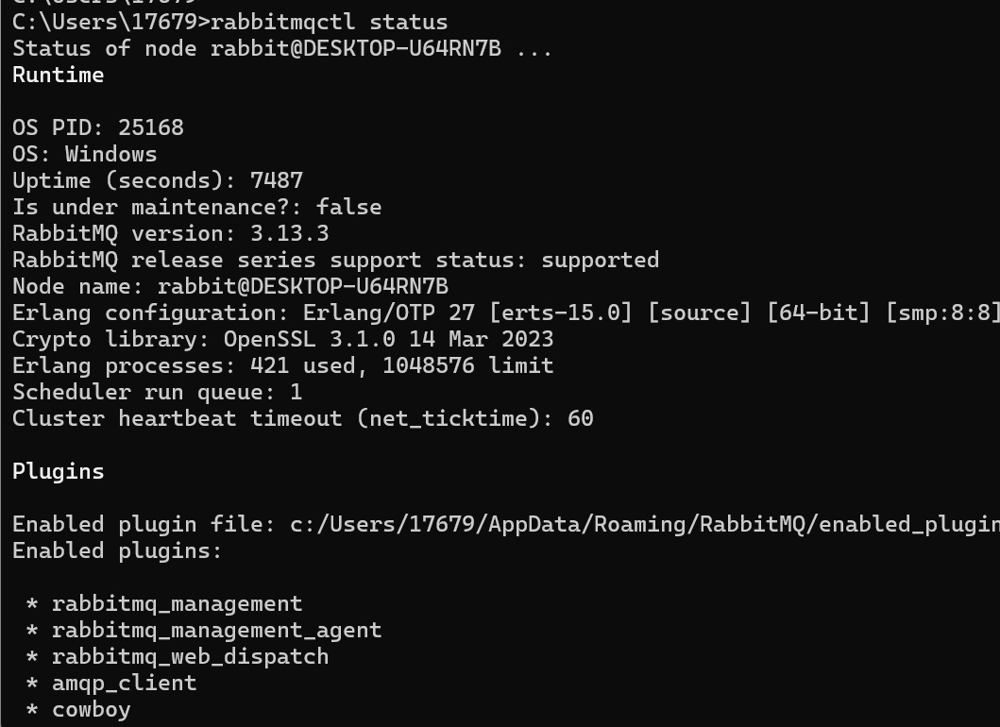
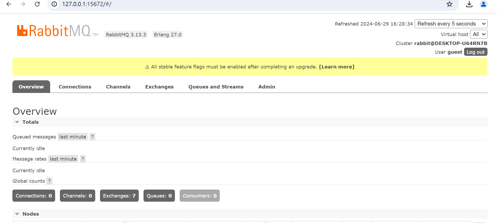

记录一次Windows下安装RabbitMQ - 妙妙屋（zy） - 博客园          

*    [](https://www.cnblogs.com/ "开发者的网上家园") 
*   [会员](https://cnblogs.vip/)
*   [众包](https://www.cnblogs.com/cmt/p/18500368)
*   [新闻](https://news.cnblogs.com/)
*   [博问](https://q.cnblogs.com/)
*   [闪存](https://ing.cnblogs.com/)
*   [赞助商](https://www.cnblogs.com/cmt/p/18341478)
*   [Trae](https://trae.cnblogs.com/)
*   [Chat2DB](https://chat2db-ai.com/)

*    
      
    
    *   
        
        所有博客
    *   
        
        当前博客
    *   
        
        我的博客
    
*    [](https://i.cnblogs.com/EditPosts.aspx?opt=1 "写随笔") [ 
     ](https://www.cnblogs.com/yehuoshun/ "我的博客") [ 
      ](https://msg.cnblogs.com/ "短消息") [](javascript:void(0) "简洁模式启用，您在访问他人博客时会使用简洁款皮肤展示") 
    
     [](https://home.cnblogs.com/u/yehuoshun) 
    
    [我的博客](https://www.cnblogs.com/yehuoshun/) [我的园子](https://home.cnblogs.com/) [账号设置](https://account.cnblogs.com/settings/account) [会员中心](https://vip.cnblogs.com/my) [简洁模式 ...](javascript:void(0) "简洁模式会使用简洁款皮肤显示所有博客") [退出登录](javascript:void(0))
    
    [注册](https://account.cnblogs.com/signup) [登录](javascript:void(0);)

[
](https://www.cnblogs.com/ZYPLJ/)

[ZYPLJ](https://www.cnblogs.com/ZYPLJ)
======================================

*   [博客园](https://www.cnblogs.com/)
*   [首页](https://www.cnblogs.com/ZYPLJ/)
*   [新随笔](https://i.cnblogs.com/EditPosts.aspx?opt=1)
*   [联系](https://msg.cnblogs.com/send/%E5%A6%99%E5%A6%99%E5%B1%8B%EF%BC%88zy%EF%BC%89)
*   [订阅](javascript:void(0))
*   [管理](https://i.cnblogs.com/)

[记录一次Windows下安装RabbitMQ](https://www.cnblogs.com/ZYPLJ/p/18275380 "发布于 2024-06-29 16:54")
=========================================================================================

[合集 - 杂七杂八(16)](/ZYPLJ/collections/4272)

[1.什么？博客园主题比我的个人博客好看？😮2023-07-17](https://www.cnblogs.com/ZYPLJ/p/17558916.html)[2.记录一次EF实体跟踪错误2023-08-23](https://www.cnblogs.com/ZYPLJ/p/17651675.html)[3.双非本科求职经验分享2023-09-21](https://www.cnblogs.com/ZYPLJ/p/17720585.html)[4.Debian安装Redis服务2023-10-13](https://www.cnblogs.com/ZYPLJ/p/17763211.html)[5.原生js实现下拉框可输入2023-10-19](https://www.cnblogs.com/ZYPLJ/p/17773476.html)[6.300元到手啦-阿里云云工开物计划 阿里云要给所有中国高校在读大学生每人送一台云服务器2023-10-31](https://www.cnblogs.com/ZYPLJ/p/17801715.html)[7.Sql Server中Cross Apply关键字的使用2023-11-12](https://www.cnblogs.com/ZYPLJ/p/17826882.html)

8.记录一次Windows下安装RabbitMQ2024-06-29

[9.在C#中使用RabbitMQ做个简单的发送邮件小项目2024-07-02](https://www.cnblogs.com/ZYPLJ/p/18279034)[10.设计模式-C#实现简单工厂模式2024-07-17](https://www.cnblogs.com/ZYPLJ/p/18306505)[11..NET Core搭配Vue开源弹幕效果，实现一个评论小项目。好玩！2024-09-09](https://www.cnblogs.com/ZYPLJ/p/18403223)[12.记录一次NPOI库导出Excel遇到的小问题解决方案2024-11-23](https://www.cnblogs.com/ZYPLJ/p/18564491)[13.解决uniapp使用Font Awesome图标无法显示问题03-06](https://www.cnblogs.com/ZYPLJ/p/18756492)[14.关于我用Claude 3.7 Sonnet模型直接生成小程序03-07](https://www.cnblogs.com/ZYPLJ/p/18758578)[15.SqlServer 中行转列PIVOT函数用法03-20](https://www.cnblogs.com/ZYPLJ/p/18783932)[16.基于Astro开发的Fuwari静态博客模版配置CICD流程07-30](https://www.cnblogs.com/ZYPLJ/p/19012706)

收起

前言
--

周六在公司加班，干完活后越显无聊，想着下载`RabbiitMQ`做个小项目玩玩。然而这一下就下载了2个小时，真让人头痛。  
简单的讲一下如何安装吧，网上教程和踩坑文章还是很多的，我讲我感觉有用的文章放在本文末尾。

安装地址
----

*   erlang [下载 - Erlang/OTP](https://www.erlang.org/downloads) [https://www.erlang.org/downloads](https://www.erlang.org/downloads)
*   RabbitMQ [Installing on Windows | RabbitMQ](https://www.rabbitmq.com/docs/install-windows) [https://www.rabbitmq.com/docs/install-windows](https://www.rabbitmq.com/docs/install-windows)

安装步骤
----

无脑Next就行

环境变量
----

先放图：  
[
](../images/3091176-20240629165228877-144097022.png)  
[
](../images/3091176-20240629165234562-1186109345.png)  
[
](../images/3091176-20240629165240177-1105539942.png)  
图1、图2变量值替换成你安装的位置。  
图3需要编辑系统变量Path，然后添加下面2段代码：

```null
%ERLANG_HOME%\bin

``` ```null
%RABBITQM_SERVER%\sbin

``` 

测试安装
----

问题就出现在这里，我一直以为我没安装成功，看图：  
[](undefined)  
打开控制台输入`erl`,和上图一致则是安装成功，然后是mq，输入`rabbitmq-server start`没有出现Error则启动成功。  
然后我看了文章末尾的2篇链接，安装完后都是要输入`rabbitmqctl status`来测试是否安装成功，然而我输了很多次都是如图错误  
[
](../images/3091176-20240629165255117-1670898548.png)

然后我以为是`.erlang.cookie`文件的问题，找了很久也只找到一个文件，网上的教程都说有2个文件，当我准备放弃的时候，我翻看了评论区，然后发现要先启动才行。  
正确的流程是：

1.  `rabbitmq-server start`
2.  `rabbitmqctl status`  
    启动之后输入`rabbitmqctl status`就行了 如图：  
    [
    ](../images/3091176-20240629165310660-1571463708.png)

安装可视化插件
-------

在mq安装目录打开控制台输入如下指令：

```null
rabbitmq-plugins enable rabbitmq_management

``` 

成功启动
----

网址：[http://127.0.0.1:15672/](http://127.0.0.1:15672/)  
账号：guest  
密码：guest  
[
](../images/3091176-20240629165328363-1502347355.png)

参考链接
----

*   [https://blog.csdn.net/qq\_25919879/article/details/113055350](https://blog.csdn.net/qq_25919879/article/details/113055350)
*   [https://blog.csdn.net/xch\_yang/article/details/136758177](https://blog.csdn.net/xch_yang/article/details/136758177)

*   [前言](#前言)
*   [安装地址](#安装地址)
*   [安装步骤](#安装步骤)
*   [环境变量](#环境变量)
*   [测试安装](#测试安装)
*   [安装可视化插件](#安装可视化插件)
*   [成功启动](#成功启动)
*   [参考链接](#参考链接)

  

\_\_EOF\_\_

[
](../images/20230208231503.png)

*   **本文作者：**  [妙妙屋（zy）](https://www.cnblogs.com/ZYPLJ)
*   **本文链接：**  [https://www.cnblogs.com/ZYPLJ/p/18275380](https://www.cnblogs.com/ZYPLJ/p/18275380)
*   **关于博主：**  评论和私信会在第一时间回复。或者[直接私信](https://msg.cnblogs.com/msg/send/ZYPLJ)我。
*   **版权声明：**  本博客所有文章除特别声明外，均采用 [BY-NC-SA](https://creativecommons.org/licenses/by-nc-sa/4.0/ "BY-NC-SA") 许可协议。转载请注明出处！
*   **声援博主：**  如果您觉得文章对您有帮助，可以点击文章右下角**【[推荐](javascript:void(0);)】** 一下。

合集: [杂七杂八](https://www.cnblogs.com/ZYPLJ/collections/4272)

标签: [RabbitMQ](https://www.cnblogs.com/ZYPLJ/tag/RabbitMQ/)

[好文要顶](javascript:void(0);)推荐该文

[关注我](javascript:void(0);)关注博主关注博主 [收藏该文](javascript:void(0);)收藏本文 [微信分享](javascript:void(0);)分享微信

[
](https://home.cnblogs.com/u/ZYPLJ/)

[妙妙屋（zy）](https://home.cnblogs.com/u/ZYPLJ/)  
[粉丝 - 72](https://home.cnblogs.com/u/ZYPLJ/followers/) [关注 - 7](https://home.cnblogs.com/u/ZYPLJ/followees/)  

[+加关注](javascript:void(0);)

0

0

[«](https://www.cnblogs.com/ZYPLJ/p/18270869) 上一篇： [在C#中进行单元测试](https://www.cnblogs.com/ZYPLJ/p/18270869 "发布于 2024-06-27 11:54")  
[»](https://www.cnblogs.com/ZYPLJ/p/18279034) 下一篇： [在C#中使用RabbitMQ做个简单的发送邮件小项目](https://www.cnblogs.com/ZYPLJ/p/18279034 "发布于 2024-07-02 08:32")

posted @ 2024-06-29 16:54  [妙妙屋（zy）](https://www.cnblogs.com/ZYPLJ)  阅读(202)  评论(0)    [收藏](javascript:void(0))  [举报](javascript:void(0))

[刷新评论](javascript:void(0);)[刷新页面](#)[返回顶部](#top)

发表评论 [升级成为园子VIP会员](https://cnblogs.vip/)

编辑 预览

c6df3402-7d42-46d7-9688-08d9b4008d6c

 自动补全

 [不改了](javascript:void(0);) [退出](javascript:void(0);) [订阅评论](javascript:void(0); "订阅后有新评论时会邮件通知您") [我的博客](//www.cnblogs.com/yehuoshun/)

\[Ctrl+Enter快捷键提交\]

[【推荐】100%开源！大型工业跨平台软件C++源码提供，建模，组态！](http://www.uccpsoft.com/index.htm)  
[【推荐】AI 的力量，开发者的翅膀：欢迎使用 AI 原生开发工具 TRAE](https://www.cnblogs.com/cmt/p/19004092)  
[【推荐】2025 HarmonyOS 鸿蒙创新赛正式启动，百万大奖等你挑战](https://www.cnblogs.com/HarmonyOS5/p/18974773)  
[【推荐】轻量又高性能的 SSH 工具 IShell：AI 加持，快人一步](http://ishell.cc/)  

 [](https://www.cnblogs.com/cmt/p/18894723) 

**相关博文：**   

·  [.NET 中使用RabbitMQ初体验](https://www.cnblogs.com/ZYPLJ/p/17572104.html ".NET 中使用RabbitMQ初体验")

·  [在C#中使用RabbitMQ做个简单的发送邮件小项目](https://www.cnblogs.com/ZYPLJ/p/18279034 "在C#中使用RabbitMQ做个简单的发送邮件小项目")

·  [Windows下安装RabbitMQ](https://www.cnblogs.com/become/p/16009303.html "Windows下安装RabbitMQ")

·  [Windows下安装RabbitMQ](https://www.cnblogs.com/tiger-yam/p/15946038.html "Windows下安装RabbitMQ")

·  [RabbitMq的安装 Windows](https://www.cnblogs.com/zhouxiuquan/p/16685034.html "RabbitMq的安装 Windows")

**阅读排行：**   
· [抽象与性能：从 LINQ 看现代 .NET 的优化之道](https://www.cnblogs.com/sdcb/p/19013541/linq-abstraction-and-perf-modern-programming-language)  
· [Coze工作流实战：一键上传excel生成数据图表](https://www.cnblogs.com/lucky_hu/p/19018899)  
· [Trae Plus 让没有编程基础的女朋友也用上了 AI Coding](https://www.cnblogs.com/caituotuo/p/19019858)  
· [程序员究竟要不要写文章](https://www.cnblogs.com/xiaoxi666/p/19019449)  
· [MySQL 23 MySQL是怎么保证数据不丢的？](https://www.cnblogs.com/san-mu/p/19007778)  

**历史上的今天：**   
2023-06-29 [.NET 个人博客-添加RSS订阅功能](https://www.cnblogs.com/ZYPLJ/p/17514916.html)  

记录一次Windows下安装Rab \_
====================

2024-06-29 16:5420200  
17733:32 ~ 5:54

[RabbitMQ](https://www.cnblogs.com/ZYPLJ/tag/RabbitMQ/)

[Scroll Down](javascript:void(0);)

   欢迎访问本博客~


昵称： [妙妙屋（zy）](https://home.cnblogs.com/u/ZYPLJ/)  
园龄： [2年6个月](https://home.cnblogs.com/u/ZYPLJ/ "入园时间：2023-02-04")  
粉丝： [72](https://home.cnblogs.com/u/ZYPLJ/followers/)  
关注： [7](https://home.cnblogs.com/u/ZYPLJ/followees/)

[+加关注](javascript:void(0))

随笔 - 72 文章 - 1 评论 - 112 阅读 - 36940

| 
| [<](javascript:void(0);) | 2025年8月 | [\>](javascript:void(0);) | |
| 日 | 一 | 二 | 三 | 四 | 五 | 六 |
| 27 | 28 | 29 | 30 | 31 | 1 | 2 |
| 3 | 4 | 5 | 6 | 7 | 8 | 9 |
| 10 | 11 | 12 | 13 | 14 | 15 | 16 |
| 17 | 18 | 19 | 20 | 21 | 22 | 23 |
| 24 | 25 | 26 | 27 | 28 | 29 | 30 |
| 31 | 1 | 2 | 3 | 4 | 5 | 6 |

*   [积分排名](javascript:void(0))
    
    *   [积分 - 39454](javascript:void(0);)
    *   [排名 - 43519](javascript:void(0);)
    
*   [最新随笔](javascript:void(0))
    
    *   [基于Astro开发的Fuwari静态博客模版配置CICD流程](https://www.cnblogs.com/ZYPLJ/p/19012706)
    *   [.Net Minimal APIs实现动态注册服务](https://www.cnblogs.com/ZYPLJ/p/18988989)
    *   [dotnet Minimal APIs实现动态注册端点](https://www.cnblogs.com/ZYPLJ/p/18985930)
    *   [SharpIcoWeb开发记录篇](https://www.cnblogs.com/ZYPLJ/p/18961664)
    *   [基于SharpIco开发图片转ICO工具网站](https://www.cnblogs.com/ZYPLJ/p/18957808)
    *   [简单说说C#中委托的使用-01](https://www.cnblogs.com/ZYPLJ/p/18897174)
    *   [SqlServer 中行转列PIVOT函数用法](https://www.cnblogs.com/ZYPLJ/p/18783932)
    *   [关于我用Claude 3.7 Sonnet模型直接生成小程序](https://www.cnblogs.com/ZYPLJ/p/18758578)
    *   [解决uniapp使用Font Awesome图标无法显示问题](https://www.cnblogs.com/ZYPLJ/p/18756492)
    *   [.NET Core + Vue3 个人博客后台系统更新啦~](https://www.cnblogs.com/ZYPLJ/p/18710924)
    
*   [我的标签](javascript:void(0))
    
    *   [.NET(49)](https://www.cnblogs.com/ZYPLJ/tag/.NET/)
    *   [C#(45)](https://www.cnblogs.com/ZYPLJ/tag/C%23/)
    *   [服务器(8)](https://www.cnblogs.com/ZYPLJ/tag/%E6%9C%8D%E5%8A%A1%E5%99%A8/)
    *   [Vue(7)](https://www.cnblogs.com/ZYPLJ/tag/Vue/)
    *   [Docker(6)](https://www.cnblogs.com/ZYPLJ/tag/Docker/)
    *   [html(3)](https://www.cnblogs.com/ZYPLJ/tag/html/)
    *   [EF Core(3)](https://www.cnblogs.com/ZYPLJ/tag/EF%20Core/)
    *   [css(3)](https://www.cnblogs.com/ZYPLJ/tag/css/)
    *   [算法设计(3)](https://www.cnblogs.com/ZYPLJ/tag/%E7%AE%97%E6%B3%95%E8%AE%BE%E8%AE%A1/)
    *   [RabbitMQ(2)](https://www.cnblogs.com/ZYPLJ/tag/RabbitMQ/)
    *   [更多](https://www.cnblogs.com/ZYPLJ/tag/)
    
*   [随笔分类](javascript:void(0))
    
*   [文章分类](javascript:void(0))
    
*   [阅读排行](javascript:void(0))
    
    *   [.NET Core WebApi接口ip限流实践(2016)](https://www.cnblogs.com/ZYPLJ/p/17243389.html)
    *   [vue＋.net入门级书签项目(1881)](https://www.cnblogs.com/ZYPLJ/p/17133550.html)
    *   [.NET Core WebAPI项目部署iis后Swagger 404问题解决(1744)](https://www.cnblogs.com/ZYPLJ/p/18057885)
    *   [在C#中使用RabbitMQ做个简单的发送邮件小项目(1522)](https://www.cnblogs.com/ZYPLJ/p/18279034)
    *   [在C#中进行单元测试(1480)](https://www.cnblogs.com/ZYPLJ/p/18270869)
    
*   [推荐排行](javascript:void(0))
    
    *   [设计模式-C#实现简单工厂模式(10)](https://www.cnblogs.com/ZYPLJ/p/18306505)
    *   [在C#中进行单元测试(9)](https://www.cnblogs.com/ZYPLJ/p/18270869)
    *   [vue＋.net入门级书签项目(7)](https://www.cnblogs.com/ZYPLJ/p/17133550.html)
    *   [在C#中使用RabbitMQ做个简单的发送邮件小项目(5)](https://www.cnblogs.com/ZYPLJ/p/18279034)
    *   [基于.NET Core + Jquery实现文件断点分片上传(5)](https://www.cnblogs.com/ZYPLJ/p/17263430.html)
    
*   [最新评论](javascript:void(0))
    
    *   [Re:dotnet Minimal APIs实现动态注册端点](https://www.cnblogs.com/ZYPLJ/p/18985930)
        
        @Dark丶潇洒哥 这个问题问的不不错，但是使用Minimal不是为了AOT哦，sharpico项目确实用到了AOT，但是它是控制台程序，我这个只是作为接口调用它，提供了接口和GUI，并没有使用AOT...
        
        \--妙妙屋（zy）
        
    *   [Re:dotnet Minimal APIs实现动态注册端点](https://www.cnblogs.com/ZYPLJ/p/18985930)
        
        使用Minimal 是为了AOT，你又加了反射，那为啥不使用控制器呢，这样的好处在哪里呢？
        
        \--Dark丶潇洒哥
        
    *   [Re:基于SharpIco开发图片转ICO工具网站](https://www.cnblogs.com/ZYPLJ/p/18957808)
        
        mark，感谢分享
        
        \--ad313
        
    *   [Re:SharpIcoWeb开发记录篇](https://www.cnblogs.com/ZYPLJ/p/18961664)
        
        @longware 之前被百度收录了 上午还能搜到 下午就搜不到了 太惨了...
        
        \--妙妙屋（zy）
        
    *   [Re:SharpIcoWeb开发记录篇](https://www.cnblogs.com/ZYPLJ/p/18961664)
        
        也算是有GUI了
        
        \--longware
        
    
*   [随笔档案](javascript:void(0))
    
    *   [2025年7月(4)](https://www.cnblogs.com/ZYPLJ/p/archive/2025/07)
    *   [2025年6月(1)](https://www.cnblogs.com/ZYPLJ/p/archive/2025/06)
    *   [2025年5月(1)](https://www.cnblogs.com/ZYPLJ/p/archive/2025/05)
    *   [2025年3月(3)](https://www.cnblogs.com/ZYPLJ/p/archive/2025/03)
    *   [2025年2月(1)](https://www.cnblogs.com/ZYPLJ/p/archive/2025/02)
    *   [2025年1月(1)](https://www.cnblogs.com/ZYPLJ/p/archive/2025/01)
    *   [2024年11月(2)](https://www.cnblogs.com/ZYPLJ/p/archive/2024/11)
    *   [2024年9月(2)](https://www.cnblogs.com/ZYPLJ/p/archive/2024/09)
    *   [2024年7月(2)](https://www.cnblogs.com/ZYPLJ/p/archive/2024/07)
    *   [2024年6月(2)](https://www.cnblogs.com/ZYPLJ/p/archive/2024/06)
    *   [2024年3月(1)](https://www.cnblogs.com/ZYPLJ/p/archive/2024/03)
    *   [2024年1月(1)](https://www.cnblogs.com/ZYPLJ/p/archive/2024/01)
    *   [2023年12月(1)](https://www.cnblogs.com/ZYPLJ/p/archive/2023/12)
    *   [2023年11月(2)](https://www.cnblogs.com/ZYPLJ/p/archive/2023/11)
    *   [2023年10月(6)](https://www.cnblogs.com/ZYPLJ/p/archive/2023/10)
    *   [2023年9月(4)](https://www.cnblogs.com/ZYPLJ/p/archive/2023/09)
    *   [2023年8月(7)](https://www.cnblogs.com/ZYPLJ/p/archive/2023/08)
    *   [2023年7月(6)](https://www.cnblogs.com/ZYPLJ/p/archive/2023/07)
    *   [2023年6月(10)](https://www.cnblogs.com/ZYPLJ/p/archive/2023/06)
    *   [2023年5月(4)](https://www.cnblogs.com/ZYPLJ/p/archive/2023/05)
    *   [2023年4月(2)](https://www.cnblogs.com/ZYPLJ/p/archive/2023/04)
    *   [2023年3月(5)](https://www.cnblogs.com/ZYPLJ/p/archive/2023/03)
    *   [2023年2月(4)](https://www.cnblogs.com/ZYPLJ/p/archive/2023/02)
    
*   [文章档案](javascript:void(0))
    
    *   [2023年2月(1)](https://www.cnblogs.com/ZYPLJ/articles/archive/2023/02)
    

[首页](https://www.cnblogs.com/ZYPLJ)

[联系](https://msg.cnblogs.com/send/ZYPLJ)

[订阅](javascript:void(0))

[管理](https://i.cnblogs.com/)

Created with Snap

MENU

### 公告

文章目录

访问主页

0

0

 Alipay

 WeChat

qrCode

关注

点击开启

跳至底部

昵称： [妙妙屋（zy）](https://home.cnblogs.com/u/ZYPLJ/)  
园龄： [2年6个月](https://home.cnblogs.com/u/ZYPLJ/ "入园时间：2023-02-04")  
粉丝： [72](https://home.cnblogs.com/u/ZYPLJ/followers/)  
关注： [7](https://home.cnblogs.com/u/ZYPLJ/followees/)

[+加关注](javascript:void(0))

### 搜索

 

### 常用链接

*   [我的随笔](https://www.cnblogs.com/ZYPLJ/p/ "我的博客的随笔列表")
*   [我的评论](https://www.cnblogs.com/ZYPLJ/MyComments.html "我的发表过的评论列表")
*   [我的参与](https://www.cnblogs.com/ZYPLJ/OtherPosts.html "我评论过的随笔列表")
*   [最新评论](https://www.cnblogs.com/ZYPLJ/comments "我的博客的评论列表")
*   [我的标签](https://www.cnblogs.com/ZYPLJ/tag/ "我的博客的标签列表")

### 最新随笔

*   [1.基于Astro开发的Fuwari静态博客模版配置CICD流程](https://www.cnblogs.com/ZYPLJ/p/19012706)
*   [2..Net Minimal APIs实现动态注册服务](https://www.cnblogs.com/ZYPLJ/p/18988989)
*   [3.dotnet Minimal APIs实现动态注册端点](https://www.cnblogs.com/ZYPLJ/p/18985930)
*   [4.SharpIcoWeb开发记录篇](https://www.cnblogs.com/ZYPLJ/p/18961664)
*   [5.基于SharpIco开发图片转ICO工具网站](https://www.cnblogs.com/ZYPLJ/p/18957808)
*   [6.简单说说C#中委托的使用-01](https://www.cnblogs.com/ZYPLJ/p/18897174)
*   [7.SqlServer 中行转列PIVOT函数用法](https://www.cnblogs.com/ZYPLJ/p/18783932)
*   [8.关于我用Claude 3.7 Sonnet模型直接生成小程序](https://www.cnblogs.com/ZYPLJ/p/18758578)
*   [9.解决uniapp使用Font Awesome图标无法显示问题](https://www.cnblogs.com/ZYPLJ/p/18756492)
*   [10..NET Core + Vue3 个人博客后台系统更新啦~](https://www.cnblogs.com/ZYPLJ/p/18710924)

### [我的标签](https://www.cnblogs.com/ZYPLJ/tag/)

*   [.NET(49)](https://www.cnblogs.com/ZYPLJ/tag/.NET/)
*   [C#(45)](https://www.cnblogs.com/ZYPLJ/tag/C%23/)
*   [服务器(8)](https://www.cnblogs.com/ZYPLJ/tag/%E6%9C%8D%E5%8A%A1%E5%99%A8/)
*   [Vue(7)](https://www.cnblogs.com/ZYPLJ/tag/Vue/)
*   [Docker(6)](https://www.cnblogs.com/ZYPLJ/tag/Docker/)
*   [html(3)](https://www.cnblogs.com/ZYPLJ/tag/html/)
*   [EF Core(3)](https://www.cnblogs.com/ZYPLJ/tag/EF%20Core/)
*   [css(3)](https://www.cnblogs.com/ZYPLJ/tag/css/)
*   [算法设计(3)](https://www.cnblogs.com/ZYPLJ/tag/%E7%AE%97%E6%B3%95%E8%AE%BE%E8%AE%A1/)
*   [RabbitMQ(2)](https://www.cnblogs.com/ZYPLJ/tag/RabbitMQ/)
*   [更多](https://www.cnblogs.com/ZYPLJ/tag/)

### 积分与排名

*   积分 - 39454
*   排名 - 43519

### 合集

*   [ZY知识库图片项目(3)](https://www.cnblogs.com/ZYPLJ/collections/2189)
*   [ZY知识库(15)](https://www.cnblogs.com/ZYPLJ/collections/2723)
*   [.NET 技术合集(23)](https://www.cnblogs.com/ZYPLJ/collections/2941)
*   [杂七杂八(16)](https://www.cnblogs.com/ZYPLJ/collections/4272)
*   [Python(1)](https://www.cnblogs.com/ZYPLJ/collections/5230)
*   [树洞(2)](https://www.cnblogs.com/ZYPLJ/collections/21115)
*   [算法简单篇(1)](https://www.cnblogs.com/ZYPLJ/collections/22779)

### 随笔档案

*   [2025年7月(4)](https://www.cnblogs.com/ZYPLJ/p/archive/2025/07)
*   [2025年6月(1)](https://www.cnblogs.com/ZYPLJ/p/archive/2025/06)
*   [2025年5月(1)](https://www.cnblogs.com/ZYPLJ/p/archive/2025/05)
*   [2025年3月(3)](https://www.cnblogs.com/ZYPLJ/p/archive/2025/03)
*   [2025年2月(1)](https://www.cnblogs.com/ZYPLJ/p/archive/2025/02)
*   [2025年1月(1)](https://www.cnblogs.com/ZYPLJ/p/archive/2025/01)
*   [2024年11月(2)](https://www.cnblogs.com/ZYPLJ/p/archive/2024/11)
*   [2024年9月(2)](https://www.cnblogs.com/ZYPLJ/p/archive/2024/09)
*   [2024年7月(2)](https://www.cnblogs.com/ZYPLJ/p/archive/2024/07)
*   [2024年6月(2)](https://www.cnblogs.com/ZYPLJ/p/archive/2024/06)
*   [2024年3月(1)](https://www.cnblogs.com/ZYPLJ/p/archive/2024/03)
*   [2024年1月(1)](https://www.cnblogs.com/ZYPLJ/p/archive/2024/01)
*   [2023年12月(1)](https://www.cnblogs.com/ZYPLJ/p/archive/2023/12)
*   [2023年11月(2)](https://www.cnblogs.com/ZYPLJ/p/archive/2023/11)
*   [2023年10月(6)](https://www.cnblogs.com/ZYPLJ/p/archive/2023/10)
*   [2023年9月(4)](https://www.cnblogs.com/ZYPLJ/p/archive/2023/09)
*   [2023年8月(7)](https://www.cnblogs.com/ZYPLJ/p/archive/2023/08)
*   [2023年7月(6)](https://www.cnblogs.com/ZYPLJ/p/archive/2023/07)
*   [2023年6月(10)](https://www.cnblogs.com/ZYPLJ/p/archive/2023/06)
*   [2023年5月(4)](https://www.cnblogs.com/ZYPLJ/p/archive/2023/05)
*   [2023年4月(2)](https://www.cnblogs.com/ZYPLJ/p/archive/2023/04)
*   [2023年3月(5)](https://www.cnblogs.com/ZYPLJ/p/archive/2023/03)
*   [2023年2月(4)](https://www.cnblogs.com/ZYPLJ/p/archive/2023/02)

### 文章档案

*   [2023年2月(1)](https://www.cnblogs.com/ZYPLJ/articles/archive/2023/02)

### [阅读排行榜](https://www.cnblogs.com/ZYPLJ/most-viewed)

*   [1\. .NET Core WebApi接口ip限流实践(2016)](https://www.cnblogs.com/ZYPLJ/p/17243389.html)
*   [2\. vue＋.net入门级书签项目(1881)](https://www.cnblogs.com/ZYPLJ/p/17133550.html)
*   [3\. .NET Core WebAPI项目部署iis后Swagger 404问题解决(1744)](https://www.cnblogs.com/ZYPLJ/p/18057885)
*   [4\. 在C#中使用RabbitMQ做个简单的发送邮件小项目(1522)](https://www.cnblogs.com/ZYPLJ/p/18279034)
*   [5\. 在C#中进行单元测试(1480)](https://www.cnblogs.com/ZYPLJ/p/18270869)

### [评论排行榜](https://www.cnblogs.com/ZYPLJ/most-commented)

*   [1\. 在C#中使用RabbitMQ做个简单的发送邮件小项目(10)](https://www.cnblogs.com/ZYPLJ/p/18279034)
*   [2\. 双非本科求职经验分享(10)](https://www.cnblogs.com/ZYPLJ/p/17720585.html)
*   [3\. 设计模式-C#实现简单工厂模式(9)](https://www.cnblogs.com/ZYPLJ/p/18306505)
*   [4\. .NET Core WebApi接口ip限流实践(7)](https://www.cnblogs.com/ZYPLJ/p/17243389.html)
*   [5\. SSM框架笔记 庆祝学习SSM框架结束！！！(6)](https://www.cnblogs.com/ZYPLJ/p/17270208.html)

### [推荐排行榜](https://www.cnblogs.com/ZYPLJ/most-liked)

*   [1\. 设计模式-C#实现简单工厂模式(10)](https://www.cnblogs.com/ZYPLJ/p/18306505)
*   [2\. 在C#中进行单元测试(9)](https://www.cnblogs.com/ZYPLJ/p/18270869)
*   [3\. vue＋.net入门级书签项目(7)](https://www.cnblogs.com/ZYPLJ/p/17133550.html)
*   [4\. 在C#中使用RabbitMQ做个简单的发送邮件小项目(5)](https://www.cnblogs.com/ZYPLJ/p/18279034)
*   [5\. 基于.NET Core + Jquery实现文件断点分片上传(5)](https://www.cnblogs.com/ZYPLJ/p/17263430.html)

### [最新评论](https://www.cnblogs.com/ZYPLJ/comments)

*   [1\. Re:dotnet Minimal APIs实现动态注册端点](https://www.cnblogs.com/ZYPLJ/p/18985930)
*   @Dark丶潇洒哥 这个问题问的不不错，但是使用Minimal不是为了AOT哦，sharpico项目确实用到了AOT，但是它是控制台程序，我这个只是作为接口调用它，提供了接口和GUI，并没有使用AOT...
*   \--妙妙屋（zy）
*   [2\. Re:dotnet Minimal APIs实现动态注册端点](https://www.cnblogs.com/ZYPLJ/p/18985930)
*   使用Minimal 是为了AOT，你又加了反射，那为啥不使用控制器呢，这样的好处在哪里呢？
    
*   \--Dark丶潇洒哥
*   [3\. Re:基于SharpIco开发图片转ICO工具网站](https://www.cnblogs.com/ZYPLJ/p/18957808)
*   mark，感谢分享
    
*   \--ad313
*   [4\. Re:SharpIcoWeb开发记录篇](https://www.cnblogs.com/ZYPLJ/p/18961664)
*   @longware 之前被百度收录了 上午还能搜到 下午就搜不到了 太惨了...
*   \--妙妙屋（zy）
*   [5\. Re:SharpIcoWeb开发记录篇](https://www.cnblogs.com/ZYPLJ/p/18961664)
*   也算是有GUI了
    
*   \--longware

\[ ##textLeft## ##textRight## \]

This blog has running : 911 d 23 h 20 m 56 s ღゝ◡╹)ノ♡

##linksHtml##

博客园  ©  2004-2025 浙公网安备 33010602011771号 浙ICP备2021040463号-3

1.  1 够爱（翻自 曾沛慈） 是我呀卡司宝贝
2.  2 老人と海 ヨルシカ
3.  3 主角 沉画文阁,马里奥,曲杨,draceana
4.  4 Wings！You Are My Future Wthegg

够爱（翻自 曾沛慈） \- 是我呀卡司宝贝

00:00 / 04:51

作词 : 无

作曲 : 无

翻唱：卡司

后期：A 酱

母带：TORA

海报：相如赋

“因为够爱，所以才勇敢啊”

我穿梭金星 木星 水星 火星 土星 追寻

追寻你 时间滴滴答滴答答的声音

我穿梭金星 木星 水星 火星 土星 追寻

追寻你 时间滴滴答滴答答的声音

指头还残留 你为我

擦的指甲油 没想透

你好像说过 你和我

会不会有以后

世界一直一直变

地球不停的转动

在你的时空 我从未退缩懦弱

当我靠在你耳朵

只想轻轻对你说

我的温柔 只想让你都拥有

我的爱 只能够

让你一个人 独自拥有

我的灵和魂魄

不停守候 在你心门口

我的伤和眼泪

化为乌有 为你而流

藏在 无边无际

小小宇宙 爱你的我

你听见了吗

我为你唱的这首歌

是为了要证明

我为了你 存在的意义

世界一直一直变

地球不停的转动

在你的时空 我从未退缩懦弱

当我靠在你耳朵

只想轻轻对你说我的温柔

只想让你都拥有

我的爱 只能够

让你一个 人独自拥有

我的灵和魂魄

不停守候 在你心门口

我的伤和眼泪化为乌有

为你而流

藏在 无边无际

小小宇宙 爱你的我

爱你的我 不能停止脉搏

为了爱你奋斗

就请你让我 说出口

爱 只能够

让你一个人 独自拥有

我的灵和魂魄

不停守候 在你心门口

我的伤和眼泪

化为乌有 为你而流

藏在 无边无际

小小宇宙 爱你的我

爱你的我 爱你的我

我穿梭金星 木星 水星

火星 土星 追寻

追寻你 时间滴滴答滴答

答滴声音

我穿梭金星 木星 水星

火星 土星 追寻

追寻你 时间滴滴答滴答

答的声音

我穿梭金星 木星 水星

火星 土星 追寻

追寻你 时间滴滴答滴答

答的声音

 

点击右上角即可分享

