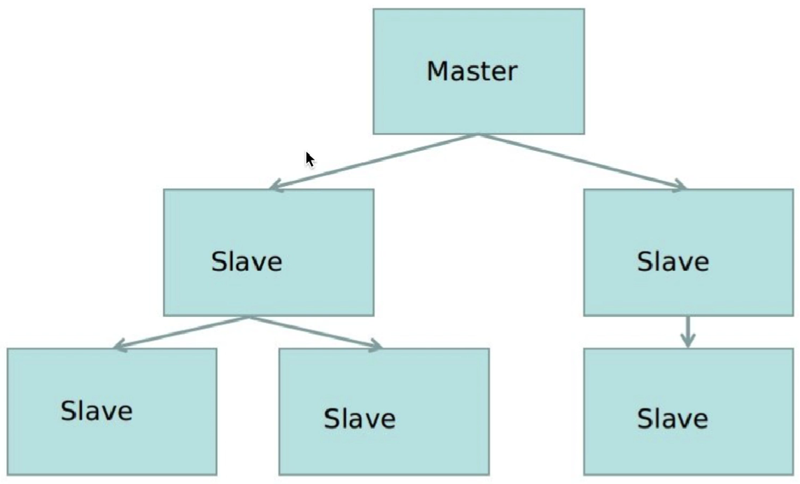

01.Redis常用的一些命令 - 野码 - 博客园            

*     
*   [会员](https://cnblogs.vip/)
*   [众包](https://www.cnblogs.com/cmt/p/18500368)
*   [新闻](https://news.cnblogs.com/)
*   [博问](https://q.cnblogs.com/)
*   [闪存](https://ing.cnblogs.com/)
*   [赞助商](https://www.cnblogs.com/cmt/p/18341478)
*   [Trae](https://trae.cnblogs.com/)
*   [Chat2DB](https://chat2db-ai.com/)

*    
      
    
    *   
        
        所有博客
    *   
        
        当前博客
    *   
        
        我的博客
    
*        "简洁模式启用，您在访问他人博客时会使用简洁款皮肤展示") 
    
      
    
    [我的博客](https://www.cnblogs.com/yehuoshun/) [我的园子](https://home.cnblogs.com/) [账号设置](https://account.cnblogs.com/settings/account) [会员中心](https://vip.cnblogs.com/my) [简洁模式 ...](javascript:void(0) "简洁模式会使用简洁款皮肤显示所有博客") [退出登录](javascript:void(0))
    
    [注册](https://account.cnblogs.com/signup) [登录](javascript:void(0);)

[一个人的行走范围，就是他的世界。](https://www.cnblogs.com/MingQiu)
===================================================

*   [博客园](https://www.cnblogs.com/)
*   [首页](https://www.cnblogs.com/MingQiu/)
*   [新随笔](https://i.cnblogs.com/EditPosts.aspx?opt=1)
*   [联系](https://msg.cnblogs.com/send/%E9%87%8E%E7%A0%81)
*   [订阅](javascript:void(0))
*   [管理](https://i.cnblogs.com/)

随笔 - 99 文章 - 0 评论 - 8 阅读 - 59921

[01.Redis常用的一些命令](https://www.cnblogs.com/MingQiu/p/18277660 "发布于 2024-07-01 13:09")
====================================================================================

[合集 - Redis笔录(1)](/MingQiu/collections/17830)

1.01.Redis常用的一些命令2024-07-01

收起

简介：

Redis是一款开源的使用ANSI C语言编写、遵守BSD协议、支持网络、可基于内存也可持久化的日志型、Key-Value高性能数据库。Redis与其他Key-Value缓存产品相比有以下三个特点：

*   支持数据持久化，可以将内存中的数据保存在磁盘中，重启可再次加载使用
    

*   支持简单的Key-Value类型的数据，同时还提供Str、List、Set、Zset、Hash等数据结构的存储
    

*   支持数据的备份，即Master-Slave模式的数据备份
    
*   NoSQL数据库
    

优势：

*   读速度为110000次/s，写速度为81000次/s，性能极高
    

*   具有丰富的数据类型
    

*   Redis所有操作都是原子的，意思是要么成功执行要么失败完全不执行，多个操作也支持事务
    

*   丰富的特性，比如Redis支持publish/subscribe、notify、key过期等
    

### Windows Redis安装

下载：

https://github.com/microsoftarchive/redis/releases

启动服务器:

redis-server redis.windows.conf   #进入到解压补录

redis\-server --service-install redis.windows.conf   #redis作为windows服务启动方式

关闭服务器:

redis-server --service-stop

启动客户端

redis-cli

redis\-cli -h ip -p 端口 -a 密码

关闭客户端:

redis-cli -p 端口号 shutdown

### Linux Redis安装

下载:

wget http://download.redis.io/releases/redis-5.0.7.tar.gz

解压:

tar xzf redis-5.0.7.tar.gz

放到/usr/local目录下面:

mv ./redis-5.0.7/\* /usr/local/redis/

进入redis目录:

cd /usr/local/redis/

生成:

sudo make

测试:

sudo make test

安装:

sudo make install

### Mac Redis安装  

下载：

http://download.redis.io/releases/redis-5.0.7.tar.gz

解压：

tar zxvf redis-4.0.10.tar.gz

编译测试：

sudo make test

编译安装

sudo make install

**redis.conf 常用配置：** 

| **配置** | **作用** | **默认** |
| bind | 

只有bind指定的ip可以直接访问Redis,这样可以避免将Redis服务暴露于危险的网络环境中，防止一些不安全的人随随便便通过远程访问Redis

如果bind选项为空或0.0.0.0的话，那会接受所有来自于可用网络接口的连接

 | 127.0.0.1 |
| protected-mode | 

protected-mode是Redis3.2之后的新特性，用于加强Redis的安全管理，当满足以下两种情况时，protected-mode起作用：

bind未设置，即接收所有来自网络的连接

密码未设置

当满足以上两种情况且protected-mode=yes的时候，访问Redis将报错，即密码未设置的情况下，无密码访问Redis只能通过安装Redis的本机进行访问

 | yes |
| port | Redis访问端口，由于Redis是单线程模型，因此单机开多个Redis进程的时候会修改端口，不然一般使用大家比较熟悉的6379端口就可以了 | 6379 |
| timeout | 指定在一个client空闲多少秒之后就关闭它，0表示不管 | 0 |
| daemonize | 指定Redis是否以守护进程的方式启动 | no |
| pidfile | 当Redis以守护进程的方式运行的时候,Redis默认会把pid写到pidfile指定的文件中 | /var/run/redis\_6379.pid |
| loglevel | 

指定Redis的日志级别，Redis本身的日志级别有notice、verbose、notice、warning四种，按照文档的说法，这四种日志级别的区别是：

debug，非常多信息，适合开发/测试

verbose，很多很少有用的信息（直译，读着拗口，从上下文理解应该是有用信息不多的意思），但并不像debug级别这么混乱

notice，适度的verbose级别的输出，很可能是生产环境中想要的

warning，只记录非常重要/致命的信息

 | notice |
| logfile | 配置log文件地址,默认打印在命令行终端的窗口上 | "" |
| databases | 设置Redis数据库的数量，默认使用0号DB | 16 |
| save | 把Redis数据保存到磁盘上 | 

save 900 1

save 300 10

save 60 10000

 |
| requirepass | 设置客户端认证密码 | 关闭 |
| maxclients | 设置同时连接的最大客户端数量，一旦达到了限制，Redis会关闭所有的新连接并发送一个"max number of clients reached"的错误 | 关闭，默认10000 |
| maxmemory | 不要使用超过指定数量的内存，一旦达到了，Redis会尝试使用驱逐策略来移除键 如果1G内存可以设置256-512之间 需要转换字节 | 关闭 |

**Redis 常用命令：** 

*   切换数据库
    
    select index    #select 1 、 select 2
    
*   清空数据库
    
    flushdb
    
*   查看所有key
    
    keys \*
    
*   删除key
    
    del key
    
*   判断key是否存在
    
    exists key               #返回1表示存在，0表示不存在
    
*   设置key过期时间
    
    expire key seconds      #expire key名为name 100秒
    
*   查看过期时间
    
    ttl  key                 #ttl name
    
    返回值 \-1 代表永久 \-2 无效
    
*   移除过期时间，让key永久有效
    
    persist key             #persist name   返回-1，表示永久
    
*   通配符查找key
    
    keys pattern \* 代表任意字符
    ？代表一个字符
    
*   返回一个随机的KEY
    
    randomkey
    
*   修改key的名字
    
    rename key newkey
    
*   把key移动到指定数据库
    
    move key db
    
*   查看KEY类型
    
    type key
    

**str数据结构常用命令**

设置指定 key 的值

set key value

获取指定 key 的值

get key

只有在 key 不存在时设置 key 的值

setnx key value

返回 key 中字符串值的截取字符串

getrange key start end     #getrange name 0 3

取出指定key的值，在赋值

getset key value

返回 key 所储存的字符串值的长度

strlen key

将 key 中储存的数字值加一

incr key

将 key 中储存的数字值减一

decr key

将 key 所储存的值加上给定的增量值

incrby key increment       #incrby age 10  加10

### Hash数据结构常用命令

将哈希表 key 中的字段 field 的值设为 value

hset key field value         #hset user:1 age 12

获取存储在哈希表中指定字段的值

hget key field              #hget user:1 age

同时将多个 field-value (域-值)对设置到哈希表 key 中

hmset key field1 value1 \[field2 value2 \]        #hmset user:2 name zhansan age 12

获取所有给定字段的值

hmget key field1 \[field2\]                       #hmget user:2 name  或  hmget user:2 name age

获取指定key所有field-value

hgetall key                      #hgetall user:2

获取指定key所有的field

hkeys key                       #hkeys user:2

获取指定key的field数量

hlen key

删除一个或多个哈希表字段

hdel key field1 \[field2\]       #hdel user:2 name 

为哈希表 key 中的指定字段的整数值加上增量 increment

hincrby key field increment      #hincrby user:2 age 1

查看哈希表 key 中，指定的字段是否存在

hexists key field  # 不存在返回0  存在返回1

### list数据建构常用命令

应用场景：消息队列、分页文章列表

在左侧插⼊数据

lpush key value1 value2 ...    #lpush mylist 1 2 3  返回的是 3 2 1

在右侧插⼊数据

rpush key value1 value2 ...

获取数据

lrange key start stop

设置指定索引位置的元素值

lset key index value

获取列表长度

llen key

根据索引获取值

lindex key index

从左侧删除默认删除一个

lpop key 

从右侧删除默认删除一个

rpop key

让列表只保存指定区间的元素

ltrim key start stop

在列表的元素前或者后插入元素

linsert key BEFORE|AFTER pivot value

删除指定元素

lrem key count value

### set数据建构常用命令

Redis中的set是无序的集合，元素类型是string，元素具有唯一性，不能重复，元素不能修改。

应用场景：通过交集、并集、差集找到爱好相同与不同的人

添加元素

sadd key member1 member2 ...

返回所有元素

smembers key

获取集合的元素的数量

scard key

判断 member 元素是否是集合 key 的成员

sismember key member

返回随机元素

srandmember key count

删除指定元素

srem key field

移除并返回集合中的一个随机元素

spop key

将 member 元素从 source 集合移动到 destination 集合

smove source destination member 

差集

sdiff key1 \[key2\] 
​
#返回给定所有集合的差集并存储在 destination 中
sdiffstore destination key1 \[key2\] 

交集

sinter key1 \[key2\]
​
#返回给定所有集合的交集并存储在 destination 中
sinterstore destination key1 \[key2\] 

并集

sunion key1 \[key2\]
​
#所有给定集合的并集存储在 destination 集合中
sunionstore destination key1 \[key2\]

### Zset数据建构常用命令

Redis中的zset是有序的集合，元素类型是string，元素具有唯一性，不能重复，元素不能修改。

每个元素都会关联⼀个double类型的score，表示权重，通过权重将元素从⼩到⼤排序

应用场景：排行榜系统

添加元素

zadd key score1 member1 score2 member2 ...      #zzadd zmm 7 zs 8 ls 8 ww 9 zl

获取元素

zrange key start stop           #zrange 0-1

计算在有序集合中指定区间分数的成员数

zcount key min max        

获取有序集合的成员数

zcard key

返回有序集合中指定成员的索引

zrank key member

返回有序集中指定区间内的成员，通过索引，分数从高到低

zrevrange key start stop \[WITHSCORES\]

删除指定元素

zrem key member1 member2 ...

移除有序集合中给定的分数区间的所有成员

zremrangebyscore key min max

移除有序集合中给定的排名区间的所有成员

zremrangebyrank key start stop

### Redis的发布订阅

### 订阅

subscribe 频道名称 \[频道名称 ...\]

### 发布

publish 频道 消息

### 取消订阅

unsubscribe 频道名称 \[频道名称 ...\]

### Redis的事务

Redis事务就是一次按照顺序执行多个命令，Redis事务有两个特点：

*   按顺序执行，不会被其他客户端的命令打断
    
*   原子操作，要不不执行、要不全执行（业务报错问题除外）
    

### 命令

| MULTI | 标记一个事务开始 |
| EXEC | 执行事务 |
| DISCARD | 取消事务 |
| WATCH | 监听KEY,如果KEY在事务执行前被改变，事务取消执行 |
| UNWATCH | 取消监听KEY |

; "复制代码")

set user:A 100    #用户A100
set user:B 50     #用户B50  
watch user:A      #监听用户A  
 umlyi                  #开启事务
decrby user:A 50       #用户A减去50 incrby user:B 50       #用户B加50

get user:A             #查看 get user:B

exec                   #执行

; "复制代码")

### Redis持久化

提供了多种不同级别的持久化方式:一种是RDB,另一种是AOF。

RDB优点：

1.体积更小：相同的数据量rdb数据比aof的小，因为rdb是紧凑型文件
​ 2.恢复更快：因为rdb是数据的快照，基本上就是数据的复制，不用重新读取再写入内存
​ 3.性能更高:父进程在保存rdb时候只需要fork一个子进程，无需父进程的进行其他io操作，也保证了服务器的性能。

RDB缺点：

1.故障丢失:因为rdb是全量的，我们一般是使用shell脚本实现30分钟或者1小时或者每天对redis进行rdb备份，（注，也可以是用自带的策略），  
  但是最少也要5分钟进行一次的备份，所以当服务死掉后，最少也要丢失5分钟的数据。
​ 2.耐久性差:相对aof的异步策略来说，因为rdb的复制是全量的，即使是fork的子进程来进行备份，当数据量很大的时候对磁盘的消耗也是不可忽视的，  
  尤其在访问量很高的时候，fork的时间也会延长，导致cpu吃紧，耐久性相对较差。

AOF优点：

1.数据保证：我们可以设置fsync策略，一般默认是everysec，也可以设置每次写入追加，所以即使服务死掉了，咱们也最多丢失一秒数据
​ 2.自动缩小：当aof文件大小到达一定程度的时候，后台会自动的去执行aof重写，此过程不会影响主进程，重写完成后，新的写入将会写到新的aof中，  
  旧的就会被删除掉。但是此条如果拿出来对比rdb的话还是没有必要算成优点，只是官网显示成优点而已。

AOF缺点：

1.性能相对较差：它的操作模式决定了它会对redis的性能有所损耗
​ 2.体积相对更大：尽管是将aof文件重写了，但是毕竟是操作过程和操作结果仍然有很大的差别，体积也毋庸置疑的更大。
​ 3.恢复速度更慢：

### Redis的过期策略

我们都知道，Redis是key-value数据库，我们可以设置Redis中缓存的key的过期时间。Redis的过期策略就是指当Redis中缓存的key过期了，Redis如何处理。

过期策略通常有以下三种：

*   定时过期：每个设置过期时间的key都需要创建一个定时器，到过期时间就会立即清除。该策略可以立即清除过期的数据，对内存很友好；但是会占用大量的CPU资源去处理过期的数据，从而影响缓存的响应时间和吞吐量。
    
*   惰性过期：只有当访问一个key时，才会判断该key是否已过期，过期则清除。该策略可以最大化地节省CPU资源，却对内存非常不友好。极端情况可能出现大量的过期key没有再次被访问，从而不会被清除，占用大量内存。
    
*   定期过期：每隔一定的时间，会扫描一定数量的数据库的expires字典中一定数量的key，并清除其中已过期的key。该策略是前两者的一个折中方案。通过调整定时扫描的时间间隔和每次扫描的限定耗时，可以在不同情况下使得CPU和内存资源达到最优的平衡效果。 (expires字典会保存所有设置了过期时间的key的过期时间数据，其中，key是指向键空间中的某个键的指针，value是该键的毫秒精度的UNIX时间戳表示的过期时间。键空间是指该Redis集群中保存的所有键。)
    

Redis中同时使用了惰性过期和定期过期两种过期策略。

### Redis的内存淘汰策略

Redis的内存淘汰策略是指在Redis的用于缓存的内存不足时，怎么处理需要新写入且需要申请额外空间的数据。

*   noeviction：当内存不足以容纳新写入数据时，新写入操作会报错。
    
*   allkeys-lru：当内存不足以容纳新写入数据时，在键空间中，移除最近最少使用的key。
    
*   allkeys-random：当内存不足以容纳新写入数据时，在键空间中，随机移除某个key。
    
*   volatile-lru：当内存不足以容纳新写入数据时，在设置了过期时间的键空间中，移除最近最少使用的key。
    
*   volatile-random：当内存不足以容纳新写入数据时，在设置了过期时间的键空间中，随机移除某个key。
    
*   volatile-ttl：当内存不足以容纳新写入数据时，在设置了过期时间的键空间中，有更早过期时间的key优先移除。
    

### 总结

Redis的内存淘汰策略的选取并不会影响过期的key的处理。内存淘汰策略用于处理内存不足时的需要申请额外空间的数据；过期策略用于处理过期的缓存数据。

### 主从复制

在数据为王的时代，数据的安全是显得尤为重要，数据我们可能要复制多份。

在网络时代，数据一般的特点是一次上传，多次读取，也就是需要我们实现读写分离。

上面这两个功能，我们都可以用Redis的主从复制来解决。

*   一个master可以拥有多个slave,一个slave又可以拥有多个slave。
    
*   数据在自动从master端复制到slave端
    
*   master用来写数据,slave用来读数据,来实现读写分离
    

### 配置

复制出一份配置文件

cp redis.conf redis.slave.conf

编辑配置文件redis.slave.conf

port 6380 replicaof 127.0.0.1 6379

启动redis

redis-server redis.slave.conf

查看主从关系

redis-cli -h ip info Replication

进入主端

redis-cli -h 127.0.0.1 -p 6379

写入数据

set name master

进入从端

redis-cli -h 127.0.0.1 -p 6380

取出数据

get name

### Redis集群

Redis集群采用无中心结构，每个节点都保存数据和整个集群状态。每个节点都和其他所有节点连接。Redis集群模式通常具有 **高可用**、**可扩展性**、**分布式**、**容错**等特点。

### 集群模型

### 配置

新建文件夹redis-cluster

mkdir redis-cluster 

在文件夹下新建7001、7002、7003、7004、7005、7006文件夹，在每个新文件夹下都创建一个文件：redis.conf

; "复制代码")

port 7001 # 需要更换
bind 127.0.0.1 # 不同机器换不同ip
daemonize yes
pidfile 7001.pid  # 需要更换
cluster\-enabled yes
cluster\-config-file 7001\_node.conf  # 需要更换
cluster\-node-timeout 15000 appendonly yes

; "复制代码")

不同的文件夹下的配置文件，port、pidfile、cluster-config-file 7001\_node.conf 值是不一样，依次排列。然后这个bind我现在是一台机器，如果两台机器，可以让一台绑定三个。

依次启动每个文件夹下的配置文件

redis-server 7001/redis.conf

执⾏集群

redis-cli --cluster create 127.0.0.1:7001 127.0.0.1:7002 127.0.0.1:7003 127.0.0.1:7004 127.0.0.1:7005 127.0.0.1:7006 --cluster-replicas 1

#### 连接集群

redis-cli -c -h 127.0.0.1 -p 7001

### 集群知识

*   redis cluster在设计的时候，就考虑到了去中⼼化，去中间件，也就是说，集群中 的每个节点都是平等的关系，都是对等的，每个节点都保存各⾃的数据和整个集 群的状态。每个节点都和其他所有节点连接，⽽且这些连接保持活跃，这样就保 证了我们只需要连接集群中的任意⼀个节点，就可以获取到其他节点的数据
    
*   Redis集群没有并使⽤传统的⼀致性哈希来分配数据，⽽是采⽤另外⼀种叫做哈希 槽 (hash slot)的⽅式来分配的。**redis cluster 默认分配了 16384 个 slot**，当我们 set⼀个key 时，会⽤CRC16算法来取模得到所属的slot，然后将这个key 分到哈 希槽区间的节点上，具体算法就是：CRC16(key) % 16384。
    
*   Redis 集群会把数据存在⼀个 master 节点，然后在这个 master 和其对应的salve 之间进⾏数据同步。当读取数据时，也根据⼀致性哈希算法到对应的 master 节 点获取数据。 **只有当⼀个master 挂掉之后，才会启动⼀个对应的 salve 节点，充 当 master**
    
*   需要注意的是：**必须要3个或以上的主节点**，否则在创建集群时会失败，并且当存 活的主节点数⼩于总节点数的⼀半时，整个集群就⽆法提供服务了
    

合集: [Redis笔录](https://www.cnblogs.com/MingQiu/collections/17830)

分类: [C#](https://www.cnblogs.com/MingQiu/category/2383261.html)

[好文要顶](javascript:void(0);) [关注我](javascript:void(0);) [收藏该文](javascript:void(0);) [微信分享](javascript:void(0);)

[野码](https://home.cnblogs.com/u/MingQiu/)  
[粉丝 - 22](https://home.cnblogs.com/u/MingQiu/followers/) [关注 - 13](https://home.cnblogs.com/u/MingQiu/followees/)  

[+加关注](javascript:void(0);)

0

0

[升级成为会员](https://cnblogs.vip/)

[«](https://www.cnblogs.com/MingQiu/p/18268219) 上一篇： [05\_Vite+Vue3不同的环境配置不同的后端API接口](https://www.cnblogs.com/MingQiu/p/18268219 "发布于 2024-06-26 09:21")

posted @ 2024-07-01 13:09  [野码](https://www.cnblogs.com/MingQiu)  阅读(154)  评论(0)    [收藏](javascript:void(0))  [举报](javascript:void(0))

[刷新评论](javascript:void(0);)[刷新页面](#)[返回顶部](#top)

发表评论 [升级成为园子VIP会员](https://cnblogs.vip/)

编辑 预览

c6df3402-7d42-46d7-9688-08d9b4008d6c

 自动补全

 [不改了](javascript:void(0);) [退出](javascript:void(0);) [订阅评论](javascript:void(0); "订阅后有新评论时会邮件通知您") [我的博客](//www.cnblogs.com/yehuoshun/)

\[Ctrl+Enter快捷键提交\]

[【推荐】100%开源！大型工业跨平台软件C++源码提供，建模，组态！](http://www.uccpsoft.com/index.htm)  
[【推荐】AI 的力量，开发者的翅膀：欢迎使用 AI 原生开发工具 TRAE](https://www.cnblogs.com/cmt/p/19004092)  
[【推荐】2025 HarmonyOS 鸿蒙创新赛正式启动，百万大奖等你挑战](https://www.cnblogs.com/HarmonyOS5/p/18974773)  
[【推荐】轻量又高性能的 SSH 工具 IShell：AI 加持，快人一步](http://ishell.cc/)  

  

**相关博文：**   

·  [04\_NET中使用Redis(ServiceStack.Redis)和Linux中安装Redis(docker安装和普通安装)](https://www.cnblogs.com/MingQiu/p/18134005 "04_NET中使用Redis(ServiceStack.Redis)和Linux中安装Redis(docker安装和普通安装)")

·  [01\_在NET中使用RabbitMQ](https://www.cnblogs.com/MingQiu/p/18129505 "01_在NET中使用RabbitMQ")

·  [Redis高频40问](https://www.cnblogs.com/tyson03/p/17263677.html "Redis高频40问")

·  [Redis高频40问](https://www.cnblogs.com/qinweizhi/p/17264080.html "Redis高频40问")

·  [redis面](https://www.cnblogs.com/zhaobin-diray/p/18727854 "redis面")

**阅读排行：**   
· [抽象与性能：从 LINQ 看现代 .NET 的优化之道](https://www.cnblogs.com/sdcb/p/19013541/linq-abstraction-and-perf-modern-programming-language)  
· [Coze工作流实战：一键上传excel生成数据图表](https://www.cnblogs.com/lucky_hu/p/19018899)  
· [Trae Plus 让没有编程基础的女朋友也用上了 AI Coding](https://www.cnblogs.com/caituotuo/p/19019858)  
· [程序员究竟要不要写文章](https://www.cnblogs.com/xiaoxi666/p/19019449)  
· [MySQL 23 MySQL是怎么保证数据不丢的？](https://www.cnblogs.com/san-mu/p/19007778)  

### 公告

昵称： [野码](https://home.cnblogs.com/u/MingQiu/)  
园龄： [9年2个月](https://home.cnblogs.com/u/MingQiu/ "入园时间：2016-05-27")  
粉丝： [22](https://home.cnblogs.com/u/MingQiu/followers/)  
关注： [13](https://home.cnblogs.com/u/MingQiu/followees/)

[+加关注](javascript:void(0))

| 
| [<](javascript:void(0);) | 2025年8月 | [\>](javascript:void(0);) | |
| 日 | 一 | 二 | 三 | 四 | 五 | 六 |
| 27 | 28 | 29 | 30 | 31 | 1 | 2 |
| 3 | 4 | 5 | 6 | 7 | 8 | 9 |
| 10 | 11 | 12 | 13 | 14 | 15 | 16 |
| 17 | 18 | 19 | 20 | 21 | 22 | 23 |
| 24 | 25 | 26 | 27 | 28 | 29 | 30 |
| 31 | 1 | 2 | 3 | 4 | 5 | 6 |

### 搜索

 

### 常用链接

*   [我的随笔](https://www.cnblogs.com/MingQiu/p/ "我的博客的随笔列表")
*   [我的评论](https://www.cnblogs.com/MingQiu/MyComments.html "我的发表过的评论列表")
*   [我的参与](https://www.cnblogs.com/MingQiu/OtherPosts.html "我评论过的随笔列表")
*   [最新评论](https://www.cnblogs.com/MingQiu/comments "我的博客的评论列表")
*   [我的标签](https://www.cnblogs.com/MingQiu/tag/ "我的博客的标签列表")

### [我的标签](https://www.cnblogs.com/MingQiu/tag/)

*   [asp.net core(4)](https://www.cnblogs.com/MingQiu/tag/asp.net%20core/)
*   [vue3(3)](https://www.cnblogs.com/MingQiu/tag/vue3/)
*   [Vue Router(1)](https://www.cnblogs.com/MingQiu/tag/Vue%20Router/)
*   [vue(1)](https://www.cnblogs.com/MingQiu/tag/vue/)
*   [vscode(1)](https://www.cnblogs.com/MingQiu/tag/vscode/)
*   [vite(1)](https://www.cnblogs.com/MingQiu/tag/vite/)
*   [pinia(1)](https://www.cnblogs.com/MingQiu/tag/pinia/)
*   [git(1)](https://www.cnblogs.com/MingQiu/tag/git/)
*   [C#(1)](https://www.cnblogs.com/MingQiu/tag/C%23/)
*   [asp.net core Task(1)](https://www.cnblogs.com/MingQiu/tag/asp.net%20core%20Task/)
*   [更多](https://www.cnblogs.com/MingQiu/tag/)

### 合集

*   [WPF学习记录(13)](https://www.cnblogs.com/MingQiu/collections/12283)
*   [WPF模块化与反应式编程技术总结(10)](https://www.cnblogs.com/MingQiu/collections/12443)
*   [.NET Web微服务总结(14)](https://www.cnblogs.com/MingQiu/collections/12653)
*   [C#23种设计模式(24)](https://www.cnblogs.com/MingQiu/collections/13523)
*   [Vue3架构搭建笔记(5)](https://www.cnblogs.com/MingQiu/collections/14825)
*   [NET组件使用(9)](https://www.cnblogs.com/MingQiu/collections/14948)
*   [微信小程序笔记(3)](https://www.cnblogs.com/MingQiu/collections/15318)
*   [Modbus笔记(3)](https://www.cnblogs.com/MingQiu/collections/15885)
*   [WPF+Prism(1)](https://www.cnblogs.com/MingQiu/collections/16328)
*   [VUE3(温故而知新)(5)](https://www.cnblogs.com/MingQiu/collections/17540)
*   [Redis笔录(1)](https://www.cnblogs.com/MingQiu/collections/17830)

### [随笔分类](https://www.cnblogs.com/MingQiu/post-categories)

*   [asp.net core(14)](https://www.cnblogs.com/MingQiu/category/1138667.html)
*   [ASP.NET Core分布式项目实战(1)](https://www.cnblogs.com/MingQiu/category/1146834.html)
*   [asp.net core学习资料(6)](https://www.cnblogs.com/MingQiu/category/1146575.html)
*   [C#(30)](https://www.cnblogs.com/MingQiu/category/2383261.html)
*   [C# 线程笔记(2)](https://www.cnblogs.com/MingQiu/category/1146179.html)
*   [RabbitMQ(1)](https://www.cnblogs.com/MingQiu/category/1304115.html)
*   [Vue(4)](https://www.cnblogs.com/MingQiu/category/2405607.html)
*   [WPF(24)](https://www.cnblogs.com/MingQiu/category/2375612.html)
*   [微信小程序(2)](https://www.cnblogs.com/MingQiu/category/2393793.html)

### 随笔档案

*   [2024年7月(1)](https://www.cnblogs.com/MingQiu/p/archive/2024/07)
*   [2024年6月(6)](https://www.cnblogs.com/MingQiu/p/archive/2024/06)
*   [2024年5月(5)](https://www.cnblogs.com/MingQiu/p/archive/2024/05)
*   [2024年4月(15)](https://www.cnblogs.com/MingQiu/p/archive/2024/04)
*   [2024年3月(25)](https://www.cnblogs.com/MingQiu/p/archive/2024/03)
*   [2024年2月(25)](https://www.cnblogs.com/MingQiu/p/archive/2024/02)
*   [2024年1月(11)](https://www.cnblogs.com/MingQiu/p/archive/2024/01)
*   [2018年3月(2)](https://www.cnblogs.com/MingQiu/p/archive/2018/03)
*   [2018年2月(3)](https://www.cnblogs.com/MingQiu/p/archive/2018/02)
*   [2018年1月(5)](https://www.cnblogs.com/MingQiu/p/archive/2018/01)
*   [2017年10月(1)](https://www.cnblogs.com/MingQiu/p/archive/2017/10)

### [阅读排行榜](https://www.cnblogs.com/MingQiu/most-viewed)

*   [1\. 09\_EntityFrameworkCore 6 简单使用(13445)](https://www.cnblogs.com/MingQiu/p/8434866.html)
*   [2\. .NET下使用HTTP请求的正确姿势(12508)](https://www.cnblogs.com/MingQiu/p/7728443.html)
*   [3\. ASP.NET Core 框架源码地址(7596)](https://www.cnblogs.com/MingQiu/p/8270038.html)
*   [4\. 1.Prism框架介绍(2049)](https://www.cnblogs.com/MingQiu/p/18002672)
*   [5\. 02\_Modbus的功能码与报文详解(1748)](https://www.cnblogs.com/MingQiu/p/18175579)

### [评论排行榜](https://www.cnblogs.com/MingQiu/most-commented)

*   [1\. 09\_EntityFrameworkCore 6 简单使用(2)](https://www.cnblogs.com/MingQiu/p/8434866.html)
*   [2\. .NET下使用HTTP请求的正确姿势(2)](https://www.cnblogs.com/MingQiu/p/7728443.html)
*   [3\. 02\_Web Api使用Jwt(1)](https://www.cnblogs.com/MingQiu/p/18132547)
*   [4\. 01\_在NET中使用RabbitMQ(1)](https://www.cnblogs.com/MingQiu/p/18129505)
*   [5\. ASP.NET Core启动流程(1)](https://www.cnblogs.com/MingQiu/p/8430959.html)

### [推荐排行榜](https://www.cnblogs.com/MingQiu/most-liked)

*   [1\. ASP.NET Core 框架源码地址(7)](https://www.cnblogs.com/MingQiu/p/8270038.html)
*   [2\. 2.WPF中控件类之间的继承关系(3)](https://www.cnblogs.com/MingQiu/p/17992844)
*   [3\. 09\_EntityFrameworkCore 6 简单使用(2)](https://www.cnblogs.com/MingQiu/p/8434866.html)
*   [4\. 07\_NET中Ocelot结合Consult使用(1)](https://www.cnblogs.com/MingQiu/p/18137772)
*   [5\. 06\_NET中使用Consul(服务发现)(1)](https://www.cnblogs.com/MingQiu/p/18137671)

### [最新评论](https://www.cnblogs.com/MingQiu/comments)

*   [1\. Re:02\_Web Api使用Jwt](https://www.cnblogs.com/MingQiu/p/18132547)
*   不错学习到了  
    .Net兼职社区  
    
*   \--Metadata科技屋
*   [2\. Re:01\_在NET中使用RabbitMQ](https://www.cnblogs.com/MingQiu/p/18129505)
*   大神666，不错学习到了  
    .Net兼职社区  
    
*   \--Metadata科技屋
*   [3\. Re:ASP.NET Core 框架源码地址](https://www.cnblogs.com/MingQiu/p/8270038.html)
*   下载后你都是怎么还原的运行的？老是报各种错误
*   \--初晨~
*   [4\. Re:asp.net EFcore配置链接sqlserver](https://www.cnblogs.com/MingQiu/p/8434866.html)
*   非常不错的新手教程，好文章要赞！
*   \--ldwstyel
*   [5\. Re:ASP.NET Core启动流程](https://www.cnblogs.com/MingQiu/p/8430959.html)
*   博客皮肤很漂亮，好看。  
    只可惜看不清字
*   \--builderman

[博客园](https://www.cnblogs.com/)  ©  2004-2025  
[
浙公网安备 33010602011771号](http://www.beian.gov.cn/portal/registerSystemInfo?recordcode=33010602011771) [浙ICP备2021040463号-3](https://beian.miit.gov.cn) 

点击右上角即可分享

