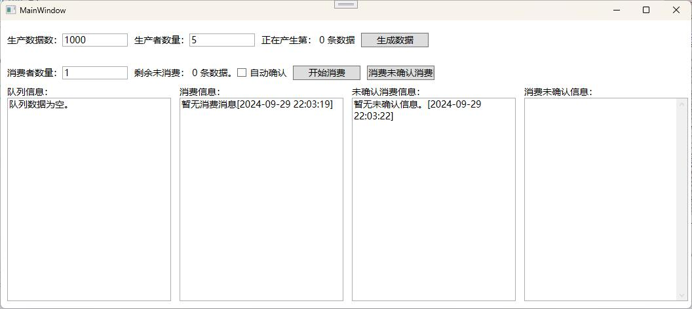
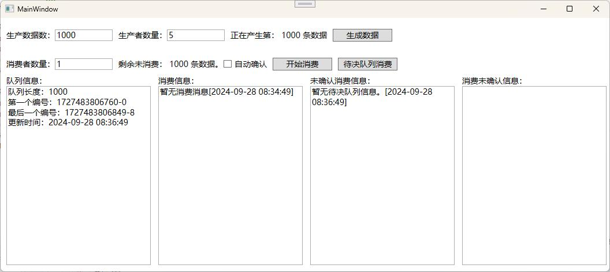
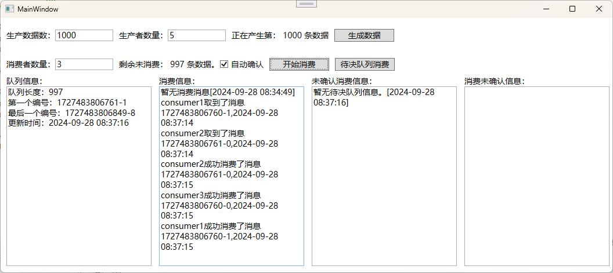
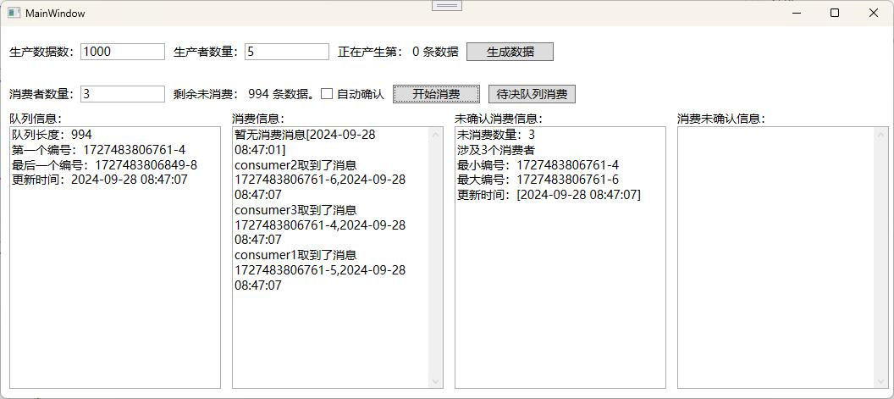
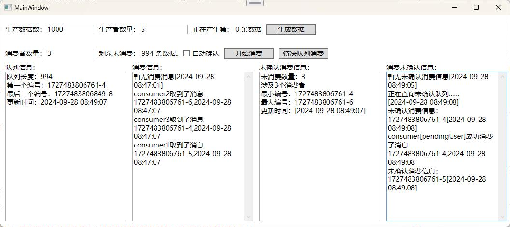

WPF下使用FreeRedis操作RedisStream实现简单的消息队列 - 踏平扶桑 - 博客园           

  

*    [](https://www.cnblogs.com/ "开发者的网上家园") 
*   [会员](https://cnblogs.vip/)
*   [众包](https://www.cnblogs.com/cmt/p/18500368)
*   [新闻](https://news.cnblogs.com/)
*   [博问](https://q.cnblogs.com/)
*   [闪存](https://ing.cnblogs.com/)
*   [赞助商](https://www.cnblogs.com/cmt/p/18341478)
*   [Trae](https://trae.cnblogs.com/)
*   [Chat2DB](https://chat2db-ai.com/)

*    
      
    
    *   
        
        所有博客
    *   
        
        当前博客
    *   
        
        我的博客
    
*    [](https://i.cnblogs.com/EditPosts.aspx?opt=1 "写随笔") [ 
     ](https://www.cnblogs.com/yehuoshun/ "我的博客") [ 
      ](https://msg.cnblogs.com/ "短消息") [](javascript:void(0) "简洁模式启用，您在访问他人博客时会使用简洁款皮肤展示") 
    
     [](https://home.cnblogs.com/u/yehuoshun) 
    
    [我的博客](https://www.cnblogs.com/yehuoshun/) [我的园子](https://home.cnblogs.com/) [账号设置](https://account.cnblogs.com/settings/account) [会员中心](https://vip.cnblogs.com/my) [简洁模式 ...](javascript:void(0) "简洁模式会使用简洁款皮肤显示所有博客") [退出登录](javascript:void(0))
    
    [注册](https://account.cnblogs.com/signup) [登录](javascript:void(0);)

[](https://www.cnblogs.com/wdw984/)

[踏平扶桑](https://www.cnblogs.com/wdw984)
======================================

*   [博客园](https://www.cnblogs.com/)
*   [园子](https://home.cnblogs.com/)
*   [首页](https://www.cnblogs.com/wdw984/)
*   [新随笔](https://i.cnblogs.com/EditPosts.aspx?opt=1)
*   [联系](https://msg.cnblogs.com/send/%E8%B8%8F%E5%B9%B3%E6%89%B6%E6%A1%91)
*   [管理](https://i.cnblogs.com/)
*   [订阅](javascript:void(0)) [
    ](https://www.cnblogs.com/wdw984/rss/)

随笔- 43  文章- 0  评论- 100  阅读 - 10万 

[WPF下使用FreeRedis操作RedisStream实现简单的消息队列](https://www.cnblogs.com/wdw984/p/18440864 "发布于 2024-09-29 22:16")
=========================================================================================================

Redis Stream简介
--------------

Redis Stream是随着5.0版本发布的一种新的Redis数据类型：

**高效消费者组**：允许多个消费者组从同一数据流的不同部分消费数据，每个消费者组都能独立地处理消息，这样可以并行处理和提高效率。

**阻塞操作**：消费者可以设置阻塞操作，这样它们会在流中有新数据添加时被唤醒并开始处理，这有助于减少资源消耗并提高响应速度。

**数据持久化**：它可以将数据持久化到内存（配置本地持久化后会写入到存储设备）中进行保存，等待消费。

**多生产者多消费者**：Redis Streams能够在多个生产者和消费者之间建立一个数据通道，使得数据的流动和处理更加灵活。

**扩展性和异步通信**：用户可以通过应用程序轻松扩展消费者数量，并且生产者和消费者之间的通信可以是异步的，这有助于提高系统的整体性能。

**满足多样化需求**：Redis Streams满足从实时数据处理到历史数据访问的各种需求，同时保持易于管理。

Redis Stream可以干什么
-----------------

**消息队列**：Redis Stream可以用作一个可靠的消息队列系统，支持发布/订阅模式，生产者和消费者可以异步地发送和接收消息。

**任务调度**：Redis Stream可以用于实现分布式任务调度系统，将任务分发到多个消费者进行处理，从而提高处理速度和系统可扩展性。

**事件驱动架构**：Redis Stream可以作为事件驱动架构中的核心组件，用于处理来自不同服务的事件，实现解耦和灵活性。

FreeRedis简介
-----------

FreeRedis 的命名来自，“自由”、“免费”，它和名字与 FreeSql 是一个理念，简易是他们一致的追寻方向，最低可支持 .NET Framework 4.0 运行环境，支持到 Redis-server 7.2。

[github MIT开源协议](https://github.com/2881099/FreeRedis)

[作者博客园地址](https://www.cnblogs.com/FreeSql)

[官方介绍](https://www.cnblogs.com/FreeSql/p/16455983.html)

基于 .NET 的 Redis 客户端，支持 .NET Core 2.1+、.NET Framework 4.0+、Xamarin 以及 AOT。

*   🌈 所有方法名与 redis-cli 保持一致
*   🌌 支持 Redis 集群（服务端要求 3.2 及以上版本）
*   ⛳ 支持 Redis 哨兵模式
*   🎣 支持主从分离（Master-Slave）
*   📡 支持发布订阅（Pub-Sub）
*   📃 支持 Redis Lua 脚本
*   💻 支持管道（Pipeline）
*   📰 支持事务
*   🌴 支持 GEO 命令（服务端要求 3.2 及以上版本）
*   🌲 支持 STREAM 类型命令（服务端要求 5.0 及以上版本）
*   ⚡ 支持本地缓存（Client-side-cahing，服务端要求 6.0 及以上版本）
*   🌳 支持 Redis 6 的 RESP3 协议

要实现的功能
------

1、生产者生产数据

2、消费者消费数据后确认

3、消费者消费数据后不确认

4、已消费但超时未确认的消息监控

5、已消费但超时未确认的消息二次消费

项目依赖
----

WPF  
CommunityToolkit.Mvvm  
FreeRedis  
Newtonsoft.Json  
NLog  
redis-windows-7.2.5

业务场景代码
------

### 涉及到的Redis命令

创建消费者组 `XGROUP CREATE key group <id | $> [MKSTREAM] [ENTRIESREAD entries-read]`

查询消费者组信息 `XINFO STREAM key [FULL [COUNT count]]`

消息队列数量（长度） `XLEN key`

添加消息到队列尾部 `XADD key [NOMKSTREAM] [<MAXLEN | MINID> [= | ~] threshold [LIMIT count]] <* | id> field value [field value ...]`

消费组成员读取消息 `XREADGROUP GROUP group consumer [COUNT count] [BLOCK milliseconds] [NOACK] STREAMS key [key ...] id [id ...]`

确认消息 `XACK key group id [id ...]`

删除消息 `XDEL key id [id ...]`

获取消费未确认消息的队列信息 `XPENDING key group [[IDLE min-idle-time] start end count [consumer]]`

把未消费的消息消费者转移到当前消费者名下 `XAUTOCLAIM key group consumer min-idle-time start [COUNT count] [JUSTID]`

### 代码

App.xaml.cs

```null
    public partial class App : Application
    {
        public static Logger Logger = LogManager.GetCurrentClassLogger();        
        public static RedisClient RedisHelper;
        public static MainViewModel MainViewModel;
        private void App_OnStartup(object sender, StartupEventArgs e)
        {
            Current.DispatcherUnhandledException += Current_DispatcherUnhandledException;

            try
            {
                //redis6以上版本启用了ACL用户管理机制，默认用户名是default，可以忽略密码
                RedisHelper = new RedisClient("127.0.0.1:6379,user=defualt,defaultDatabase=13");
                RedisHelper.Serialize = JsonConvert.SerializeObject;//序列化
                RedisHelper.Deserialize = JsonConvert.DeserializeObject;//反序列化
                RedisHelper.Notice += (s, ee) => Console.WriteLine(ee.Log); //打印命令日志
                MainViewModel = new MainViewModel();
            }
            catch (Exception exception)
            {
                MessageBox.Show(exception.Message);
                Current.Shutdown(-100);
            }
        }

        private void Current_DispatcherUnhandledException(object sender, System.Windows.Threading.DispatcherUnhandledExceptionEventArgs e)
        {
            e.Handled = true;
            Logger.Error($"未捕获的错误：来源:{sender},错误：{e}");
        }

        private void App_OnExit(object sender, ExitEventArgs e)
        {
            RedisHelper.Dispose();
        }
    }

```

MainWindow.xaml的主要内容

```null
    <StackPanel>
        <WrapPanel ItemHeight="40" Margin="10,10,0,0" VerticalAlignment="Center">
            <TextBlock Text="生产数据数：" VerticalAlignment="Center"></TextBlock>
            <TextBox Text="{Binding RecordCount}" Width="100" MaxLength="9" VerticalAlignment="Center"></TextBox>

            <TextBlock Text="生产者数量：" Margin="10,0,0,0" VerticalAlignment="Center"></TextBlock>
            <TextBox Text="{Binding TaskCount}" Width="100" MaxLength="6" VerticalAlignment="Center"></TextBox>

            <TextBlock Margin="10,0,0,0" VerticalAlignment="Center">
                <Run Text="正在产生第："></Run>
                <Run Text="{Binding ProducerIndex}"></Run>
                <Run Text="条数据"></Run>
            </TextBlock>

            <Button Content="生成数据" HorizontalAlignment="Left" Margin="10,0,0,0" VerticalAlignment="Center" Width="103" Command="{Binding ProducerRelayCommand}" />
        </WrapPanel>

        <WrapPanel ItemHeight="40" Margin="0,10,0,0" VerticalAlignment="Center">
            <TextBlock Text="消费者数量：" Margin="10,0,0,0" VerticalAlignment="Center"></TextBlock>
            <TextBox Text="{Binding ConsumerCount}" Width="100" MaxLength="6" VerticalAlignment="Center"></TextBox>

            <TextBlock Margin="10,0,0,0" VerticalAlignment="Center">
                <Run Text="剩余未消费："></Run>
                <Run Text="{Binding ConsumeIndex}"></Run>
                <Run Text="条数据。"></Run>
            </TextBlock>
            <CheckBox IsChecked="{Binding IsAutoAck,Mode=TwoWay}" Content="自动确认" VerticalAlignment="Center" ></CheckBox>
            <Button Content="开始消费" HorizontalAlignment="Left" Margin="10,0,0,0" VerticalAlignment="Center" Width="103" Command="{Binding ConsumeRelayCommand}" />
            <Button Content="消费未确认消费队列" HorizontalAlignment="Left" Margin="10,0,0,0" VerticalAlignment="Center" Width="103" Command="{Binding PendingRelayCommand}" />
        </WrapPanel>

        <WrapPanel>
            <StackPanel>
                <TextBlock Margin="10,0,0,0" Text="队列信息：" VerticalAlignment="Center"></TextBlock>
                <TextBox Margin="10,0,0,0" VerticalAlignment="Center" Height="310" Width="250" Text="{Binding StreamInfo}" VerticalScrollBarVisibility="Auto"></TextBox>
            </StackPanel>

            <StackPanel>
                <TextBlock Margin="13,0,0,0" Text="消费信息：" VerticalAlignment="Center"></TextBlock>
                <TextBox Margin="13,0,0,0" VerticalAlignment="Center" Height="310" Width="250" Text="{Binding ConsumeInfo}" VerticalScrollBarVisibility="Auto" TextWrapping="WrapWithOverflow"></TextBox>
            </StackPanel>

            <StackPanel>
                <TextBlock Margin="13,0,0,0" Text="未确认消费信息：" VerticalAlignment="Center"></TextBlock>
                <TextBox Margin="13,0,0,0" VerticalAlignment="Center" Height="310" Width="250" Text="{Binding PendingInfo}" VerticalScrollBarVisibility="Auto" TextWrapping="WrapWithOverflow"></TextBox>
            </StackPanel>

            <StackPanel>
                <TextBlock Margin="13,0,0,0" Text="消费未确认信息：" VerticalAlignment="Center"></TextBlock>
                <TextBox Margin="13,0,0,0" VerticalAlignment="Center" Height="310" Width="250" Text="{Binding PendingConsumeInfo}" VerticalScrollBarVisibility="Visible" HorizontalScrollBarVisibility="Auto" TextWrapping="WrapWithOverflow"></TextBox>
            </StackPanel>
        </WrapPanel>
    </StackPanel>
</Grid>

```



MainWindow.xaml.cs

```null
	public partial class MainWindow : Window
    {
        public MainWindow()
        {
            InitializeComponent();
            DataContext = App.MainViewModel;
        }

        private void MainWindow_OnLoaded(object sender, RoutedEventArgs e)
        {
            App.MainViewModel.RecordCount = 1000;
            App.MainViewModel.TaskCount = 5;
            App.MainViewModel.ConsumerCount = 1;
            App.MainViewModel.ConsumeInfo = "等待消费信息……";
            App.MainViewModel.PendingInfo = "加载中……";
            App.MainViewModel.StreamInfo = "加载中……";
        }
    }

```

MainViewModel的声明和变量定义

```null
	public class MainViewModel : ObservableObject
	{
		#region 变量定义
		private readonly string _streamKey = "redisstream";
		private readonly string _consumeGroupName = "counsumeGroup";

		private DateTime _utcTime = new DateTime(1970, 1, 1, 0, 0, 0);
		/// <summary>
		/// 生成的消息条数
		/// </summary>
		private static int _exchangeValue;
		/// <summary>
		/// 剩余未消费条数
		/// </summary>
		private static int _consumeValue;
		/// <summary>
		/// 消费信息展示队列
		/// </summary>
		private static ConcurrentQueue<string> _consumedQueue = new ConcurrentQueue<string>();
		/// <summary>
		/// 消费未确认展示队列
		/// </summary>
		private static ConcurrentQueue<string> _pendingConsumedQueue = new ConcurrentQueue<string>();
		/// <summary>
		/// 退出令牌
		/// </summary>
		private CancellationTokenSource _cancellationTokenSource;
		/// <summary>
		/// 生成消息
		/// </summary>
		public RelayCommand ProducerRelayCommand { get; }
		/// <summary>
		/// 消费消息
		/// </summary>
		public RelayCommand ConsumeRelayCommand { get; }
		/// <summary>
		/// 消费未确认信息队列消费
		/// </summary>
		public RelayCommand PendingRelayCommand { get; }
		private int _recordCount;
		/// <summary>
		/// 数据条数
		/// </summary>
		public int RecordCount
		{
			get => _recordCount;
			set => SetProperty(ref _recordCount, value);
		}

		private int _taskCount;
		/// <summary>
		/// 开启后台生产者数量
		/// </summary>
		public int TaskCount
		{
			get => _taskCount;
			set => SetProperty(ref _taskCount, value);
		}

		private int _consumerCount;
		/// <summary>
		/// 消费者数量
		/// </summary>
		public int ConsumerCount
		{
			get => _consumerCount;
			set => SetProperty(ref _consumerCount, value);
		}

		private int _producerIndex;
		/// <summary>
		/// 正在生产的序列号
		/// </summary>
		public int ProducerIndex
		{
			get => Interlocked.Exchange(ref _producerIndex, _exchangeValue);
			set
			{
				SetProperty(ref _producerIndex, _exchangeValue);
			}
		}

		private long _consumeIndex;
		/// <summary>
		/// 正在消费的序列号
		/// </summary>
		public long ConsumeIndex
		{
			get => Interlocked.Read(ref _consumeIndex);
			set => SetProperty(ref _consumeIndex, value);
		}

		private string _streamInfo;
		/// <summary>
		/// 队列信息展示
		/// </summary>
		public string StreamInfo
		{
			get => _streamInfo;
			set => SetProperty(ref _streamInfo, value);
		}

		private string _consumeInfo;
		/// <summary>
		/// 消费信息展示
		/// </summary>
		public string ConsumeInfo
		{
			get => _consumeInfo;
			set
			{
				value = $"暂无消费消息[{DateTime.Now:yyyy-MM-dd HH:mm:ss}]";
				if (_consumedQueue.TryDequeue(out var message))
				{
					value = _consumeInfo + Environment.NewLine + message;
				}
				SetProperty(ref _consumeInfo, value);
			}
		}

		private string _pendingInfo;
		/// <summary>
		/// 消费未确认队列信息展示
		/// </summary>
		public string PendingInfo
		{
			get => _pendingInfo;
			set => SetProperty(ref _pendingInfo, value);
		}

		private string _pedingConsumeInfo;
		/// <summary>
		/// 消费未确认队列的展示
		/// </summary>
		public string PendingConsumeInfo
		{
			get => _pedingConsumeInfo;
			set
			{
				value = $"暂无未确认消费信息[{DateTime.Now:yyyy-MM-dd HH:mm:ss}]";
				if (_pendingConsumedQueue.TryDequeue(out var message))
				{
					value = _pedingConsumeInfo + Environment.NewLine + message;
				}

				SetProperty(ref _pedingConsumeInfo, value);
			}
		}

		private bool _isProduceCanExec;
		/// <summary>
		/// 是否可以执行生成任务
		/// </summary>
		public bool IsProduceCanExec
		{
			get => _isProduceCanExec;
			set
			{
				SetProperty(ref _isProduceCanExec, value);
				ProducerRelayCommand.NotifyCanExecuteChanged();
			}
		}

		private bool _isAutoAck;
		/// <summary>
		/// 是否自动确认消费信息
		/// </summary>
		public bool IsAutoAck
		{
			get => _isAutoAck;
			set
			{
				SetProperty(ref _isAutoAck, value);
				ProducerRelayCommand.NotifyCanExecuteChanged();
			}
		}
		#endregion

		public MainViewModel()
		{
			ProducerRelayCommand = new RelayCommand(async () => await DoProduce(), () => !_isProduceCanExec);

			ConsumeRelayCommand = new RelayCommand(async () => await DoConsume());

			PendingRelayCommand = new RelayCommand(async () => await DoPendingConsume());

			_cancellationTokenSource = new CancellationTokenSource();

			var exist = App.RedisHelper.Exists(_streamKey);
			if (!exist)
			{
				//创建消费组，同一个消费组可以有多个消费者，它们直接不会重复读取到同一条消息
				App.RedisHelper.XGroupCreate(_streamKey, _consumeGroupName, MkStream: true);
			}
			else
			{
				var groups = App.RedisHelper.XInfoGroups(_streamKey);

				if (groups == null || !groups.Any())
				{
					App.RedisHelper.XGroupCreate(_streamKey, _consumeGroupName);
				}
			}

			ConsumeIndex = App.RedisHelper.XLen(_streamKey);

			DoLoadStreamInfo();
			DoLoadPendingInfo();
		}
	}

```

### 消息生成者

```null
private async Task DoProduce()
{
	if (IsProduceCanExec)
	{
		return;
	}
	IsProduceCanExec = true;

	if (TaskCount > RecordCount)
	{
		TaskCount = RecordCount;
	}

	_exchangeValue = 0;
	ProducerIndex = 0;

	if (TaskCount > 0)
	{
		var pageSize = RecordCount / TaskCount;
		var tasks = Enumerable.Range(1, TaskCount).Select(x =>
		{
			return Task.Run(() =>
			{
				var internalPageSize = pageSize;

				if (TaskCount > 1 && x == TaskCount)
				{
					if (x * internalPageSize < RecordCount)
					{
						internalPageSize = RecordCount - (TaskCount - 1) * internalPageSize;
					}
				}
				
				for (var i = 1; i <= internalPageSize; i++)
				{
					ProducerIndex = Interlocked.Increment(ref _exchangeValue);
					ConsumeIndex = Interlocked.Increment(ref _consumeValue);

					var dic = new Dictionary<string, MessageModel> { { $"user_{x}", new MessageModel { Age = 16, Description = $"描述:{ProducerIndex}", Id = 1, Name = "wang", Status = 1 } } };
					App.RedisHelper.XAdd(_streamKey, 0, "*", dic);
				}
				return Task.CompletedTask;
			});
		});
		await Task.WhenAll(tasks);
	}
	IsProduceCanExec = false;
}

#endregion

```



### 消息消费者

```null
private Task DoConsume()
{
	var groups = App.RedisHelper.XInfoGroups(_streamKey);
	if (groups == null || !groups.Any())
	{
		App.RedisHelper.XGroupCreate(_streamKey, _consumeGroupName);
	}

	//添加消费者
	var tasks = Enumerable.Range(1, _consumerCount).Select(c =>
	{
		var task = Task.Run(async () =>
		{
			//从消费组中读取消息，同一个组内的成员不会重复获取同一条消息。
			var streamRead = App.RedisHelper.XReadGroup(_consumeGroupName, $"consumer{c}", 0, _streamKey, ">");
			if (streamRead != null)
			{
				//取得消息
				var id = streamRead.id;
				var model = new Dictionary<string, MessageModel>(1)
				{
					{ streamRead.fieldValues[0].ToString(), JsonConvert.DeserializeObject<MessageModel>(streamRead.fieldValues[1].ToString()) }
				};
				_consumedQueue.Enqueue($"consumer{c}取到了消息{id},{DateTime.Now:yyyy-MM-dd HH:mm:ss}");
				ConsumeInfo = "";
				await Task.Delay(100);//模拟业务逻辑耗时
				
				if (IsAutoAck)
				{
					//ACK
					var success = App.RedisHelper.XAck(_streamKey, _consumeGroupName, id);
					if (success > 0)
					{
						//xdel
						App.RedisHelper.XDel(_streamKey, id);
						_consumedQueue.Enqueue($"consumer{c}成功消费了消息{id},{DateTime.Now:yyyy-MM-dd HH:mm:ss}");
					}
					else
					{
						_consumedQueue.Enqueue($"consumer{c}的消息{id}加入了未确认队列,{DateTime.Now:yyyy-MM-dd HH:mm:ss}");
					}
					ConsumeInfo = "";
				}
			}
		});
		return task;
	});
	Task.WhenAll(tasks);

	return Task.CompletedTask;
}
#endregion

```



### 未消费信息队列监控

```null
private Task DoLoadStreamInfo()
{
	Task.Factory.StartNew(async () =>
	{
		while (!_cancellationTokenSource.IsCancellationRequested)
		{
			StreamInfo = "正在查询队列信息……";
			try
			{
				if (!App.RedisHelper.Exists(_streamKey))
				{
					StreamInfo = "队列尚未创建";
					await Task.Delay(3000);
					continue;
				}
				var info = App.RedisHelper.XInfoStream(_streamKey);
				StreamInfo = info?.first_entry == null ? "队列数据为空。" : $"队列长度：{info.length}{Environment.NewLine}第一个编号：{info.first_entry.id}{Environment.NewLine}最后一个编号：{info.last_entry.id}{Environment.NewLine}更新时间：{DateTime.Now:yyyy-MM-dd HH:mm:ss}";
				ConsumeIndex = info?.first_entry == null ? 0 : (int)info.length;
			}
			catch (Exception e)
			{
				StreamInfo = $"获取队列信息失败：{e.Message}";
			}
			await Task.Delay(3000);
		}
	}, _cancellationTokenSource.Token, TaskCreationOptions.LongRunning, TaskScheduler.Default);
	return Task.CompletedTask;
}
#endregion

```

### 未消费成功（超时或业务逻辑执行失败）的消息队列消息展示

```null
private Task DoLoadPendingInfo()
{
	Task.Run(async () =>
	{
		while (!_cancellationTokenSource.IsCancellationRequested)
		{
			PendingInfo = "正在查询未确认队列……";
			if (!App.RedisHelper.Exists(_streamKey))
			{
				PendingInfo = "队列尚未创建";
				await Task.Delay(3000);
				continue;
			}
			try
			{
				var info = App.RedisHelper.XPending(_streamKey, _consumeGroupName);
				if (info == null || info.count == 0)
				{
					PendingInfo = $"暂无未确认信息。[{DateTime.Now:yyyy-MM-dd HH:mm:ss}]";
					await Task.Delay(3000);

					continue;
				}
				var infoTxt = $"未消费数量：{info.count}{Environment.NewLine}涉及{info.consumers.Length}个消费者{Environment.NewLine}最小编号：{info.minId}{Environment.NewLine}最大编号：{info.maxId}{Environment.NewLine}更新时间：[{DateTime.Now:yyyy-MM-dd HH:mm:ss}]";
				PendingInfo = infoTxt;
			}
			catch (Exception e)
			{
				PendingInfo = $"获取队列信息失败：{e.Message}";
			}

			await Task.Delay(3000);
		}
	}, _cancellationTokenSource.Token);
	return Task.CompletedTask;
}
#endregion

```



### 未消费成功的消息重新消费

```null
private Task DoPendingConsume()
{
	Task.Run(async () =>
	{
		while (!_cancellationTokenSource.IsCancellationRequested)
		{
			_pendingConsumedQueue.Enqueue($"正在查询未确认队列……[{DateTime.Now:yyyy-MM-dd HH:mm:ss}]");
			PendingConsumeInfo = "";
			if (!App.RedisHelper.Exists(_streamKey))
			{
				_pendingConsumedQueue.Enqueue($"队列尚未创建……[{DateTime.Now:yyyy-MM-dd HH:mm:ss}]");
				PendingConsumeInfo = "";
				await Task.Delay(3000);
				continue;
			}
			try
			{
				//从stream队列的头部（0-0的位置）获取2条已读取时间超过2分钟且未确认的消息，修改所有者为pendingUser重新消费并确认。
				var info = App.RedisHelper.XAutoClaim(_streamKey, _consumeGroupName, "pendingUser", 120000, "0-0", 2);
				if (info == null || info.entries == null || info.entries.Length == 0)
				{
					_pendingConsumedQueue.Enqueue("未确认队列中暂无信息。[{DateTime.Now:yyyy-MM-dd HH:mm:ss}]");
					await Task.Delay(3000);
					continue;
				}

				foreach (var entry in info.entries)
				{
					if (entry == null) continue;
					_pendingConsumedQueue.Enqueue($"未确认消费信息：{entry.id}[{DateTime.Now:yyyy-MM-dd HH:mm:ss}]");

					Debug.WriteLine(JsonConvert.DeserializeObject<MessageModel>(entry.fieldValues[1].ToString()));
					PendingConsumeInfo = "";
					//ACK
					await Task.Delay(100);//模拟业务逻辑执行时间
					var success = App.RedisHelper.XAck(_streamKey, _consumeGroupName, entry.id);
					if (success > 0)
					{
						//xdel
						if (App.RedisHelper.XDel(_streamKey, entry.id) > 0)
						{
							_pendingConsumedQueue.Enqueue($"consumer[pendingUser]成功消费了消息{entry.id},{DateTime.Now:yyyy-MM-dd HH:mm:ss}");
						}
						else
						{
							_pendingConsumedQueue.Enqueue($"[pendingUser]删除{entry.id}[失败],{DateTime.Now:yyyy-MM-dd HH:mm:ss}");
						}
					}
					else
					{
						_pendingConsumedQueue.Enqueue($"[pendingUser]消费{entry.id}[失败],{DateTime.Now:yyyy-MM-dd HH:mm:ss}");
					}
				}
			}
			catch (Exception e)
			{
				PendingConsumeInfo = $"获取队列信息失败：{e.Message}";
			}
			PendingConsumeInfo = "";

			await Task.Delay(3000);
		}
	}, _cancellationTokenSource.Token);
	return Task.CompletedTask;
}

#endregion

```



总结
--

本次我们通过Redis的Stream数据类型实现了部署简单、高性能、高可用性的消息队列，在中小型项目上可适用于需要处理数据流转的场景。

参考资料
----

① [Redis Streams](https://redis.io/blog/youre-probably-thinking-about-redis-streams-wrong/)

②[Redis Commands](https://redis.io/docs/latest/commands/)

分类: [.Net](https://www.cnblogs.com/wdw984/category/1431036.html)

标签: [C#操作redisstream队列](https://www.cnblogs.com/wdw984/tag/C%23%E6%93%8D%E4%BD%9Credisstream%E9%98%9F%E5%88%97/)

[好文要顶](javascript:void(0);) [关注我](javascript:void(0);) [收藏该文](javascript:void(0);) [微信分享](javascript:void(0);)

[
](https://home.cnblogs.com/u/wdw984/)

[踏平扶桑](https://home.cnblogs.com/u/wdw984/)  
[粉丝 - 30](https://home.cnblogs.com/u/wdw984/followers/) [关注 - 55](https://home.cnblogs.com/u/wdw984/followees/)  

[+加关注](javascript:void(0);)

10

0

[升级成为会员](https://cnblogs.vip/)

[«](https://www.cnblogs.com/wdw984/p/18289632) 上一篇： [WTM的项目中EFCore如何适配人大金仓数据库](https://www.cnblogs.com/wdw984/p/18289632 "发布于 2024-07-08 11:46")

posted @ 2024-09-29 22:16  [踏平扶桑](https://www.cnblogs.com/wdw984)  阅读(922)  评论(3)    [收藏](javascript:void(0))  [举报](javascript:void(0))

  

发表评论

默认 | 按时间 | 按支持数

   [回复](javascript:void(0);) [引用](javascript:void(0);)

[#1楼](#5305941) 2024-09-30 08:27 | [87年老渔](https://www.cnblogs.com/Apae/)

可以提供源代码吗

[支持(0)](javascript:void(0);) [反对(0)](javascript:void(0);)

https://pic.cnblogs.com/face/1515341/20181019110226.png

   [回复](javascript:void(0);) [引用](javascript:void(0);)

[#2楼](#5305942) 2024-09-30 08:30 | [ArgoZhang](https://www.cnblogs.com/argozhang/)

精品啊

[支持(0)](javascript:void(0);) [反对(0)](javascript:void(0);)

   [回复](javascript:void(0);) [引用](javascript:void(0);)

[#3楼](#5305953) \[楼主\] 5305953 2024/9/30 09:18:55 2024-09-30 09:18 | [踏平扶桑](https://www.cnblogs.com/wdw984/)

[@](#5305941 "查看所回复的评论")87年老渔  
代码都在文章里，就一个窗体和一个viewmodel。

[支持(1)](javascript:void(0);) [反对(0)](javascript:void(0);)

../images/20240930093914.png

[刷新评论](javascript:void(0);)[刷新页面](#)[返回顶部](#top)

发表评论 [升级成为园子VIP会员](https://cnblogs.vip/)

编辑 预览

c6df3402-7d42-46d7-9688-08d9b4008d6c

 自动补全

 [不改了](javascript:void(0);) [退出](javascript:void(0);) [订阅评论](javascript:void(0); "订阅后有新评论时会邮件通知您") [我的博客](//www.cnblogs.com/yehuoshun/)

\[Ctrl+Enter快捷键提交\]

[【推荐】100%开源！大型工业跨平台软件C++源码提供，建模，组态！](http://www.uccpsoft.com/index.htm)  
[【推荐】AI 的力量，开发者的翅膀：欢迎使用 AI 原生开发工具 TRAE](https://www.cnblogs.com/cmt/p/19004092)  
[【推荐】2025 HarmonyOS 鸿蒙创新赛正式启动，百万大奖等你挑战](https://www.cnblogs.com/HarmonyOS5/p/18974773)  
[【推荐】轻量又高性能的 SSH 工具 IShell：AI 加持，快人一步](http://ishell.cc/)  

  

**相关博文：**   

·  [ASP.NET Core修改CentOS的IP地址](https://www.cnblogs.com/wdw984/p/16395961.html "ASP.NET Core修改CentOS的IP地址")

·  [WTM的项目中EFCore如何适配人大金仓数据库](https://www.cnblogs.com/wdw984/p/18289632 "WTM的项目中EFCore如何适配人大金仓数据库")

·  [Redis Stream实现消息队列](https://www.cnblogs.com/mini9264/p/16287505.html "Redis Stream实现消息队列")

·  [2、Redis高级特性和应用(发布 订阅、Stream)](https://www.cnblogs.com/pome/p/18579699 "2、Redis高级特性和应用(发布 订阅、Stream)")

·  [Redis 高级特性 Redis Stream使用](https://www.cnblogs.com/goldsunshine/p/17410148.html "Redis 高级特性 Redis Stream使用")

**阅读排行：**   
· [记一次酣畅淋漓的js逆向](https://www.cnblogs.com/qzero233/p/19020404)  
· [程序员究竟要不要写文章](https://www.cnblogs.com/xiaoxi666/p/19019449)  
· [一个被BCL遗忘的高性能集合：C# CircularBuffer<T>深度解析](https://www.cnblogs.com/sdcb/p/19019424/csharp-circular-buffer)  
· [Trae Plus 让没有编程基础的女朋友也用上了 AI Coding](https://www.cnblogs.com/caituotuo/p/19019858)  
· [Coze工作流实战：一键上传excel生成数据图表](https://www.cnblogs.com/lucky_hu/p/19018899)  

### 公告

昵称： [踏平扶桑](https://home.cnblogs.com/u/wdw984/)  
园龄： [15年8个月](https://home.cnblogs.com/u/wdw984/ "入园时间：2009-11-05")  
粉丝： [30](https://home.cnblogs.com/u/wdw984/followers/)  
关注： [55](https://home.cnblogs.com/u/wdw984/followees/)

[+加关注](javascript:void(0))

| 
| [<](javascript:void(0);) | 2025年8月 | [\>](javascript:void(0);) | |
| 日 | 一 | 二 | 三 | 四 | 五 | 六 |
| 27 | 28 | 29 | 30 | 31 | 1 | 2 |
| 3 | 4 | 5 | 6 | 7 | 8 | 9 |
| 10 | 11 | 12 | 13 | 14 | 15 | 16 |
| 17 | 18 | 19 | 20 | 21 | 22 | 23 |
| 24 | 25 | 26 | 27 | 28 | 29 | 30 |
| 31 | 1 | 2 | 3 | 4 | 5 | 6 |

### 搜索

 

### 常用链接

*   [我的随笔](https://www.cnblogs.com/wdw984/p/ "我的博客的随笔列表")
*   [我的评论](https://www.cnblogs.com/wdw984/MyComments.html "我的发表过的评论列表")
*   [我的参与](https://www.cnblogs.com/wdw984/OtherPosts.html "我评论过的随笔列表")
*   [最新评论](https://www.cnblogs.com/wdw984/comments "我的博客的评论列表")
*   [我的标签](https://www.cnblogs.com/wdw984/tag/ "我的博客的标签列表")
*   [更多链接](#)

### [我的标签](https://www.cnblogs.com/wdw984/tag/)

*   [WPF开发华为摄像头(2)](https://www.cnblogs.com/wdw984/tag/WPF%E5%BC%80%E5%8F%91%E5%8D%8E%E4%B8%BA%E6%91%84%E5%83%8F%E5%A4%B4/)
*   [WebUploader实现大文件分片上传(2)](https://www.cnblogs.com/wdw984/tag/WebUploader%E5%AE%9E%E7%8E%B0%E5%A4%A7%E6%96%87%E4%BB%B6%E5%88%86%E7%89%87%E4%B8%8A%E4%BC%A0/)
*   [SignalR(2)](https://www.cnblogs.com/wdw984/tag/SignalR/)
*   [WTM使用人大金仓数据库(1)](https://www.cnblogs.com/wdw984/tag/WTM%E4%BD%BF%E7%94%A8%E4%BA%BA%E5%A4%A7%E9%87%91%E4%BB%93%E6%95%B0%E6%8D%AE%E5%BA%93/)
*   [WPF执行等待框窗口(1)](https://www.cnblogs.com/wdw984/tag/WPF%E6%89%A7%E8%A1%8C%E7%AD%89%E5%BE%85%E6%A1%86%E7%AA%97%E5%8F%A3/)
*   [WPF录制视频(1)](https://www.cnblogs.com/wdw984/tag/WPF%E5%BD%95%E5%88%B6%E8%A7%86%E9%A2%91/)
*   [WPF滚动条(1)](https://www.cnblogs.com/wdw984/tag/WPF%E6%BB%9A%E5%8A%A8%E6%9D%A1/)
*   [WPF背景透明磨砂(1)](https://www.cnblogs.com/wdw984/tag/WPF%E8%83%8C%E6%99%AF%E9%80%8F%E6%98%8E%E7%A3%A8%E7%A0%82/)
*   [WPF DataTrigger(1)](https://www.cnblogs.com/wdw984/tag/WPF%20DataTrigger/)
*   [windows批处理启动mysql(1)](https://www.cnblogs.com/wdw984/tag/windows%E6%89%B9%E5%A4%84%E7%90%86%E5%90%AF%E5%8A%A8mysql/)
*   [更多](https://www.cnblogs.com/wdw984/tag/)

### [随笔分类](https://www.cnblogs.com/wdw984/post-categories)

*   [.Net(11)](https://www.cnblogs.com/wdw984/category/1431036.html)
*   [.NetCore(13)](https://www.cnblogs.com/wdw984/category/1431039.html)
*   [Golang(1)](https://www.cnblogs.com/wdw984/category/1381712.html)
*   [Linux(8)](https://www.cnblogs.com/wdw984/category/1431037.html)
*   [Mysql(2)](https://www.cnblogs.com/wdw984/category/1435606.html)
*   [WPF(9)](https://www.cnblogs.com/wdw984/category/1491454.html)
*   [转载(1)](https://www.cnblogs.com/wdw984/category/1995145.html)

### 随笔档案

*   [2024年9月(1)](https://www.cnblogs.com/wdw984/p/archive/2024/09)
*   [2024年7月(1)](https://www.cnblogs.com/wdw984/p/archive/2024/07)
*   [2023年10月(1)](https://www.cnblogs.com/wdw984/p/archive/2023/10)
*   [2023年9月(1)](https://www.cnblogs.com/wdw984/p/archive/2023/09)
*   [2023年6月(1)](https://www.cnblogs.com/wdw984/p/archive/2023/06)
*   [2022年6月(2)](https://www.cnblogs.com/wdw984/p/archive/2022/06)
*   [2021年7月(1)](https://www.cnblogs.com/wdw984/p/archive/2021/07)
*   [2021年4月(2)](https://www.cnblogs.com/wdw984/p/archive/2021/04)
*   [2021年2月(1)](https://www.cnblogs.com/wdw984/p/archive/2021/02)
*   [2020年10月(1)](https://www.cnblogs.com/wdw984/p/archive/2020/10)
*   [2020年9月(2)](https://www.cnblogs.com/wdw984/p/archive/2020/09)
*   [2020年8月(3)](https://www.cnblogs.com/wdw984/p/archive/2020/08)
*   [2020年7月(3)](https://www.cnblogs.com/wdw984/p/archive/2020/07)
*   [2020年6月(1)](https://www.cnblogs.com/wdw984/p/archive/2020/06)
*   [2020年4月(1)](https://www.cnblogs.com/wdw984/p/archive/2020/04)
*   [2020年2月(2)](https://www.cnblogs.com/wdw984/p/archive/2020/02)
*   [2019年10月(3)](https://www.cnblogs.com/wdw984/p/archive/2019/10)
*   [2019年9月(1)](https://www.cnblogs.com/wdw984/p/archive/2019/09)
*   [2019年7月(1)](https://www.cnblogs.com/wdw984/p/archive/2019/07)
*   [2019年6月(4)](https://www.cnblogs.com/wdw984/p/archive/2019/06)
*   [2019年4月(6)](https://www.cnblogs.com/wdw984/p/archive/2019/04)
*   [2019年3月(3)](https://www.cnblogs.com/wdw984/p/archive/2019/03)
*   [2019年1月(1)](https://www.cnblogs.com/wdw984/p/archive/2019/01)
*   [更多](javascript:void(0))

### [阅读排行榜](https://www.cnblogs.com/wdw984/most-viewed)

*   [1\. C# byte和10进制、16进制相互转换(12854)](https://www.cnblogs.com/wdw984/p/10718728.html)
*   [2\. 使用SignalR ASP.NET Core来简单实现一个后台实时推送数据给Echarts展示图表的功能(8668)](https://www.cnblogs.com/wdw984/p/14645614.html)
*   [3\. WPF实现背景透明磨砂，并通过HandyControl组件实现弹出等待框(8376)](https://www.cnblogs.com/wdw984/p/11049550.html)
*   [4\. CentOS7离线安装devtoolset-9并编译redis6.0.5(5995)](https://www.cnblogs.com/wdw984/p/13330761.html)
*   [5\. C#实现摄像头视频流拉取并推送到RTMP服务器进行播放(5473)](https://www.cnblogs.com/wdw984/p/12286414.html)

### [评论排行榜](https://www.cnblogs.com/wdw984/most-commented)

*   [1\. 使用SignalR ASP.NET Core来简单实现一个后台实时推送数据给Echarts展示图表的功能(34)](https://www.cnblogs.com/wdw984/p/14645614.html)
*   [2\. 使用C#对华为IPC摄像头二次开发（一）(10)](https://www.cnblogs.com/wdw984/p/13564195.html)
*   [3\. C#使用FileSystemWatcher来监控指定文件夹，并使用TCP/IP协议通过Socket发送到另外指定文件夹(10)](https://www.cnblogs.com/wdw984/p/11008385.html)
*   [4\. C#使用Emgu CV来进行图片人脸检测(5)](https://www.cnblogs.com/wdw984/p/11758163.html)
*   [5\. .NETCore项目在Windows下构建Docker镜像并本地导出分发到CentOS系统下(4)](https://www.cnblogs.com/wdw984/p/17506272.html)

### [推荐排行榜](https://www.cnblogs.com/wdw984/most-liked)

*   [1\. 使用SignalR ASP.NET Core来简单实现一个后台实时推送数据给Echarts展示图表的功能(33)](https://www.cnblogs.com/wdw984/p/14645614.html)
*   [2\. ASP.NET CORE使用WebUploader对大文件分片上传，并通过ASP.NET CORE SignalR实时反馈后台处理进度给前端展示(11)](https://www.cnblogs.com/wdw984/p/14702514.html)
*   [3\. WPF下使用FreeRedis操作RedisStream实现简单的消息队列(10)](https://www.cnblogs.com/wdw984/p/18440864)
*   [4\. C#使用FileSystemWatcher来监控指定文件夹，并使用TCP/IP协议通过Socket发送到另外指定文件夹(8)](https://www.cnblogs.com/wdw984/p/11008385.html)
*   [5\. 解决WPF+Avalonia在openKylin系统下默认字体问题(7)](https://www.cnblogs.com/wdw984/p/17717864.html)

### [最新评论](https://www.cnblogs.com/wdw984/comments)

*   [1\. Re:一种让运行在CentOS下的.NET CORE的Web项目简单方便易部署的自动更新方案](https://www.cnblogs.com/wdw984/p/16426163.html)
*   GeneralUpdate是基于.NET标准库写的，一直都支持.NET Core。
    
*   \--justerzhu
*   [2\. Re:WPF下使用FreeRedis操作RedisStream实现简单的消息队列](https://www.cnblogs.com/wdw984/p/18440864)
*   @87年老渔 代码都在文章里，就一个窗体和一个viewmodel。...
*   \--踏平扶桑
*   [3\. Re:WPF下使用FreeRedis操作RedisStream实现简单的消息队列](https://www.cnblogs.com/wdw984/p/18440864)
*   精品啊
    
*   \--ArgoZhang
*   [4\. Re:WPF下使用FreeRedis操作RedisStream实现简单的消息队列](https://www.cnblogs.com/wdw984/p/18440864)
*   可以提供源代码吗
    
*   \--87年老渔
*   [5\. Re:WTM的项目中EFCore如何适配人大金仓数据库](https://www.cnblogs.com/wdw984/p/18289632)
*   还有一个，就是.net中的guid类型，在mysql中是char(36)，在人大金仓中需要转换成uuid类型。
    
*   \--踏平扶桑

点击右上角即可分享

