1.下载 Redis for Windows
----------------------

Redis 官方并没有提供 Windows 版本的安装包，但你可以使用 Microsoft 维护的 Windows 版本的 Redis。你可以从以下链接下载 Redis for Windows：  
git项目地址：[https://github.com/microsoftarchive/redis/releases](https://github.com/microsoftarchive/redis/releases)  
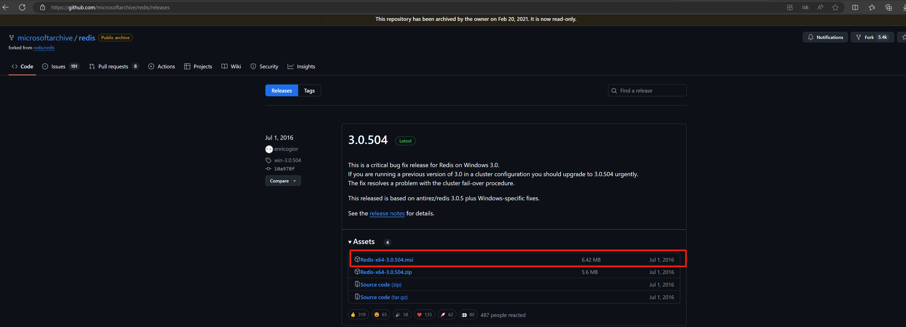

2.安装 Redis
----------

运行安装程序：  
双击下载的 .msi 文件，启动安装程序。  
按照安装向导的提示进行安装。  
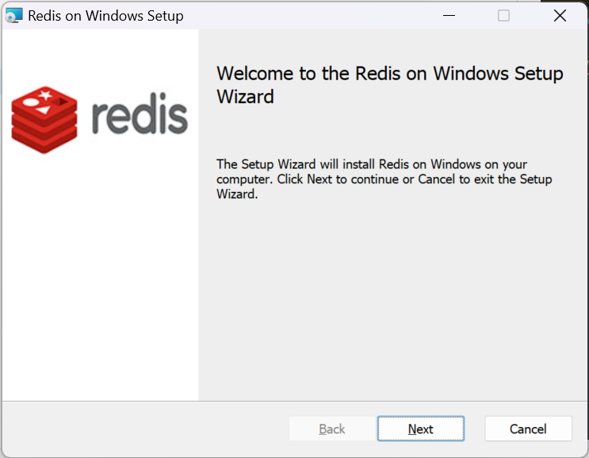
  
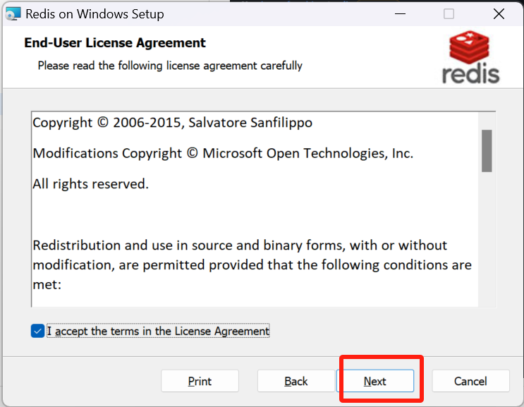
  
这里记得勾选  
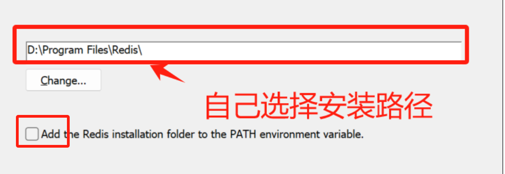

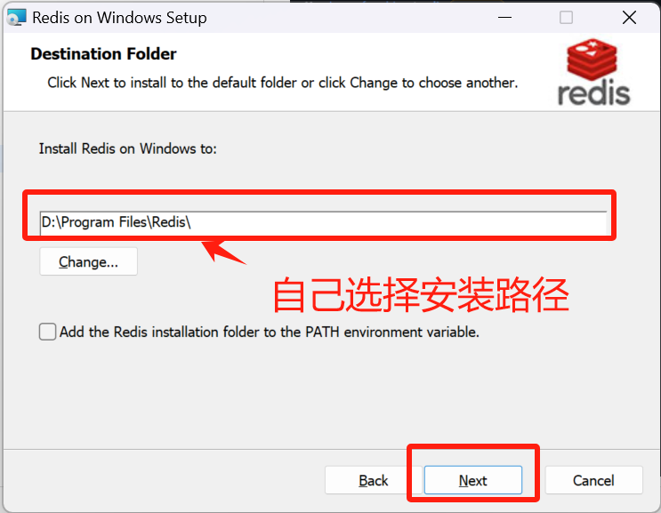
  
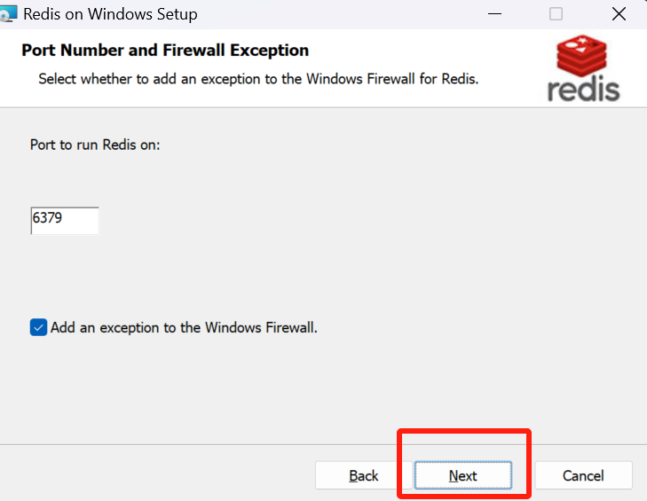
  
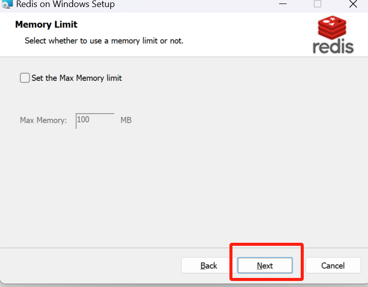
  
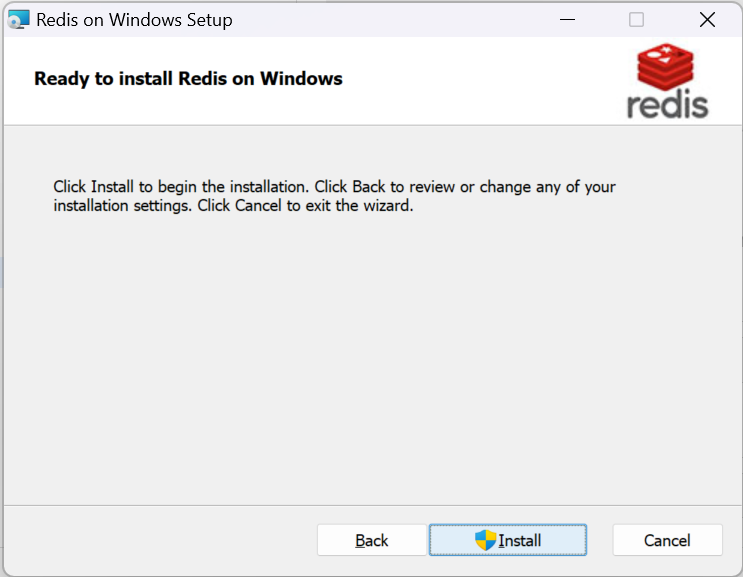
  
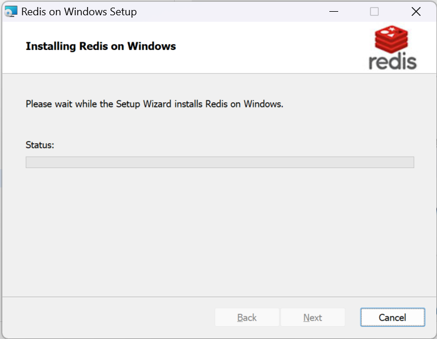
  
等待安装完成。  
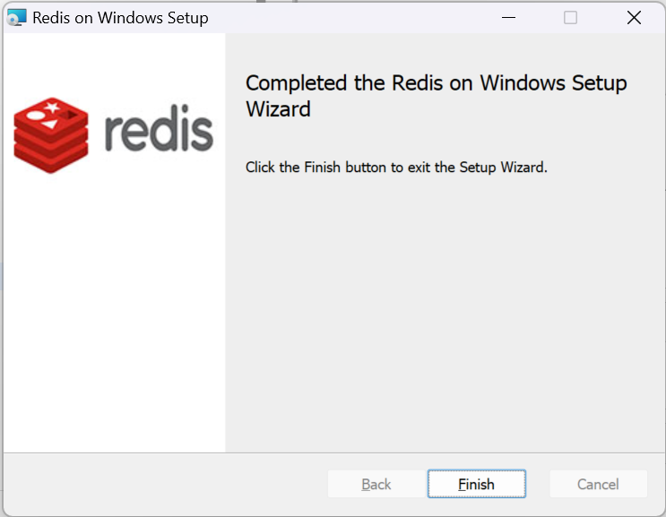

3.配置 Redis：
-----------

在安装过程中，你可以选择 Redis 的安装路径和其他配置选项。  
默认情况下，Redis 会安装在 C:\\Program Files\\Redis 目录下。

4.启动 Redis 服务
-------------

1启动 Redis 服务：  
安装完成后，Redis 服务会自动启动。你可以在 Windows 服务管理器中查看 Redis 服务的状态。  
你也可以通过命令行启动 Redis 服务：

```null
redis-server

```

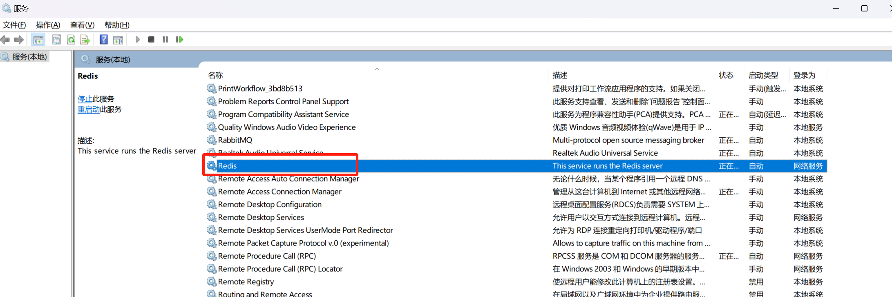

2.验证 Redis 服务：  
打开一个新的命令行窗口，运行以下命令验证 Redis 服务是否正常运行：

```null
redis-cli ping

```

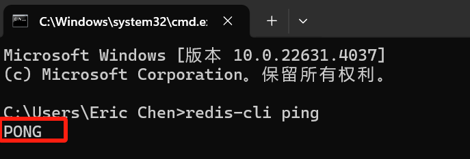
  
出现：PONG 表示redis正常运行中

5.配置 Redis 环境变量
---------------

为了方便使用 Redis 命令行工具，你可以将 Redis 的安装路径添加到系统的 PATH 环境变量中。

1.打开环境变量设置：  
右键点击“此电脑”或“计算机”，选择“属性”。  
点击“高级系统设置”。  
在“系统属性”窗口中，点击“环境变量”按钮。

2.编辑 Path 变量：  
在“系统变量”部分，找到并选择 Path 变量，然后点击“编辑”。  
点击“新建”，添加 Redis 的安装路径（例如 C:\\Program Files\\Redis）。  
点击“确定”保存更改。

6.使用 Redis
----------

安装和配置完成后，你可以在命令行中使用 Redis 命令行工具（redis-cli）来管理和操作 Redis 数据库。

例如，你可以使用以下命令连接到 Redis 服务器：

```null
redis-cli

```

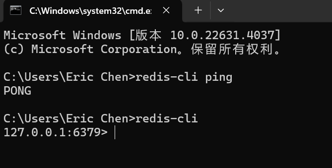

然后，你可以执行各种 Redis 命令，例如：

```null
SET mykey "Hello"
GET mykey

```

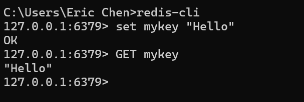

7.配置 Redis 持久化
--------------

Redis 支持两种持久化方式：RDB 和 AOF。你可以在 redis.conf 文件中配置持久化选项。

1.编辑 redis.conf 文件：  
打开 Redis 安装目录下的 redis.conf 文件  
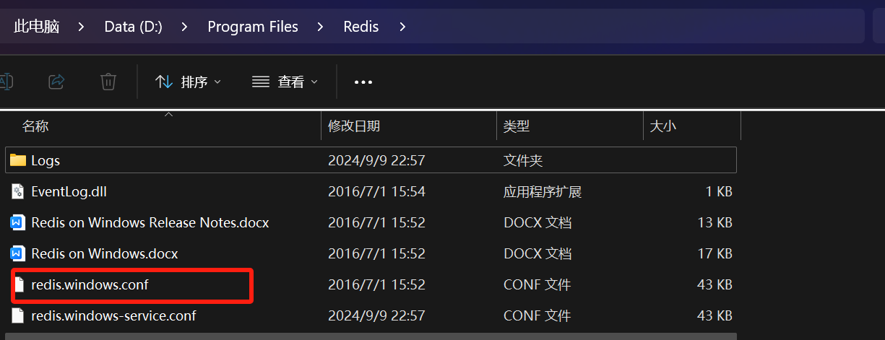

2.配置持久化选项：  
找到 save 配置项，配置 RDB 持久化：

```null
save 900 1
save 300 10
save 60 10000

```

找到 appendonly 配置项，配置 AOF 持久化：

```null
appendonly yes

```

3.重启 Redis 服务：  
修改配置文件后，重启 Redis 服务以应用更改。  
打开命令提示符或者PowerShell窗口。可以通过在开始菜单的搜索栏中输入“cmd”或“PowerShell”来找到相应的程序。

a.使用cd命令切换到Redis的安装目录。

```null
cd D:\Program Files\Redis

```

b.停止Redis服务器。在命令提示符或者PowerShell窗口中运行以下命令：

```null
redis-cli.exe shutdown

```

这个命令会发送一个关闭信号给Redis服务器，然后Redis服务器会开始关闭过程。  
等待Redis服务器完全关闭。在命令提示符或者PowerShell窗口中不会看到任何输出，需要等待一段时间，直到Redis服务器完全关闭。

c.启动Redis服务器。再次在命令提示符或者PowerShell窗口中运行以下命令

```null
redis-server.exe redis.conf

```

如果执行上面的命令显示文件不存在；就执行以下命令

```null
redis-server.exe redis.windows.conf

```

这个命令会启动Redis服务器，并且使用指定的配置文件（在这里是redis.conf）来进行配置。

d.检查Redis是否成功启动。可以通过在命令提示符或者PowerShell窗口中运行以下命令来检查Redis是否成功启动：

```null
redis-cli.exe ping

```

如果成功启动，会返回“PONG”作为响应。

完成。至此，Redis服务器已经成功重启。