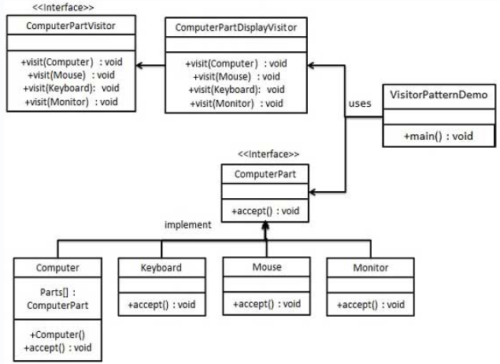

\[设计模式/Java\] 设计模式之访问者模式【24】 - 千千寰宇 - 博客园           

*    [](https://www.cnblogs.com/ "开发者的网上家园") 
*   [会员](https://cnblogs.vip/)
*   [众包](https://www.cnblogs.com/cmt/p/18500368)
*   [新闻](https://news.cnblogs.com/)
*   [博问](https://q.cnblogs.com/)
*   [闪存](https://ing.cnblogs.com/)
*   [赞助商](https://www.cnblogs.com/cmt/p/18341478)
*   [Trae](https://trae.cnblogs.com/)
*   [Chat2DB](https://chat2db-ai.com/)

*    
      
    
    *   
        
        所有博客
    *   
        
        当前博客
    *   
        
        我的博客
    
*    [](https://i.cnblogs.com/EditPosts.aspx?opt=1 "写随笔") [ 
     ](https://www.cnblogs.com/yehuoshun/ "我的博客") [ 
      ](https://msg.cnblogs.com/ "短消息") [](javascript:void(0) "简洁模式启用，您在访问他人博客时会使用简洁款皮肤展示") 
    
     [](https://home.cnblogs.com/u/yehuoshun) 
    
    [我的博客](https://www.cnblogs.com/yehuoshun/) [我的园子](https://home.cnblogs.com/) [账号设置](https://account.cnblogs.com/settings/account) [会员中心](https://vip.cnblogs.com/my) [简洁模式 ...](javascript:void(0) "简洁模式会使用简洁款皮肤显示所有博客") [退出登录](javascript:void(0))
    
    [注册](https://account.cnblogs.com/signup) [登录](javascript:void(0);)

[
](https://www.cnblogs.com/johnnyzen/)

[千千寰宇](https://www.cnblogs.com/johnnyzen)
=========================================

大数据与Java软件开发从业者，数智化转型实践者。
-------------------------

*   [首页](https://www.cnblogs.com/johnnyzen/)

*   [联系](https://msg.cnblogs.com/send/%E5%8D%83%E5%8D%83%E5%AF%B0%E5%AE%87)
*   [订阅](javascript:void(0))
*   [管理](https://i.cnblogs.com/)

随笔 - 993 文章 - 0 评论 - 58 阅读 - 160万

[\[设计模式/Java\] 设计模式之访问者模式【24】](https://www.cnblogs.com/johnnyzen/p/18845275 "发布于 2025-04-24 20:38")
===================================================================================================

**目录**

*   [序](#_label0)
*   [概述：访问者模式 := Visitor Pattern ∈ 行为型模式](#_label1)

*   [模式定义](#_lab2_1_0)
*   [适用场景](#_lab2_1_1)
*   [实现步骤](#_lab2_1_2)
*   [模式特点](#_lab2_1_3)

*   [优点](#_label3_1_3_0)
*   [缺点](#_label3_1_3_1)

*   [使用建议](#_lab2_1_4)

*   [案例实践](#_label2)

*   [CASE 生活场景-朋友家做客](#_lab2_2_0)
*   [CASE 计算机零部件](#_lab2_2_1)

*   [ComputerPart ： 元素接口](#_label3_2_1_0)
*   [Keyboard|Monitor|Mouse|Computer implements ComputerPart : 具体元素](#_label3_2_1_1)
*   [ComputerPartVisitor : 访问者接口](#_label3_2_1_2)
*   [ComputerPartDisplayVisitor implements ComputerPartVisitor : 具体访问者](#_label3_2_1_3)
*   [Client](#_label3_2_1_4)

*   [Y 推荐文献](#_label3)
*   [X 参考文献](#_label4)

[回到顶部(Back to Top)](#_labelTop)

序
=

*   **访问者模式**可以说是`GOF23`中**设计模式**中**最复杂**的一个，但日常开发中**使用频率**却不高。

> 所以说上帝喜欢简洁！  
> 增删改查虽然简单，却是大部分程序员日常主要工作，是可以混饭吃的家伙式。  
> 你技术再牛逼，企业用不到，那对于企业来说也没啥用，所以说**合适的才是最好的**。  
> 但**不常用**不等于**没有用**，这一点的认识到。

[回到顶部(Back to Top)](#_labelTop)

概述：访问者模式 := Visitor Pattern ∈ 行为型模式
===================================

模式定义
----

*   问题背景

> 访问者模式试图解决如下问题： > 一个类农场里面包含各种元素，例如有大雁，狗子，鸭子。而每个元素的操作却经常变换，一会让大雁排成一字，一会让大雁排成人字。  
> 当大雁排成一字的时候狗子要排成S形状，鸭子要排成B形状，当大雁排成人字时候狗子要叫两声，鸭子要跳起来...。  
> 但对农场这类有要求，第一：可以迭代这些元素，第二：里面的元素不能频繁变动，你不能一会把鸭子杀了吃了，一会又买回一匹马...，  
> 如果是这样的话就不适合使用`Visitor`模式

如果我们不采用设计模式，那么就要频繁的修改这些元素类，违背了开闭原则，降低代码的可维护和扩展性。

*   主要解决的问题

> 解决在**稳定数据结构**和**易变操作**之间的【耦合】问题，使得操作可以独立于数据结构变化。

*   模式定义

> **封装**一些作用于**某种数据结构**中的各元素的操作，它可以在**不改变这个数据结构**的前提下，定义作用于其内部各个元素的新操作  
> 在访问者模式（Visitor Pattern）中，我们使用了一个**访问者类**，它改变了元素类的执行算法。通过这种方式，**元素的执行算法**可以随着**访问者**改变而改变。  
> 这种类型的设计模式属于**行为型模式**。根据模式，**元素对象**已接受**访问者对象**，这样访问者对象就可以处理元素对象上的操作。

适用场景
----

*   当你有个类，里面的包含各种类型的元素，这个**类的结构比较稳定**，**不会经常增删不同类型的元素**。而需要经常给这些元素**添加新的操作**的时候，考虑使用此设计模式。

> 当需要对一个对象结构中的对象执行多种不同的且不相关的操作时，尤其是这些操作需要避免"污染"对象类本身。

实现步骤
----

*   定义**元素接口**：声明一个接受访问者的方法。
    
*   创建**具体元素**：实现元素接口，每个具体元素类对应数据结构中的一个具体对象。
    
*   定义**访问者接口（`Visitor`）**：声明一系列访问方法，一个访问方法对应数据结构中的一个元素类。
    
*   创建**具体访问者（`Concrete Visitor`）**：实现访问者接口，为每个具体元素类的访问方法提供具体实现。
    
*   **对象结构**（`Object Structure`）（可选）：
    

> *   定义了如何组装具体元素，如一个组合类。

模式特点
----

### 优点

*   单一职责原则：访问者模式符合单一职责原则，每个类只负责一项职责。
*   扩展性：容易为数据结构添加新的操作。
*   灵活性：访问者可以独立于数据结构变化。

### 缺点

*   违反迪米特原则：元素需要向访问者公开其内部信息。
*   元素类难以变更：元素类需要维持与访问者的兼容。
*   依赖具体类：访问者模式依赖于具体类而不是接口，违反了依赖倒置原则。

使用建议
----

*   当对象结构稳定，但需要在其上定义多种新操作时，考虑使用访问者模式。
*   当需要避免操作"污染"对象类时，使用访问者模式封装操作。
*   访问者模式可以用于功能统一，如报表生成、用户界面显示、拦截器和过滤器等。

[回到顶部(Back to Top)](#_labelTop)

案例实践
====

CASE 生活场景-朋友家做客
---------------

*   **做客场景**：访问者（如您）访问朋友家，朋友作为元素提供信息，访问者根据信息做出判断。

CASE 计算机零部件
-----------

*   我们将创建一个定义接受操作的 \`ComputerPart 接口。
    
*   Keyboard、Mouse、Monitor 和 Computer 是实现了 ComputerPart 接口的实体类。
    
*   我们将定义另一个接口 ComputerPartVisitor，它定义了访问者类的操作。
    
*   Computer 使用实体访问者来执行相应的动作。
    
*   VisitorPatternDemo，我们的演示类使用 Computer、ComputerPartVisitor 类来演示访问者模式的用法。
    



### ComputerPart ： 元素接口

```null
public interface ComputerPart {   public void accept(ComputerPartVisitor computerPartVisitor);}
```

### Keyboard|Monitor|Mouse|Computer implements ComputerPart : 具体元素

*   Keyboard

```null
public class Keyboard implements ComputerPart {   @Override   public void accept(ComputerPartVisitor computerPartVisitor) {      computerPartVisitor.visit(this);   }}
```

*   Monitor

```null
public class Monitor implements ComputerPart {    @Override   public void accept(ComputerPartVisitor computerPartVisitor) {      computerPartVisitor.visit(this);   }}
```

*   Mouse

```null
public class Mouse implements ComputerPart {    @Override   public void accept(ComputerPartVisitor computerPartVisitor) {      computerPartVisitor.visit(this);   }}
```

*   Computer

```null
public class Computer implements ComputerPart {     ComputerPart[] parts;    public Computer(){      parts = new ComputerPart[] {new Mouse(), new Keyboard(), new Monitor()};         }      @Override   public void accept(ComputerPartVisitor computerPartVisitor) {      for (int i = 0; i < parts.length; i++) {         parts[i].accept(computerPartVisitor);      }      computerPartVisitor.visit(this);   }}
```

### ComputerPartVisitor : 访问者接口

```null
//访问者接口 : 声明一系列访问方法，一个访问方法对应数据结构中的一个元素类。public interface ComputerPartVisitor {    public void visit(Computer computer);    public void visit(Mouse mouse);    public void visit(Keyboard keyboard);    public void visit(Monitor monitor);}
```

### ComputerPartDisplayVisitor implements ComputerPartVisitor : 具体访问者

```null
public class ComputerPartDisplayVisitor implements ComputerPartVisitor {   @Override   public void visit(Computer computer) {      System.out.println("Displaying Computer.");   }    @Override   public void visit(Mouse mouse) {      System.out.println("Displaying Mouse.");   }    @Override   public void visit(Keyboard keyboard) {      System.out.println("Displaying Keyboard.");   }    @Override   public void visit(Monitor monitor) {      System.out.println("Displaying Monitor.");   }}
```

### Client

> 使用 ComputerPartDisplayVisitor 来显示 Computer 的组成部分。

```null
public class VisitorPatternDemo {   public static void main(String[] args) {      ComputerPart computer = new Computer();      computer.accept(new ComputerPartDisplayVisitor());   }}
```

> out

```null
Displaying Mouse.Displaying Keyboard.Displaying Monitor.Displaying Computer.
```

[回到顶部(Back to Top)](#_labelTop)

Y 推荐文献
======

*   [设计模式之总述 - 博客园/千千寰宇](https://www.cnblogs.com/johnnyzen/p/17189752.html)

[回到顶部(Back to Top)](#_labelTop)

X 参考文献
======

*   [秒懂设计模式之访问者模式（Visitor Pattern） - Zhihu](https://zhuanlan.zhihu.com/p/380161731)
*   [设计模式： 访问者模式 - 概念、实现及spring中的访问者模式 - CSDN](https://blog.csdn.net/hhy107107/article/details/107892386)
*   [访问者模式 - 菜鸟教程](https://www.runoob.com/design-pattern/visitor-pattern.html)


本文作者： **[千千寰宇](https://github.com/Johnny-ZTSD)**  
本文链接： [https://www.cnblogs.com/johnnyzen/p/18845275](https://www.cnblogs.com/johnnyzen/p/18845275)  
关于博文：评论和私信会在第一时间回复，或[直接私信](https://msg.cnblogs.com/msg/send/johnnyzen)我。  
版权声明：本博客所有文章除特别声明外，均采用 [BY-NC-SA](http://blog.sina.com.cn/s/blog_896327b90102y6c6.html "https://creativecommons.org/licenses/by-nc-nd/4.0/") 许可协议。转载请注明出处！  
日常交流：大数据与软件开发-QQ交流群: 774386015 **【[入群二维码](javascript:void(0);)】** 参见左下角。您的支持、鼓励是博主技术写作的重要动力！  

标签: [设计模式](https://www.cnblogs.com/johnnyzen/tag/%E8%AE%BE%E8%AE%A1%E6%A8%A1%E5%BC%8F/)

[好文要顶](javascript:void(0);) [关注我](javascript:void(0);) [收藏该文](javascript:void(0);) [微信分享](javascript:void(0);)

[
](https://home.cnblogs.com/u/johnnyzen/)

[千千寰宇](https://home.cnblogs.com/u/johnnyzen/)  
[粉丝 - 81](https://home.cnblogs.com/u/johnnyzen/followers/) [关注 - 63](https://home.cnblogs.com/u/johnnyzen/followees/)  

[+加关注](javascript:void(0);)

0

0

[«](https://www.cnblogs.com/johnnyzen/p/18844046) 上一篇： [\[设计模式/Java\] 设计模式之迭代器模式【23】](https://www.cnblogs.com/johnnyzen/p/18844046 "发布于 2025-04-24 09:37")  
[»](https://www.cnblogs.com/johnnyzen/p/18845702) 下一篇： [\[设计模式/Java\] 设计模式之备忘录模式【25】](https://www.cnblogs.com/johnnyzen/p/18845702 "发布于 2025-04-25 01:42")

posted @ 2025-04  [千千寰宇](https://www.cnblogs.com/johnnyzen)  阅读(37)  评论(0)    [收藏](javascript:void(0))  [举报](javascript:void(0))

[刷新评论](javascript:void(0);)[刷新页面](#)[返回顶部](#top)

发表评论 [升级成为园子VIP会员](https://cnblogs.vip/)

编辑 预览

c6df3402-7d42-46d7-9688-08d9b4008d6c

 自动补全

 [不改了](javascript:void(0);) [退出](javascript:void(0);) [订阅评论](javascript:void(0); "订阅后有新评论时会邮件通知您") [我的博客](//www.cnblogs.com/yehuoshun/)

\[Ctrl+Enter快捷键提交\]

[【推荐】注册飞算 JavaAI 开发助手，立得京东e卡！分享体验再领30元](https://www.cnblogs.com/cmt/p/19038269)  
[【推荐】100%开源！大型工业跨平台软件C++源码提供，建模，组态！](http://www.uccpsoft.com/index.htm)  
[【推荐】AI 的力量，开发者的翅膀：欢迎使用 AI 原生开发工具 TRAE](https://www.cnblogs.com/cmt/p/19004092)  
[【推荐】2025 HarmonyOS 鸿蒙创新赛正式启动，百万大奖等你挑战](https://www.cnblogs.com/HarmonyOS5/p/18974773)  
[【推荐】博客园的心动：当一群程序员决定开源共建一个真诚相亲平台](https://www.cnblogs.com/cmt/p/18894723)  

 [](https://www.cnblogs.com/cmt/p/19038269) 

**相关博文：**   

·  [\[设计模式\] 设计模式之装饰器模式【8】](https://www.cnblogs.com/johnnyzen/p/17199181.html "[设计模式] 设计模式之装饰器模式【8】")

·  [\[设计模式\] 设计模式之总述【0】](https://www.cnblogs.com/johnnyzen/p/17189752.html "[设计模式] 设计模式之总述【0】")

·  [23种设计模式之访问者模式（Visitor Pattern）](https://www.cnblogs.com/cuizb/p/16709525.html "23种设计模式之访问者模式（Visitor Pattern）")

·  [访问者模式](https://www.cnblogs.com/A88888/p/17175388.html "访问者模式")

·  [初识设计模式 - 访问者模式](https://www.cnblogs.com/fatedeity/p/16875853.html "初识设计模式 - 访问者模式")

**阅读排行：**   
· [博客园众包：再次诚征3D影像景深延拓实时处理方案（预算8-15万，需求有调整）](https://www.cnblogs.com/cmt/p/19038016)  
· [扣子(Coze)，开源了！Dify 天塌了](https://www.cnblogs.com/tangshiye/p/19037650)  
· [\[原创\]《C#高级GDI+实战：从零开发一个流程图》第09章：增加贝塞尔曲线，上、下、左、右连接点](https://www.cnblogs.com/lesliexin/p/19033113)  
· [从经典产品看大模型方向](https://www.cnblogs.com/cicada-smile/p/19037116)  
· [终于有人讲明白了！解读Agent 4大协议：MCP/ACP/A2A/ANP](https://www.cnblogs.com/tangshiye/p/19035765)  

**历史上的今天：**   
2022-04-24 [\[Java/LeetCode\]算法练习：转变日期格式(1507/simple)](https://www.cnblogs.com/johnnyzen/p/16187363.html)  
2022-04-24 [\[Java/LeetCode\]算法练习：二进制间距(868/simple)](https://www.cnblogs.com/johnnyzen/p/16187186.html)  
2021-04-24 [\[游记\]二访金陵](https://www.cnblogs.com/johnnyzen/p/14698298.html)  
2018-04-24 [\[C++\]PAT乙级1011. A+B和C (15/15)](https://www.cnblogs.com/johnnyzen/p/8934170.html)  

### 公告

*   Email：[johnnyztsd@gmail.com](mailto:johnnyztsd@gmail.com)
*   My Links : [朋友之链](https://www.cnblogs.com/johnnyzen/p/18438637)
*   [【博文推荐排行榜】](https://www.cnblogs.com/johnnyzen/most-liked?page=1)
*   欢迎加入【大数据与Java软件开发】QQ 交流群: 774386015 (合作请私信~)
*   软件定义世界，数据驱动未来。
*   1.个人的【财富规模/存在意义】、工作/事业的稳定性，根本上取决于个人真正地、持续地创造了多少【社会价值/利他价值】
*   2.守正出奇，居安思危，构建核心护城河能力。
*   3.时常思考，未来的航向与当前践行的情况。
*   4.每日习得新知，即使它再小，也是进步，亦不枉此大好年青时光。
*   5.新知必复盘、必总结；先尝试、实践、归纳总结，再逐步深究、创新。
*   **职业**：深度>>广度，聚焦【数据】
*   **视野**：博览天下，通透万物
*   To be a software engineer,not a code porter.
*   重视:项目管理{需求/进度/质量/成本/风险}/软件生命周期过程{人/方法/工具/过程/文档}
*   支持-RUP系统建模、真敏捷、反对-无脑的伪敏捷


昵称： [千千寰宇](https://home.cnblogs.com/u/johnnyzen/)  
园龄： [8年2个月](https://home.cnblogs.com/u/johnnyzen/ "入园时间：2017-05-28")  
粉丝： [81](https://home.cnblogs.com/u/johnnyzen/followers/)  
关注： [63](https://home.cnblogs.com/u/johnnyzen/followees/)

[+加关注](javascript:void(0))

| 
| [<](javascript:void(0);) | 2025年8月 | [\>](javascript:void(0);) | |
| 日 | 一 | 二 | 三 | 四 | 五 | 六 |
| 27 | 28 | 29 | 30 | 31 | 1 | 2 |
| 3 | 4 | 5 | [6](https://www.cnblogs.com/johnnyzen/p/archive/2025/08/06) | 7 | [8](https://www.cnblogs.com/johnnyzen/p/archive/2025/08/08) | 9 |
| 10 | 11 | [12](https://www.cnblogs.com/johnnyzen/p/archive/2025/08/12) | 13 | 14 | 15 | 16 |
| 17 | 18 | 19 | 20 | 21 | 22 | 23 |
| 24 | 25 | 26 | 27 | 28 | 29 | 30 |
| 31 | 1 | 2 | 3 | 4 | 5 | 6 |

### 常用链接

*   [我的随笔](https://www.cnblogs.com/johnnyzen/p/ "我的博客的随笔列表")
*   [我的评论](https://www.cnblogs.com/johnnyzen/MyComments.html "我的发表过的评论列表")
*   [我的参与](https://www.cnblogs.com/johnnyzen/OtherPosts.html "我评论过的随笔列表")
*   [最新评论](https://www.cnblogs.com/johnnyzen/comments "我的博客的评论列表")
*   [我的标签](https://www.cnblogs.com/johnnyzen/tag/ "我的博客的标签列表")

### [我的标签](https://www.cnblogs.com/johnnyzen/tag/)

*   [Linux(130)](https://www.cnblogs.com/johnnyzen/tag/Linux/)
*   [操作系统(84)](https://www.cnblogs.com/johnnyzen/tag/%E6%93%8D%E4%BD%9C%E7%B3%BB%E7%BB%9F/)
*   [JavaScript(69)](https://www.cnblogs.com/johnnyzen/tag/JavaScript/)
*   [计算机网络(62)](https://www.cnblogs.com/johnnyzen/tag/%E8%AE%A1%E7%AE%97%E6%9C%BA%E7%BD%91%E7%BB%9C/)
*   [算法(47)](https://www.cnblogs.com/johnnyzen/tag/%E7%AE%97%E6%B3%95/)
*   [Python(45)](https://www.cnblogs.com/johnnyzen/tag/Python/)
*   [Java SE-JDK/JVM(44)](https://www.cnblogs.com/johnnyzen/tag/Java%20SE-JDK%2FJVM/)
*   [Java SE(43)](https://www.cnblogs.com/johnnyzen/tag/Java%20SE/)
*   [经验总结(43)](https://www.cnblogs.com/johnnyzen/tag/%E7%BB%8F%E9%AA%8C%E6%80%BB%E7%BB%93/)
*   [Java EE(37)](https://www.cnblogs.com/johnnyzen/tag/Java%20EE/)
*   [设计模式(37)](https://www.cnblogs.com/johnnyzen/tag/%E8%AE%BE%E8%AE%A1%E6%A8%A1%E5%BC%8F/)
*   [Docker/K8S/虚拟化/容器化(36)](https://www.cnblogs.com/johnnyzen/tag/Docker%2FK8S%2F%E8%99%9A%E6%8B%9F%E5%8C%96%2F%E5%AE%B9%E5%99%A8%E5%8C%96/)
*   [DATABASE-MYSQL(32)](https://www.cnblogs.com/johnnyzen/tag/DATABASE-MYSQL/)
*   [C++(31)](https://www.cnblogs.com/johnnyzen/tag/C%2B%2B/)
*   [SVN/Git(26)](https://www.cnblogs.com/johnnyzen/tag/SVN%2FGit/)
*   [更多](https://www.cnblogs.com/johnnyzen/tag/)

### 积分与排名

*   积分 - 948052
*   排名 - 447

### [阅读排行榜](https://www.cnblogs.com/johnnyzen/most-viewed)

*   [1\. \[Git\] 一次搞定：Github 2FA(Two-Factor Authentication/两因素认证)(59103)](https://www.cnblogs.com/johnnyzen/p/17880870.html)
*   [2\. \[Windows/CMD\] 不重启设置/刷新环境变量(39455)](https://www.cnblogs.com/johnnyzen/p/13527718.html)
*   [3\. \[JDK\] Intellij IDEA中设置JDK版本(25431)](https://www.cnblogs.com/johnnyzen/p/16984948.html)
*   [4\. \[C++\] Linux之头文件sys/types.h\[/usr/include/sys\](24997)](https://www.cnblogs.com/johnnyzen/p/8016796.html)
*   [5\. \[汽车/行业标准\] GB/T 32960《电动汽车远程服务与管理系统技术规范》(22193)](https://www.cnblogs.com/johnnyzen/p/17956365)
*   [6\. \[Linux\] Alpine Linux 概述(21879)](https://www.cnblogs.com/johnnyzen/p/17805510.html)
*   [7\. \[Java EE\] Hibernate异常总结【4】org.hibernate.exception.SQLGrammarException: could not execute statement(18604)](https://www.cnblogs.com/johnnyzen/p/7804712.html)
*   [8\. \[技术选型与调研\] 流程引擎(工作流引擎|BPM引擎)：Activiti、Flowable、Camunda(18511)](https://www.cnblogs.com/johnnyzen/p/18024283/business-process-engine)
*   [9\. \[Python/数学\] Numpy : 支持多维数组与矩阵运算的线性代数库(17421)](https://www.cnblogs.com/johnnyzen/p/10855208.html)
*   [10\. \[Linux\] Ubuntu下如何查看已安装的软件/库文件 \[转\](17354)](https://www.cnblogs.com/johnnyzen/p/7995157.html)
*   [11\. \[日志管理\] 启动程序时，因报“log4j-slf4j-impl cannot be present with log4j-to-slf4j”错误而导致程序终止运行\[转发\](16610)](https://www.cnblogs.com/johnnyzen/p/17448771.html)
*   [12\. \[GIT\] GIT推送/拉取远程代码时报：unable to access 'https://github.com/xxxx/yyyy.git/': OpenSSL SSL\_connect: SSL\_ERROR\_SYSCALL in connection to github.com:443(16567)](https://www.cnblogs.com/johnnyzen/p/18026408)
*   [13\. \[PHP\] 字符串匹配(15499)](https://www.cnblogs.com/johnnyzen/p/8052127.html)
*   [14\. \[Shell\] Windows上支持Linux Shell的工具/方法(14162)](https://www.cnblogs.com/johnnyzen/p/17163623.html)
*   [15\. 系统建模之程序流程图|系统流程图|数据流图(13550)](https://www.cnblogs.com/johnnyzen/p/14644010.html)

### [推荐排行榜](https://www.cnblogs.com/johnnyzen/most-liked)

*   [1\. \[技术选型与调研\] 流程引擎(工作流引擎|BPM引擎)：Activiti、Flowable、Camunda(16)](https://www.cnblogs.com/johnnyzen/p/18024283/business-process-engine)
*   [2\. \[Git\] 一次搞定：Github 2FA(Two-Factor Authentication/两因素认证)(12)](https://www.cnblogs.com/johnnyzen/p/17880870.html)
*   [3\. \[计算机/硬件/GPU\] 显卡(7)](https://www.cnblogs.com/johnnyzen/p/18721232)
*   [4\. \[图形绘制/流程图/AI/GPT/JS\] Mermaid : 开源的低代码图形绘制语言、协议及工具——AI时代的绘图宠儿(4)](https://www.cnblogs.com/johnnyzen/p/18706467)
*   [5\. \[计算机组成原理/Java\] 字符集编码: Unicode 字符集(UTF8/UTF16/UTF32) / \`BOM\`(Byte Order Mark/字节序标记) / UnicodeTextUtils(3)](https://www.cnblogs.com/johnnyzen/p/18931813)
*   [6\. \[虚拟化/Docker\] Docker Desktop 安装与使用(3)](https://www.cnblogs.com/johnnyzen/p/18335324)
*   [7\. \[数据库\] MYSQL之binlog概述(3)](https://www.cnblogs.com/johnnyzen/p/17362965.html)
*   [8\. \[nacos\] JAR启动并加载/解析Nacos yml格式的配置文件时，报“java.nio.charset.MalformedInputException: Input length = 1 ”(3)](https://www.cnblogs.com/johnnyzen/p/17332241.html)
*   [9\. \[大数据\] ETL之增量数据抽取(CDC)(3)](https://www.cnblogs.com/johnnyzen/p/12781942.html)
*   [10\. \[数智化转型\] 数智化转型之业务信息系统(总述)(2)](https://www.cnblogs.com/johnnyzen/p/18869312)

[博客园](https://www.cnblogs.com/)  ©  2004-2025  
[
浙公网安备 33010602011771号](http://www.beian.gov.cn/portal/registerSystemInfo?recordcode=33010602011771) [浙ICP备2021040463号-3](https://beian.miit.gov.cn) 

点击右上角即可分享

