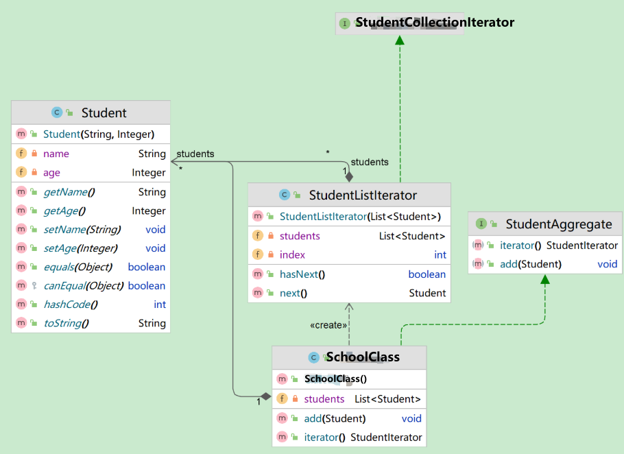

**目录**

*   [概述：迭代器模式 ∈ 行为型模式](#_label0)

*   [模式定义](#_lab2_0_0)
*   [模式的组成](#_lab2_0_1)
*   [模式特点](#_lab2_0_2)

*   [优点](#_label3_0_2_0)
*   [缺点](#_label3_0_2_1)

*   [案例实践](#_label1)

*   [CASE 生活场景-教师按照班级名单点名](#_lab2_1_0)

*   [Student : 被遍历的数据对象](#_label3_1_0_0)
*   [StudentCollectionIterator : 抽象的集合迭代器](#_label3_1_0_1)
*   [StudentListIterator : 具体的集合迭代器(Concrete Iterator)](#_label3_1_0_2)
*   [StudentAggregate : 抽象的聚合器（Aggregate）](#_label3_1_0_3)
*   [SchoolClass : 具体的聚合器（Concrete Aggregate）](#_label3_1_0_4)
*   [Client](#_label3_1_0_5)

*   [CASE 生活场景-遍历音乐播放列表](#_lab2_1_1)
*   [CASE Java 集合框架中的迭代器](#_lab2_1_2)
*   [CASE JDBC的ResultSet](#_lab2_1_3)
*   [CASE 文件读取(XxxxReader#readerLine())](#_lab2_1_4)

*   [Y 推荐文献](#_label2)
*   [X 参考文献](#_label3)

模式定义
----

*   **迭代器模式**提供了一种**统一访问集合对象元素的方式**，将**遍历操作**封装到**迭代器**中，**简化集合接口**、并**解耦**集合与遍历操作。

> *   **迭代器模式**是一种**行为型设计模式**
> *   它提供了一种**统一的方式来访问集合对象中的元素**，而不是**暴露集合内部**的表示方式。
> 
> > 简单地说，就是将遍历集合的责任封装到一个单独的对象中，我们可以**按照特定的方式**访问集合中的元素。

模式的组成
-----

*   **抽象的集合迭代器**（`Iterator`）：定义了遍历聚合对象所需的方法，包括`hashNext()`和`next()`方法等，用于**遍历**聚合对象中的元素。
*   **具体的集合迭代器**（`Concrete Iterator`）：它是实现迭代器接口的具体实现类，负责具体的遍历逻辑。

> 它保存了当前遍历的位置信息，并可以根据需要向前或向后遍历集合元素。

*   **抽象的聚合器**（`Aggregate`）： 一般是一个接口，提供一个`iterator()`方法

> 例如: java中的Collection接口，List接口，Set接口等。

*   **具体的聚合器**（`Concrete Aggregate`）：就是抽象容器的具体实现类

> 比如: `List`接口的有序列表实现ArrayList，`List`接口的链表实现LinkList，`Set`接口的哈希列表的实现HashSet等。

模式特点
----

### 优点

*   **简化**了集合类的接口，使用者可以更加简单地遍历集合对象，而不需要了解集合内部结构和实现细节。
*   将集合和遍历操作**解耦**，使得我们可以更灵活地使用**不同的迭代器**来遍历同一个集合，根据需求选择不同的遍历方式。
*   满足**开闭原则**，如果需要增加新的遍历方式，只需实现一个新的具体迭代器即可，不需要修改原先聚合对象的代码。

### 缺点

*   具体迭代器实现的算法**对外不可见**，因此不利于**调试和维护**。
*   对于某些小型、简单的集合对象来说，使用迭代器模式可能会**显得过于复杂**，增加了**代码的复杂性**。

CASE 生活场景-教师按照班级名单点名
--------------------

*   **遍历班级名单**：假设你是一名班主任，你需要遍历班级名单来点名。

> **班级名单**可以看作是一个集合，**每个学生名字**可以看作是集合中的一个元素。  
> 使用迭代器模式，你可以通过迭代器对象逐个访问学生的名字，而不需要了解班级名单的具体实现细节。



### Student : 被遍历的数据对象

```null
 import lombok.Data;import lombok.ToString;  * 学生实体类 */@Data@ToStringpublic class Student {    private String name;    private Integer age;     public Student(String name,Integer age){        this.age=age;        this.name=name;    }}
```

### StudentCollectionIterator : 抽象的集合迭代器

> 创建一个抽象迭代器（学生迭代器）并继承Iterator接口（java.util包下的Iterator）

*   StudentCollectionIterator

```null
import java.util.Iterator; * 抽象的集合迭代器（Iterator）：学生集合的迭代器 * 实现Iterator接口 * 负责定义访问和遍历元素的接口，例如提供hasNext()和next()方法。 */public interface StudentCollectionIterator extends Iterator<Student> { }
```

*   Iterator

```null
package java.util; import java.util.function.Consumer;  * An iterator over a collection.  {@code Iterator} takes the place of * {@link Enumeration} in the Java Collections Framework.  Iterators * differ from enumerations in two ways: * * <ul> *      <li> Iterators allow the caller to remove elements from the *           underlying collection during the iteration with well-defined *           semantics. *      <li> Method names have been improved. * </ul> * * <p>This interface is a member of the * <a href="{@docRoot}/../technotes/guides/collections/index.html"> * Java Collections Framework</a>. * * @param <E> the type of elements returned by this iterator * * @author  Josh Bloch * @see Collection * @see ListIterator * @see Iterable * @since 1.2 */public interface Iterator<E> {         * Returns {@code true} if the iteration has more elements.     * (In other words, returns {@code true} if {@link #next} would     * return an element rather than throwing an exception.)     *     * @return {@code true} if the iteration has more elements     */    boolean hasNext();          * Returns the next element in the iteration.     *     * @return the next element in the iteration     * @throws NoSuchElementException if the iteration has no more elements     */    E next();          * Removes from the underlying collection the last element returned     * by this iterator (optional operation).  This method can be called     * only once per call to {@link #next}.  The behavior of an iterator     * is unspecified if the underlying collection is modified while the     * iteration is in progress in any way other than by calling this     * method.     *     * @implSpec     * The default implementation throws an instance of     * {@link UnsupportedOperationException} and performs no other action.     *     * @throws UnsupportedOperationException if the {@code remove}     *         operation is not supported by this iterator     *     * @throws IllegalStateException if the {@code next} method has not     *         yet been called, or the {@code remove} method has already     *         been called after the last call to the {@code next}     *         method     */    default void remove() {        throw new UnsupportedOperationException("remove");    }          * Performs the given action for each remaining element until all elements     * have been processed or the action throws an exception.  Actions are     * performed in the order of iteration, if that order is specified.     * Exceptions thrown by the action are relayed to the caller.     *     * @implSpec     * <p>The default implementation behaves as if:     * <pre>{@code     *     while (hasNext())     *         action.accept(next());     * }</pre>     *     * @param action The action to be performed for each element     * @throws NullPointerException if the specified action is null     * @since 1.8     */    default void forEachRemaining(Consumer<? super E> action) {        Objects.requireNonNull(action);        while (hasNext())            action.accept(next());    }}
```

### StudentListIterator : 具体的集合迭代器(Concrete Iterator)

*   在这个具体的集合迭代器中，实现**抽象的集合迭代器**，重写`hashNext()`和`next()`方法。

```null
import java.util.List;import java.util.NoSuchElementException;  * 具体迭代器（Concrete iterator）： * 实现抽象迭代器定义的接口，负责实现对元素的访问和遍历。 */public class StudentListIterator implements StudentIterator{    private List<Student> students;    private int index;     public StudentListIterator(List<Student> students) {        this.students = students;        this.index = 0;    }     //检查是否还有下一个元素    @Override    public boolean hasNext() {        return (index < students.size());    }     //返回下一个元素    @Override    public Student next() {        if (!hasNext()) {            throw new NoSuchElementException();        }        Student student = students.get(index);        index++;        return student;    }}
```

### StudentAggregate : 抽象的聚合器（Aggregate）

*   定义一个**抽象聚合器**，并定义一个`iterator()`方法，用于创建具体的迭代器对象。

```null
 * 学生集合的聚合器: 抽象的聚合器（Aggregate） * 提供创建迭代器的接口，例如可以定义一个iterator()方法。 */public interface StudentAggregate {    //用于创建具体的迭代器对象    StudentCollectionIterator iterator();    void add(Student student);}
```

### SchoolClass : 具体的聚合器（Concrete Aggregate）

*   实现**抽象聚合器**定义的接口，负责创建**具体的迭代器对象**。

```null
import java.util.ArrayList;import java.util.List;  * 学校班级 : 具体的聚合器（ConcreteAggregate） * 实现抽象聚合器定义的接口，负责创建具体的迭代器对象，并返回该对象。 */public class SchoolClass implements StudentAggregate {    //本班级的学生    private List<Student> students = new ArrayList<>();     //创建迭代器对象    @Override    public StudentCollectionIterator iterator() {        return new StudentListIterator(students);    }     //向班级名单中添加学生信息    @Override    public void add(Student student) {        students.add(student);    }}
```

### Client

```null
//import junit.framework.TestCase; import org.junit.Test; //@SpringBootTestpublic class Client {    @Test    public void testIterator(){        SchoolClass schoolClass = new SchoolClass();        // 添加学生信息        schoolClass.add(new Student("张三", 18));        schoolClass.add(new Student("李四", 19));        schoolClass.add(new Student("王五", 20));         // 获取迭代器，遍历学生信息        StudentCollectionIterator iterator = schoolClass.iterator();         while(iterator.hasNext()) {            Student student = iterator.next();            System.out.println("学生姓名：" + student.getName() + "，学生年龄：" + student.getAge());        }    }}
```

> out

```null
学生姓名：张三，学生年龄：18学生姓名：李四，学生年龄：19学生姓名：王五，学生年龄：20
```

CASE 生活场景-遍历音乐播放列表
------------------

*   **遍历音乐播放列表**：当我们在手机或电脑上播放音乐时，通常会创建一个播放列表。

> **播放列表**可以被视为一个集合，**每首歌曲**可以被视为集合中的一个元素。  
> 使用迭代器模式，我们可以通过迭代器对象逐个访问播放列表中的歌曲，进行播放、暂停或切歌等操作。

CASE Java 集合框架中的迭代器
-------------------

*   **集合框架中的迭代器**：在`Java`中，集合包括`List`、`Set`、`Map`等等，每个集合类中都提供了一个获取迭代器的方法

> 例如: `List`提供的`iterator()`方法、`Set`提供的`iterator()`方法等等，通过获取对应的**迭代器对象**，可以对集合中的元素进行遍历和访问。

CASE JDBC的`ResultSet`
---------------------

*   `JDBC`中的`ResultSet`对象：在Java中，如果需要对数据库中的数据进行遍历和访问，可以使用JDBC操作数据库。

> JDBC中，查询结果集使用`ResultSet`对象来表示，通过使用`ResultSet`的`next()`方法，就可以像使用迭代器一样遍历和访问查询结果中的数据。

CASE 文件读取(`XxxxReader`#`readerLine()`)
--------------------------------------

*   **文件读取**：在Java中，我们可以使用`BufferedReader`类来读取文本文件。

> `BufferedReader`类提供了一个方法`readLine()`来逐行读取文件内容。  
> 实际上，`BufferedReader`在内部使用了**迭代器模式**来逐行读取文本文件的内容。

*   [设计模式之总述 - 博客园/千千寰宇](https://www.cnblogs.com/johnnyzen/p/17189752.html)

*   [设计模式第16讲——迭代器模式（Iterator） - CSDN](https://blog.csdn.net/weixin_45433817/article/details/131382881)
*   [迭代器模式 - 菜鸟教程](https://www.runoob.com/design-pattern/iterator-pattern.html)