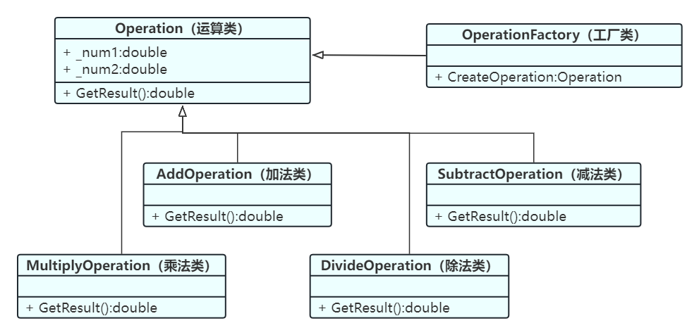

设计模式-C#实现简单工厂模式 - 妙妙屋（zy） - 博客园          

*    [](https://www.cnblogs.com/ "开发者的网上家园") 
*   [会员](https://cnblogs.vip/)
*   [众包](https://www.cnblogs.com/cmt/p/18500368)
*   [新闻](https://news.cnblogs.com/)
*   [博问](https://q.cnblogs.com/)
*   [闪存](https://ing.cnblogs.com/)
*   [赞助商](https://www.cnblogs.com/cmt/p/18341478)
*   [Trae](https://trae.cnblogs.com/)
*   [Chat2DB](https://chat2db-ai.com/)

*    
      
    
    *   
        
        所有博客
    *   
        
        当前博客
    *   
        
        我的博客
    
*    [](https://i.cnblogs.com/EditPosts.aspx?opt=1 "写随笔") [ 
     ](https://www.cnblogs.com/yehuoshun/ "我的博客") [ 
      ](https://msg.cnblogs.com/ "短消息") [](javascript:void(0) "简洁模式启用，您在访问他人博客时会使用简洁款皮肤展示") 
    
     [](https://home.cnblogs.com/u/yehuoshun) 
    
    [我的博客](https://www.cnblogs.com/yehuoshun/) [我的园子](https://home.cnblogs.com/) [账号设置](https://account.cnblogs.com/settings/account) [会员中心](https://vip.cnblogs.com/my) [简洁模式 ...](javascript:void(0) "简洁模式会使用简洁款皮肤显示所有博客") [退出登录](javascript:void(0))
    
    [注册](https://account.cnblogs.com/signup) [登录](javascript:void(0);)

[
](https://www.cnblogs.com/ZYPLJ/)

[ZYPLJ](https://www.cnblogs.com/ZYPLJ)
======================================

*   [博客园](https://www.cnblogs.com/)
*   [首页](https://www.cnblogs.com/ZYPLJ/)
*   [新随笔](https://i.cnblogs.com/EditPosts.aspx?opt=1)
*   [联系](https://msg.cnblogs.com/send/%E5%A6%99%E5%A6%99%E5%B1%8B%EF%BC%88zy%EF%BC%89)
*   [订阅](javascript:void(0))
*   [管理](https://i.cnblogs.com/)

[设计模式-C#实现简单工厂模式](https://www.cnblogs.com/ZYPLJ/p/18306505 "发布于 2024-07-17 08:44")
==================================================================================

[合集 - 杂七杂八(16)](/ZYPLJ/collections/4272)

[1.什么？博客园主题比我的个人博客好看？😮2023-07-17](https://www.cnblogs.com/ZYPLJ/p/17558916.html)[2.记录一次EF实体跟踪错误2023-08-23](https://www.cnblogs.com/ZYPLJ/p/17651675.html)[3.双非本科求职经验分享2023-09-21](https://www.cnblogs.com/ZYPLJ/p/17720585.html)[4.Debian安装Redis服务2023-10-13](https://www.cnblogs.com/ZYPLJ/p/17763211.html)[5.原生js实现下拉框可输入2023-10-19](https://www.cnblogs.com/ZYPLJ/p/17773476.html)[6.300元到手啦-阿里云云工开物计划 阿里云要给所有中国高校在读大学生每人送一台云服务器2023-10-31](https://www.cnblogs.com/ZYPLJ/p/17801715.html)[7.Sql Server中Cross Apply关键字的使用2023-11-12](https://www.cnblogs.com/ZYPLJ/p/17826882.html)[8.记录一次Windows下安装RabbitMQ2024-06-29](https://www.cnblogs.com/ZYPLJ/p/18275380)[9.在C#中使用RabbitMQ做个简单的发送邮件小项目2024-07-02](https://www.cnblogs.com/ZYPLJ/p/18279034)

10.设计模式-C#实现简单工厂模式2024-07-17

[11..NET Core搭配Vue开源弹幕效果，实现一个评论小项目。好玩！2024-09-09](https://www.cnblogs.com/ZYPLJ/p/18403223)[12.记录一次NPOI库导出Excel遇到的小问题解决方案2024-11-23](https://www.cnblogs.com/ZYPLJ/p/18564491)[13.解决uniapp使用Font Awesome图标无法显示问题03-06](https://www.cnblogs.com/ZYPLJ/p/18756492)[14.关于我用Claude 3.7 Sonnet模型直接生成小程序03-07](https://www.cnblogs.com/ZYPLJ/p/18758578)[15.SqlServer 中行转列PIVOT函数用法03-20](https://www.cnblogs.com/ZYPLJ/p/18783932)[16.基于Astro开发的Fuwari静态博客模版配置CICD流程07-30](https://www.cnblogs.com/ZYPLJ/p/19012706)

收起

前言
==

上一篇文章写了如何使用RabbitMQ做个简单的发送邮件项目，然后评论也是比较多，也是准备去学习一下如何确保RabbitMQ的消息可靠性，但是由于时间原因，先来说说设计模式中的简单工厂模式吧！  
在了解简单工厂模式之前，我们要知道C#是一款面向对象的高级程序语言。它有3大特性，封装、继承、多态。

简述
==

> 工厂模式（Factory Pattern）是一种常用的设计模式，属于创建型模式，它提供了一种创建对象的最佳方式。在工厂模式中，我们创建对象时不会对客户端暴露创建逻辑，并且是通过使用一个共同的接口来指向新创建的对象。  
> 工厂模式的核心是定义一个创建产品对象的工厂接口，将实际创建工作推迟到子类当中。这样客户端可以无需指定具体产品的类，只需通过工厂类即可得到所需的产品对象。

工厂模式主要分为三种类型：简单工厂模式（Simple Factory Pattern）、工厂方法模式（Factory Method Pattern）和抽象工厂模式（Abstract Factory Pattern）。  
本文主要讲解简单工厂模式（Simple Factory Pattern）。

案例带入
====

下面使用C#控制台程序去写一个简易的计算器，实现加减乘除。如果我没学过设计模式，我会这么写：

```null
static void Main(string[] args)  
{  
    Console.WriteLine("请输入数字A：");  
    string A = Console.ReadLine();  
    Console.WriteLine("请选择运算符号：(+、-、*、/)：");  
    string op = Console.ReadLine();  
    Console.WriteLine("请输入数字B：");  
    string B = Console.ReadLine();  
    string result = "";  
    switch (op)  
    {        
	    case "+":  
            result = Convert.ToString(Convert.ToDouble(A) + Convert.ToDouble(B));  
            break;  
        case "-":  
            result = Convert.ToString(Convert.ToDouble(A) - Convert.ToDouble(B));  
            break;  
        case "*":  
            result = Convert.ToString(Convert.ToDouble(A) * Convert.ToDouble(B));  
            break;  
        case "/":  
            result = Convert.ToString(Convert.ToDouble(A) / Convert.ToDouble(B));  
            break;  
        default:  
            Console.WriteLine("输入的运算符号有误！");  
            break;  
    }    
    Console.WriteLine("结果：" + result);  
}

``` 

上述代码乍一看没问题，实则隐藏了很多陷阱，比如：

1.  变量命名不规范
2.  除数为0怎么办
3.  输入的不是数字怎么办
4.  ......

优化
--

我们用面向对象的思想进行优化，主要体现在：可维护、可复用、可扩展、灵活性几个方面。通过封装、继承、多态来降低程序的耦合度。

### 封装

我们可以将运算逻辑封装成一个方法去实现，让主方法减轻负担。封装后：  
`Operation`类

```null
public class Operation
{
    public static double GetResult(double num1, double num2, string op)
    {
        double result = 0d;
        switch (op)
        {
            case "+":
                result = num1 + num2;
                break;
            case "-":
                result = num1 - num2;
                break;
            case "*":
                result = num1 * num2;
                break;
            case "/":
                result = num1 / num2;
                break;
        }
        return result;
    }
}

``` 

`Main`方法

```null
static void Main(string[] args)
{
	try
	{
		Console.WriteLine("请输入数字A：");
		string strNumA = Console.ReadLine();
		Console.WriteLine("请选择运算符号：(+、-、*、/)：");
		string op = Console.ReadLine();
		Console.WriteLine("请输入数字B：");
		string strNumB = Console.ReadLine();
		string result = "";
		result = Convert.ToString(Operation.GetResult(Convert.ToDouble(strNumA), Convert.ToDouble(strNumB), op));
		Console.WriteLine("结果：" + result);
	}
	catch (Exception e)
	{
		Console.WriteLine("发生异常：" + e.Message);
	}
}

``` 

### 松耦合

当我们完成封装后开始思考一个问题，如果后面有新的需求，需要增加一个开根运行，应该如何去修改？如果是我，我会在switch里面加一个分支，但是这样耦合度太高。我明明只需要去开根，但是却要让加减乘除参与进来，所以我们应该将加减乘除运算分离出来。  
优化耦合度：

```null
public class Operation
{
    private double _num1;
    private double _num2;
    public double Num1 { get => _num1; set => _num1 = value; }
    public double Num2 { get => _num2; set => _num2 = value; }
    public virtual double GetResult()
    {
        return 0;
    }
}

//加法类
public class AddOperation : Operation
{
    public override double GetResult()
    {
        return Num1 + Num2;
    }
}
//减法类
public class SubtractOperation : Operation
{
    public override double GetResult()
    {
        return Num1 - Num2;
    }
}
//乘法类
public class MultiplyOperation : Operation
{
    public override double GetResult()
    {
        return Num1 * Num2;
    }
}
//除法类
public class DivideOperation : Operation
{
    public override double GetResult()
    {
        if (Num2 == 0)
            throw new DivideByZeroException("除数不能为0");
        return Num1 / Num2;
    }
}  

``` 

我创建了`Operation`基类，并定义了2个成员变量`_num1`和`_num2`,同时定义了一个`GetResult`虚方法。同时分别创建了加减乘除子类去重写`GetResult`方法来降级耦合度。

### 回归正题(简单工厂模式)

我们需要通过简单工厂模式，来让程序知道该实例化谁。需要来创建一个工厂类：

```null
public class OperationFactory
{
    public static Operation CreateOperation(string operation)
    {
        switch (operation)
        {
            case "+":
                return new AddOperation();
            case "-":
                return new SubtractOperation();
            case "*":
                return new MultiplyOperation();
            case "/":
                return new DivideOperation();
            default:
                return null;
        }
    }
}

``` 

创建了工厂类有什么好处呢，好处就是，只需要输入运算符号，工厂就能自己实例化出合适的对象，通过多态，返回父类的方法实现了计算器的计算结果。  
`Main`方法  
通过简单工厂模式，让我们在计算加减乘除的时候只需要去增加对应的子类就行了，下面的代码进行加法运行时，通过传入+号让工厂去帮我们实例化子类。

```null
static void Main(string[] args)  
{  
    try  
    {  
        // 简单工厂模式  
        var oper = OperationFactory.CreateOperation("+");  
        oper.Num1 = 10;  
        oper.Num2 = 5;  
        Console.WriteLine(oper.GetResult());  
    }    
    catch (Exception e)  
    {        
    Console.WriteLine("发生异常：" + e.Message);  
    }
}

``` 

类图
==

讲完简单工厂模式后，简简单单复现一下类图：  
(之前线画错了，下图已更正)  
[
](../images/3091176-20240718144626476-806048317.png)

小小知识点
=====

*   **接口**：强调“做什么”，即接口定义了对象应该做什么，而不关心它是如何做的。
*   **虚方法**：强调“如何做”，即基类提供了一种实现方式，但允许派生类根据需要进行修改。

参考资料
====

*   熟读并反复背诵大话设计模式-程杰出版

*   [前言](#前言)
*   [简述](#简述)
*   [案例带入](#案例带入)
*   [    优化](#优化)
*   [        封装](#封装)
*   [        松耦合](#松耦合)
*   [        回归正题(简单工厂模式)](#回归正题简单工厂模式)
*   [类图](#类图)
*   [小小知识点](#小小知识点)
*   [参考资料](#参考资料)

  

\_\_EOF\_\_

[
](../images/20230208231503.png)

*   **本文作者：**  [妙妙屋（zy）](https://www.cnblogs.com/ZYPLJ)
*   **本文链接：**  [https://www.cnblogs.com/ZYPLJ/p/18306505](https://www.cnblogs.com/ZYPLJ/p/18306505)
*   **关于博主：**  评论和私信会在第一时间回复。或者[直接私信](https://msg.cnblogs.com/msg/send/ZYPLJ)我。
*   **版权声明：**  本博客所有文章除特别声明外，均采用 [BY-NC-SA](https://creativecommons.org/licenses/by-nc-sa/4.0/ "BY-NC-SA") 许可协议。转载请注明出处！
*   **声援博主：**  如果您觉得文章对您有帮助，可以点击文章右下角**【[推荐](javascript:void(0);)】** 一下。

合集: [杂七杂八](https://www.cnblogs.com/ZYPLJ/collections/4272)

标签: [.NET](https://www.cnblogs.com/ZYPLJ/tag/.NET/), [C#](https://www.cnblogs.com/ZYPLJ/tag/C%23/)

[好文要顶](javascript:void(0);)推荐该文

[关注我](javascript:void(0);)关注博主关注博主 [收藏该文](javascript:void(0);)收藏本文 [微信分享](javascript:void(0);)分享微信

[
](https://home.cnblogs.com/u/ZYPLJ/)

[妙妙屋（zy）](https://home.cnblogs.com/u/ZYPLJ/)  
[粉丝 - 72](https://home.cnblogs.com/u/ZYPLJ/followers/) [关注 - 7](https://home.cnblogs.com/u/ZYPLJ/followees/)  

[+加关注](javascript:void(0);)

10

0

[«](https://www.cnblogs.com/ZYPLJ/p/18279034) 上一篇： [在C#中使用RabbitMQ做个简单的发送邮件小项目](https://www.cnblogs.com/ZYPLJ/p/18279034 "发布于 2024-07-02 08:32")  
[»](https://www.cnblogs.com/ZYPLJ/p/18403223) 下一篇： [.NET Core搭配Vue开源弹幕效果，实现一个评论小项目。好玩！](https://www.cnblogs.com/ZYPLJ/p/18403223 "发布于 2024-09-09 08:33")

posted @ 2024-07-17 08:44  [妙妙屋（zy）](https://www.cnblogs.com/ZYPLJ)  阅读(1127)  评论(9)    [收藏](javascript:void(0))  [举报](javascript:void(0))

  

评论列表

默认 | 按时间 | 按支持数

[
](https://www.cnblogs.com/freecat1/)

   [回复](javascript:void(0);) [引用](javascript:void(0);)

[#1楼](#5286036) 2024-07-17 09:16 [老顽皮](https://www.cnblogs.com/freecat1/)

新手不会学c# 。老手这几种设计模式太简单了😀

[支持(1)](javascript:void(0);) [反对(0)](javascript:void(0);)

[
](https://www.cnblogs.com/ZYPLJ/)

   [回复](javascript:void(0);) [引用](javascript:void(0);)

[#2楼](#5286040) \[楼主\] 2024-07-17 09:21 [妙妙屋（zy）](https://www.cnblogs.com/ZYPLJ/)

[@](#5286036 "查看所回复的评论")老顽皮  
用什么语言不重要，主要是理解。由浅入深慢慢来，不着急😂。

[支持(0)](javascript:void(0);) [反对(0)](javascript:void(0);)

../images/20230208231503.png

[
](https://www.cnblogs.com/czb071/)

   [回复](javascript:void(0);) [引用](javascript:void(0);)

[#3楼](#5286177) 2024-07-17 11:55 [大大只植物](https://www.cnblogs.com/czb071/)

很多文章一来就怼个图,上代码,代码看得懂,就是不知道为什么这么写  
循序渐进的说明才是好教材,楼主好耶

[支持(2)](javascript:void(0);) [反对(0)](javascript:void(0);)

../images/20201121111950.png

[
](https://home.cnblogs.com/u/3484346/)

   [回复](javascript:void(0);) [引用](javascript:void(0);)

[#4楼](#5286247) 2024-07-17 14:51 [1721032743](https://home.cnblogs.com/u/3484346/)

不错不错

[支持(2)](javascript:void(0);) [反对(0)](javascript:void(0);)

[
](https://www.cnblogs.com/deali/)

   [回复](javascript:void(0);) [引用](javascript:void(0);)

[#5楼](#5286260) 2024-07-17 15:25 [程序设计实验室](https://www.cnblogs.com/deali/)

不错👍点赞支持

[支持(0)](javascript:void(0);) [反对(0)](javascript:void(0);)

../images/20200704002251.png

[
](https://home.cnblogs.com/u/2453724/)

   [回复](javascript:void(0);) [引用](javascript:void(0);)

[#6楼](#5286469) 2024-07-18 08:56 [御守矢](https://home.cnblogs.com/u/2453724/)

The word repeat again.. again... and again, it looks like a design pattern, which we've met seventeen years ago. I'm happy we still have new players, also sad it's nothing changed.

[支持(0)](javascript:void(0);) [反对(0)](javascript:void(0);)

[
](https://www.cnblogs.com/ZYPLJ/)

   [回复](javascript:void(0);) [引用](javascript:void(0);)

[#7楼](#5286567) \[楼主\] 2024-07-18 11:20 [妙妙屋（zy）](https://www.cnblogs.com/ZYPLJ/)

[@](#5286469 "查看所回复的评论")御守矢  
确实，有些经典的设计模式经得起时间的考验，持续被沿用也说明了它们的价值。但同时，每个时代都在进步，新的技术和理念也在不断涌现，为我们带来了更多的选择和可能性。所以，虽然有些方面看起来没变，但实际上我们也在不断地探索和创新中。(AI)

身为一位刚入门程序员，我所能做的是让大家能够了解到新技术以及分享更多的知识。

[支持(0)](javascript:void(0);) [反对(0)](javascript:void(0);)

../images/20230208231503.png

[
](https://www.cnblogs.com/Lvkang/)

   [回复](javascript:void(0);) [引用](javascript:void(0);)

[#8楼](#5286655) 2024-07-18 14:31 [御行所](https://www.cnblogs.com/Lvkang/)

UML类图里，实现关系是使用实现加实心箭头吗？

[支持(1)](javascript:void(0);) [反对(0)](javascript:void(0);)

../images/20150730142218.png

[
](https://www.cnblogs.com/ZYPLJ/)

   [回复](javascript:void(0);) [引用](javascript:void(0);)

[#9楼](#5286664) \[楼主\] 5286664 2024/7/18 14:41:49 2024-07-18 14:41 [妙妙屋（zy）](https://www.cnblogs.com/ZYPLJ/)

[@](#5286655 "查看所回复的评论")御行所  
你别说，还真没注意到。我这里是继承关系应该用空心+实线的。接口的实现关系应该用空心+虚线。

[支持(0)](javascript:void(0);) [反对(0)](javascript:void(0);)

../images/20230208231503.png

[刷新评论](javascript:void(0);)[刷新页面](#)[返回顶部](#top)

发表评论 [升级成为园子VIP会员](https://cnblogs.vip/)

编辑 预览

c6df3402-7d42-46d7-9688-08d9b4008d6c

 自动补全

 [不改了](javascript:void(0);) [退出](javascript:void(0);) [订阅评论](javascript:void(0); "订阅后有新评论时会邮件通知您") [我的博客](//www.cnblogs.com/yehuoshun/)

\[Ctrl+Enter快捷键提交\]

[【推荐】100%开源！大型工业跨平台软件C++源码提供，建模，组态！](http://www.uccpsoft.com/index.htm)  
[【推荐】AI 的力量，开发者的翅膀：欢迎使用 AI 原生开发工具 TRAE](https://www.cnblogs.com/cmt/p/19004092)  
[【推荐】2025 HarmonyOS 鸿蒙创新赛正式启动，百万大奖等你挑战](https://www.cnblogs.com/HarmonyOS5/p/18974773)  
[【推荐】轻量又高性能的 SSH 工具 IShell：AI 加持，快人一步](http://ishell.cc/)  

 [](https://www.trae.com.cn/?utm_source=advertising&utm_medium=cnblogs_ug_cpa&utm_term=hw_trae_cnblogs) 

**相关博文：**   

·  [在C#中使用RabbitMQ做个简单的发送邮件小项目](https://www.cnblogs.com/ZYPLJ/p/18279034 "在C#中使用RabbitMQ做个简单的发送邮件小项目")

·  [.NET中使用RabbitMQ延时队列和死信队列](https://www.cnblogs.com/ZYPLJ/p/17591838.html ".NET中使用RabbitMQ延时队列和死信队列")

·  [设计模式-简单工厂模式](https://www.cnblogs.com/wxynb/p/15856227.html "设计模式-简单工厂模式")

·  [设计模式--简单工厂模式](https://www.cnblogs.com/yubo-guan/p/17965914 "设计模式--简单工厂模式")

·  [简单工厂模式](https://www.cnblogs.com/AILove/p/18217094 "简单工厂模式")

**阅读排行：**   
· [抽象与性能：从 LINQ 看现代 .NET 的优化之道](https://www.cnblogs.com/sdcb/p/19013541/linq-abstraction-and-perf-modern-programming-language)  
· [Coze工作流实战：一键上传excel生成数据图表](https://www.cnblogs.com/lucky_hu/p/19018899)  
· [Trae Plus 让没有编程基础的女朋友也用上了 AI Coding](https://www.cnblogs.com/caituotuo/p/19019858)  
· [程序员究竟要不要写文章](https://www.cnblogs.com/xiaoxi666/p/19019449)  
· [MySQL 23 MySQL是怎么保证数据不丢的？](https://www.cnblogs.com/san-mu/p/19007778)  

**历史上的今天：**   
2023-07-17 [什么？博客园主题比我的个人博客好看？😮](https://www.cnblogs.com/ZYPLJ/p/17558916.html)  

设计模式-C#实现简单工厂模式 \_
==================

2024-07-17 08:441127910  
527310:32 ~ 17:34

[.NET](https://www.cnblogs.com/ZYPLJ/tag/.NET/)[C#](https://www.cnblogs.com/ZYPLJ/tag/C%23/)

[Scroll Down](javascript:void(0);)

   欢迎访问本博客~


昵称： [妙妙屋（zy）](https://home.cnblogs.com/u/ZYPLJ/)  
园龄： [2年6个月](https://home.cnblogs.com/u/ZYPLJ/ "入园时间：2023-02-04")  
粉丝： [72](https://home.cnblogs.com/u/ZYPLJ/followers/)  
关注： [7](https://home.cnblogs.com/u/ZYPLJ/followees/)

[+加关注](javascript:void(0))

随笔 - 72 文章 - 1 评论 - 112 阅读 - 36943

| 
| [<](javascript:void(0);) | 2025年8月 | [\>](javascript:void(0);) | |
| 日 | 一 | 二 | 三 | 四 | 五 | 六 |
| 27 | 28 | 29 | 30 | 31 | 1 | 2 |
| 3 | 4 | 5 | 6 | 7 | 8 | 9 |
| 10 | 11 | 12 | 13 | 14 | 15 | 16 |
| 17 | 18 | 19 | 20 | 21 | 22 | 23 |
| 24 | 25 | 26 | 27 | 28 | 29 | 30 |
| 31 | 1 | 2 | 3 | 4 | 5 | 6 |

*   [积分排名](javascript:void(0))
    
    *   [积分 - 39454](javascript:void(0);)
    *   [排名 - 43519](javascript:void(0);)
    
*   [最新随笔](javascript:void(0))
    
    *   [基于Astro开发的Fuwari静态博客模版配置CICD流程](https://www.cnblogs.com/ZYPLJ/p/19012706)
    *   [.Net Minimal APIs实现动态注册服务](https://www.cnblogs.com/ZYPLJ/p/18988989)
    *   [dotnet Minimal APIs实现动态注册端点](https://www.cnblogs.com/ZYPLJ/p/18985930)
    *   [SharpIcoWeb开发记录篇](https://www.cnblogs.com/ZYPLJ/p/18961664)
    *   [基于SharpIco开发图片转ICO工具网站](https://www.cnblogs.com/ZYPLJ/p/18957808)
    *   [简单说说C#中委托的使用-01](https://www.cnblogs.com/ZYPLJ/p/18897174)
    *   [SqlServer 中行转列PIVOT函数用法](https://www.cnblogs.com/ZYPLJ/p/18783932)
    *   [关于我用Claude 3.7 Sonnet模型直接生成小程序](https://www.cnblogs.com/ZYPLJ/p/18758578)
    *   [解决uniapp使用Font Awesome图标无法显示问题](https://www.cnblogs.com/ZYPLJ/p/18756492)
    *   [.NET Core + Vue3 个人博客后台系统更新啦~](https://www.cnblogs.com/ZYPLJ/p/18710924)
    
*   [我的标签](javascript:void(0))
    
    *   [.NET(49)](https://www.cnblogs.com/ZYPLJ/tag/.NET/)
    *   [C#(45)](https://www.cnblogs.com/ZYPLJ/tag/C%23/)
    *   [服务器(8)](https://www.cnblogs.com/ZYPLJ/tag/%E6%9C%8D%E5%8A%A1%E5%99%A8/)
    *   [Vue(7)](https://www.cnblogs.com/ZYPLJ/tag/Vue/)
    *   [Docker(6)](https://www.cnblogs.com/ZYPLJ/tag/Docker/)
    *   [html(3)](https://www.cnblogs.com/ZYPLJ/tag/html/)
    *   [EF Core(3)](https://www.cnblogs.com/ZYPLJ/tag/EF%20Core/)
    *   [css(3)](https://www.cnblogs.com/ZYPLJ/tag/css/)
    *   [算法设计(3)](https://www.cnblogs.com/ZYPLJ/tag/%E7%AE%97%E6%B3%95%E8%AE%BE%E8%AE%A1/)
    *   [RabbitMQ(2)](https://www.cnblogs.com/ZYPLJ/tag/RabbitMQ/)
    *   [更多](https://www.cnblogs.com/ZYPLJ/tag/)
    
*   [随笔分类](javascript:void(0))
    
*   [文章分类](javascript:void(0))
    
*   [阅读排行](javascript:void(0))
    
    *   [.NET Core WebApi接口ip限流实践(2016)](https://www.cnblogs.com/ZYPLJ/p/17243389.html)
    *   [vue＋.net入门级书签项目(1881)](https://www.cnblogs.com/ZYPLJ/p/17133550.html)
    *   [.NET Core WebAPI项目部署iis后Swagger 404问题解决(1744)](https://www.cnblogs.com/ZYPLJ/p/18057885)
    *   [在C#中使用RabbitMQ做个简单的发送邮件小项目(1522)](https://www.cnblogs.com/ZYPLJ/p/18279034)
    *   [在C#中进行单元测试(1480)](https://www.cnblogs.com/ZYPLJ/p/18270869)
    
*   [推荐排行](javascript:void(0))
    
    *   [设计模式-C#实现简单工厂模式(10)](https://www.cnblogs.com/ZYPLJ/p/18306505)
    *   [在C#中进行单元测试(9)](https://www.cnblogs.com/ZYPLJ/p/18270869)
    *   [vue＋.net入门级书签项目(7)](https://www.cnblogs.com/ZYPLJ/p/17133550.html)
    *   [在C#中使用RabbitMQ做个简单的发送邮件小项目(5)](https://www.cnblogs.com/ZYPLJ/p/18279034)
    *   [基于.NET Core + Jquery实现文件断点分片上传(5)](https://www.cnblogs.com/ZYPLJ/p/17263430.html)
    
*   [最新评论](javascript:void(0))
    
    *   [Re:dotnet Minimal APIs实现动态注册端点](https://www.cnblogs.com/ZYPLJ/p/18985930)
        
        @Dark丶潇洒哥 这个问题问的不不错，但是使用Minimal不是为了AOT哦，sharpico项目确实用到了AOT，但是它是控制台程序，我这个只是作为接口调用它，提供了接口和GUI，并没有使用AOT...
        
        \--妙妙屋（zy）
        
    *   [Re:dotnet Minimal APIs实现动态注册端点](https://www.cnblogs.com/ZYPLJ/p/18985930)
        
        使用Minimal 是为了AOT，你又加了反射，那为啥不使用控制器呢，这样的好处在哪里呢？
        
        \--Dark丶潇洒哥
        
    *   [Re:基于SharpIco开发图片转ICO工具网站](https://www.cnblogs.com/ZYPLJ/p/18957808)
        
        mark，感谢分享
        
        \--ad313
        
    *   [Re:SharpIcoWeb开发记录篇](https://www.cnblogs.com/ZYPLJ/p/18961664)
        
        @longware 之前被百度收录了 上午还能搜到 下午就搜不到了 太惨了...
        
        \--妙妙屋（zy）
        
    *   [Re:SharpIcoWeb开发记录篇](https://www.cnblogs.com/ZYPLJ/p/18961664)
        
        也算是有GUI了
        
        \--longware
        
    
*   [随笔档案](javascript:void(0))
    
    *   [2025年7月(4)](https://www.cnblogs.com/ZYPLJ/p/archive/2025/07)
    *   [2025年6月(1)](https://www.cnblogs.com/ZYPLJ/p/archive/2025/06)
    *   [2025年5月(1)](https://www.cnblogs.com/ZYPLJ/p/archive/2025/05)
    *   [2025年3月(3)](https://www.cnblogs.com/ZYPLJ/p/archive/2025/03)
    *   [2025年2月(1)](https://www.cnblogs.com/ZYPLJ/p/archive/2025/02)
    *   [2025年1月(1)](https://www.cnblogs.com/ZYPLJ/p/archive/2025/01)
    *   [2024年11月(2)](https://www.cnblogs.com/ZYPLJ/p/archive/2024/11)
    *   [2024年9月(2)](https://www.cnblogs.com/ZYPLJ/p/archive/2024/09)
    *   [2024年7月(2)](https://www.cnblogs.com/ZYPLJ/p/archive/2024/07)
    *   [2024年6月(2)](https://www.cnblogs.com/ZYPLJ/p/archive/2024/06)
    *   [2024年3月(1)](https://www.cnblogs.com/ZYPLJ/p/archive/2024/03)
    *   [2024年1月(1)](https://www.cnblogs.com/ZYPLJ/p/archive/2024/01)
    *   [2023年12月(1)](https://www.cnblogs.com/ZYPLJ/p/archive/2023/12)
    *   [2023年11月(2)](https://www.cnblogs.com/ZYPLJ/p/archive/2023/11)
    *   [2023年10月(6)](https://www.cnblogs.com/ZYPLJ/p/archive/2023/10)
    *   [2023年9月(4)](https://www.cnblogs.com/ZYPLJ/p/archive/2023/09)
    *   [2023年8月(7)](https://www.cnblogs.com/ZYPLJ/p/archive/2023/08)
    *   [2023年7月(6)](https://www.cnblogs.com/ZYPLJ/p/archive/2023/07)
    *   [2023年6月(10)](https://www.cnblogs.com/ZYPLJ/p/archive/2023/06)
    *   [2023年5月(4)](https://www.cnblogs.com/ZYPLJ/p/archive/2023/05)
    *   [2023年4月(2)](https://www.cnblogs.com/ZYPLJ/p/archive/2023/04)
    *   [2023年3月(5)](https://www.cnblogs.com/ZYPLJ/p/archive/2023/03)
    *   [2023年2月(4)](https://www.cnblogs.com/ZYPLJ/p/archive/2023/02)
    
*   [文章档案](javascript:void(0))
    
    *   [2023年2月(1)](https://www.cnblogs.com/ZYPLJ/articles/archive/2023/02)
    

[首页](https://www.cnblogs.com/ZYPLJ)

[联系](https://msg.cnblogs.com/send/ZYPLJ)

[订阅](javascript:void(0))

[管理](https://i.cnblogs.com/)

Created with Snap

MENU

### 公告

文章目录

访问主页

10

0

 Alipay

 WeChat

qrCode

关注

点击开启

跳至底部

昵称： [妙妙屋（zy）](https://home.cnblogs.com/u/ZYPLJ/)  
园龄： [2年6个月](https://home.cnblogs.com/u/ZYPLJ/ "入园时间：2023-02-04")  
粉丝： [72](https://home.cnblogs.com/u/ZYPLJ/followers/)  
关注： [7](https://home.cnblogs.com/u/ZYPLJ/followees/)

[+加关注](javascript:void(0))

### 搜索

 

### 常用链接

*   [我的随笔](https://www.cnblogs.com/ZYPLJ/p/ "我的博客的随笔列表")
*   [我的评论](https://www.cnblogs.com/ZYPLJ/MyComments.html "我的发表过的评论列表")
*   [我的参与](https://www.cnblogs.com/ZYPLJ/OtherPosts.html "我评论过的随笔列表")
*   [最新评论](https://www.cnblogs.com/ZYPLJ/comments "我的博客的评论列表")
*   [我的标签](https://www.cnblogs.com/ZYPLJ/tag/ "我的博客的标签列表")

### 最新随笔

*   [1.基于Astro开发的Fuwari静态博客模版配置CICD流程](https://www.cnblogs.com/ZYPLJ/p/19012706)
*   [2..Net Minimal APIs实现动态注册服务](https://www.cnblogs.com/ZYPLJ/p/18988989)
*   [3.dotnet Minimal APIs实现动态注册端点](https://www.cnblogs.com/ZYPLJ/p/18985930)
*   [4.SharpIcoWeb开发记录篇](https://www.cnblogs.com/ZYPLJ/p/18961664)
*   [5.基于SharpIco开发图片转ICO工具网站](https://www.cnblogs.com/ZYPLJ/p/18957808)
*   [6.简单说说C#中委托的使用-01](https://www.cnblogs.com/ZYPLJ/p/18897174)
*   [7.SqlServer 中行转列PIVOT函数用法](https://www.cnblogs.com/ZYPLJ/p/18783932)
*   [8.关于我用Claude 3.7 Sonnet模型直接生成小程序](https://www.cnblogs.com/ZYPLJ/p/18758578)
*   [9.解决uniapp使用Font Awesome图标无法显示问题](https://www.cnblogs.com/ZYPLJ/p/18756492)
*   [10..NET Core + Vue3 个人博客后台系统更新啦~](https://www.cnblogs.com/ZYPLJ/p/18710924)

### [我的标签](https://www.cnblogs.com/ZYPLJ/tag/)

*   [.NET(49)](https://www.cnblogs.com/ZYPLJ/tag/.NET/)
*   [C#(45)](https://www.cnblogs.com/ZYPLJ/tag/C%23/)
*   [服务器(8)](https://www.cnblogs.com/ZYPLJ/tag/%E6%9C%8D%E5%8A%A1%E5%99%A8/)
*   [Vue(7)](https://www.cnblogs.com/ZYPLJ/tag/Vue/)
*   [Docker(6)](https://www.cnblogs.com/ZYPLJ/tag/Docker/)
*   [html(3)](https://www.cnblogs.com/ZYPLJ/tag/html/)
*   [EF Core(3)](https://www.cnblogs.com/ZYPLJ/tag/EF%20Core/)
*   [css(3)](https://www.cnblogs.com/ZYPLJ/tag/css/)
*   [算法设计(3)](https://www.cnblogs.com/ZYPLJ/tag/%E7%AE%97%E6%B3%95%E8%AE%BE%E8%AE%A1/)
*   [RabbitMQ(2)](https://www.cnblogs.com/ZYPLJ/tag/RabbitMQ/)
*   [更多](https://www.cnblogs.com/ZYPLJ/tag/)

### 积分与排名

*   积分 - 39454
*   排名 - 43519

### 合集

*   [ZY知识库图片项目(3)](https://www.cnblogs.com/ZYPLJ/collections/2189)
*   [ZY知识库(15)](https://www.cnblogs.com/ZYPLJ/collections/2723)
*   [.NET 技术合集(23)](https://www.cnblogs.com/ZYPLJ/collections/2941)
*   [杂七杂八(16)](https://www.cnblogs.com/ZYPLJ/collections/4272)
*   [Python(1)](https://www.cnblogs.com/ZYPLJ/collections/5230)
*   [树洞(2)](https://www.cnblogs.com/ZYPLJ/collections/21115)
*   [算法简单篇(1)](https://www.cnblogs.com/ZYPLJ/collections/22779)

### 随笔档案

*   [2025年7月(4)](https://www.cnblogs.com/ZYPLJ/p/archive/2025/07)
*   [2025年6月(1)](https://www.cnblogs.com/ZYPLJ/p/archive/2025/06)
*   [2025年5月(1)](https://www.cnblogs.com/ZYPLJ/p/archive/2025/05)
*   [2025年3月(3)](https://www.cnblogs.com/ZYPLJ/p/archive/2025/03)
*   [2025年2月(1)](https://www.cnblogs.com/ZYPLJ/p/archive/2025/02)
*   [2025年1月(1)](https://www.cnblogs.com/ZYPLJ/p/archive/2025/01)
*   [2024年11月(2)](https://www.cnblogs.com/ZYPLJ/p/archive/2024/11)
*   [2024年9月(2)](https://www.cnblogs.com/ZYPLJ/p/archive/2024/09)
*   [2024年7月(2)](https://www.cnblogs.com/ZYPLJ/p/archive/2024/07)
*   [2024年6月(2)](https://www.cnblogs.com/ZYPLJ/p/archive/2024/06)
*   [2024年3月(1)](https://www.cnblogs.com/ZYPLJ/p/archive/2024/03)
*   [2024年1月(1)](https://www.cnblogs.com/ZYPLJ/p/archive/2024/01)
*   [2023年12月(1)](https://www.cnblogs.com/ZYPLJ/p/archive/2023/12)
*   [2023年11月(2)](https://www.cnblogs.com/ZYPLJ/p/archive/2023/11)
*   [2023年10月(6)](https://www.cnblogs.com/ZYPLJ/p/archive/2023/10)
*   [2023年9月(4)](https://www.cnblogs.com/ZYPLJ/p/archive/2023/09)
*   [2023年8月(7)](https://www.cnblogs.com/ZYPLJ/p/archive/2023/08)
*   [2023年7月(6)](https://www.cnblogs.com/ZYPLJ/p/archive/2023/07)
*   [2023年6月(10)](https://www.cnblogs.com/ZYPLJ/p/archive/2023/06)
*   [2023年5月(4)](https://www.cnblogs.com/ZYPLJ/p/archive/2023/05)
*   [2023年4月(2)](https://www.cnblogs.com/ZYPLJ/p/archive/2023/04)
*   [2023年3月(5)](https://www.cnblogs.com/ZYPLJ/p/archive/2023/03)
*   [2023年2月(4)](https://www.cnblogs.com/ZYPLJ/p/archive/2023/02)

### 文章档案

*   [2023年2月(1)](https://www.cnblogs.com/ZYPLJ/articles/archive/2023/02)

### [阅读排行榜](https://www.cnblogs.com/ZYPLJ/most-viewed)

*   [1\. .NET Core WebApi接口ip限流实践(2016)](https://www.cnblogs.com/ZYPLJ/p/17243389.html)
*   [2\. vue＋.net入门级书签项目(1881)](https://www.cnblogs.com/ZYPLJ/p/17133550.html)
*   [3\. .NET Core WebAPI项目部署iis后Swagger 404问题解决(1744)](https://www.cnblogs.com/ZYPLJ/p/18057885)
*   [4\. 在C#中使用RabbitMQ做个简单的发送邮件小项目(1522)](https://www.cnblogs.com/ZYPLJ/p/18279034)
*   [5\. 在C#中进行单元测试(1480)](https://www.cnblogs.com/ZYPLJ/p/18270869)

### [评论排行榜](https://www.cnblogs.com/ZYPLJ/most-commented)

*   [1\. 在C#中使用RabbitMQ做个简单的发送邮件小项目(10)](https://www.cnblogs.com/ZYPLJ/p/18279034)
*   [2\. 双非本科求职经验分享(10)](https://www.cnblogs.com/ZYPLJ/p/17720585.html)
*   [3\. 设计模式-C#实现简单工厂模式(9)](https://www.cnblogs.com/ZYPLJ/p/18306505)
*   [4\. .NET Core WebApi接口ip限流实践(7)](https://www.cnblogs.com/ZYPLJ/p/17243389.html)
*   [5\. SSM框架笔记 庆祝学习SSM框架结束！！！(6)](https://www.cnblogs.com/ZYPLJ/p/17270208.html)

### [推荐排行榜](https://www.cnblogs.com/ZYPLJ/most-liked)

*   [1\. 设计模式-C#实现简单工厂模式(10)](https://www.cnblogs.com/ZYPLJ/p/18306505)
*   [2\. 在C#中进行单元测试(9)](https://www.cnblogs.com/ZYPLJ/p/18270869)
*   [3\. vue＋.net入门级书签项目(7)](https://www.cnblogs.com/ZYPLJ/p/17133550.html)
*   [4\. 在C#中使用RabbitMQ做个简单的发送邮件小项目(5)](https://www.cnblogs.com/ZYPLJ/p/18279034)
*   [5\. 基于.NET Core + Jquery实现文件断点分片上传(5)](https://www.cnblogs.com/ZYPLJ/p/17263430.html)

### [最新评论](https://www.cnblogs.com/ZYPLJ/comments)

*   [1\. Re:dotnet Minimal APIs实现动态注册端点](https://www.cnblogs.com/ZYPLJ/p/18985930)
*   @Dark丶潇洒哥 这个问题问的不不错，但是使用Minimal不是为了AOT哦，sharpico项目确实用到了AOT，但是它是控制台程序，我这个只是作为接口调用它，提供了接口和GUI，并没有使用AOT...
*   \--妙妙屋（zy）
*   [2\. Re:dotnet Minimal APIs实现动态注册端点](https://www.cnblogs.com/ZYPLJ/p/18985930)
*   使用Minimal 是为了AOT，你又加了反射，那为啥不使用控制器呢，这样的好处在哪里呢？
    
*   \--Dark丶潇洒哥
*   [3\. Re:基于SharpIco开发图片转ICO工具网站](https://www.cnblogs.com/ZYPLJ/p/18957808)
*   mark，感谢分享
    
*   \--ad313
*   [4\. Re:SharpIcoWeb开发记录篇](https://www.cnblogs.com/ZYPLJ/p/18961664)
*   @longware 之前被百度收录了 上午还能搜到 下午就搜不到了 太惨了...
*   \--妙妙屋（zy）
*   [5\. Re:SharpIcoWeb开发记录篇](https://www.cnblogs.com/ZYPLJ/p/18961664)
*   也算是有GUI了
    
*   \--longware

\[ ##textLeft## ##textRight## \]

This blog has running : 911 d 23 h 34 m 59 s ღゝ◡╹)ノ♡

##linksHtml##

博客园  ©  2004-2025 浙公网安备 33010602011771号 浙ICP备2021040463号-3

1.  1 够爱（翻自 曾沛慈） 是我呀卡司宝贝
2.  2 老人と海 ヨルシカ
3.  3 主角 沉画文阁,马里奥,曲杨,draceana
4.  4 Wings！You Are My Future Wthegg

主角 \- 沉画文阁,马里奥,曲杨,draceana

00:00 / 04:17

作词 : 无

作曲 : 无

编曲 : 无

蜿蜒的长河

落叶就随意漂泊

从不留恋着

那些早已褪去的颜色

划掉了不舍

该放就放也许不必背负

太多枷锁

时间的流波

让人们手足无措

无情地吞没

那些无法重现的景色

只需要记得

从前现在都要坚持自我

多点幽默

过去的走过去就过了别过

何必再多说

应诺了就去做承诺

不应推脱

故事之中

唯一独特的主要角色

是你是我

多余的留多许就多了太多

还犹豫什么

要断的就断了利落

无需斟酌

从始至终

总是相伴的主要角色

是你是我

北风的摧挫

未必就因此败落

干涸的脉络

反而沾染美丽的红色

命运在诉说

最终所得全部都是自己

如何抉择

过去的走过去就过了别过

何必再多说

应诺了就去做承诺

不应推脱

故事之中

唯一独特的主要角色

是你是我

多余的留多余就多了太多

还犹豫什么

要断的就断了利落

无需斟酌

从始至终

总是相伴的主要角色

是你是我

无需斟酌

从始至终

总是相伴的主要角色

是你是我

是你是我

陪你陪我

一起度过

 

点击右上角即可分享

